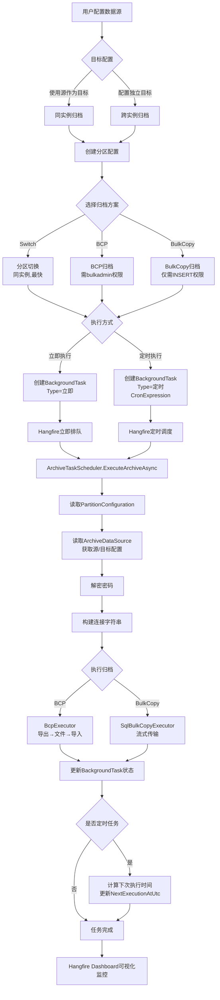

# BCP/BulkCopy 数据归档方案技术设计

> **版本**：v1.5
> **制定日期**：2025-11-04
> **最后更新**：2025-11-13
> **状态**：✅ 测试验证通过
> 
> **变更历史**:
> - v1.0 (2025-11-04): 初版,包含 BCP/BulkCopy 基础设计
> - v1.1 (2025-11-04): 技术选型确认(Dapper + Hangfire)
> - v1.2 (2025-11-04): **重大调整** - 删除冗余的 `PartitionArchive_TargetDatabaseConfig` 表,复用现有 `ArchiveDataSource` 目标配置;集成 `BackgroundTask` 统一任务机制
> - v1.3 (2025-11-04): **架构优化** - 创建独立的 `ArchiveConfiguration` 表,解耦归档配置与分区配置,支持用户自建分区表和普通表归档
> - v1.4 (2025-11-04): **性能优化** - 新增分区表归档优化策略(SWITCH + BCP/BulkCopy),生产表影响降低 99%,业务零感知
> - v1.5 (2025-11-13): ✅ **测试验证通过** - BCP 跨服务器归档执行成功;修复临时表文件组问题、DbContext 并发冲突、跨服务器重复检查等关键问题

---

## 📋 文档概览

本文档描述数据归档工具的 BCP/BulkCopy 实现方案，用于支持跨实例数据归档场景。

**核心目标**：

- ✅ **灵活归档**: 支持工具管理的分区表、用户自建分区表、普通表归档
- ✅ **跨实例支持**: 支持跨实例、跨服务器的数据归档
- ✅ **多方案选择**: 根据用户权限级别提供不同方案（PartitionSwitch/BCP/BulkCopy）
- ✅ **定时调度**: 支持后台定时任务长期运行
- ✅ **解耦设计**: 归档配置独立于分区配置,不强制依赖

**关键技术决策**：

1. ✅ **BulkCopy 使用 Dapper 实现**: 保持与项目现有技术栈（`ISqlExecutor`、`SqlExecutor`）的一致性
2. ✅ **定时任务框架选择 Hangfire**: 内置 Dashboard、易用性高、集成简单，详见 [技术选型-Hangfire vs Quartz.md](./技术选型-Hangfire%20vs%20Quartz.md)
3. ✅ **复用 ArchiveDataSource 目标配置**: 避免数据模型冗余,符合 DRY 原则,密码加密等安全机制已实现
4. ✅ **集成 BackgroundTask 任务机制**: 统一的后台任务管理,详见《重构完成总结-BackgroundTask.md》
5. ✅ **独立归档配置表**: 创建 `ArchiveConfiguration` 表,支持灵活归档需求,可选关联 `PartitionConfiguration`
6. ✅ **分区表归档优化策略**: 先 SWITCH 到临时表(< 1秒),再对临时表执行 BCP/BulkCopy,**生产表影响降低 99%,业务零感知**

---

## 🎨 设计原则说明

### 1. DRY 原则实践

**问题**: 初版设计中包含独立的 `PartitionArchive_TargetDatabaseConfig` 表,用于存储目标数据库配置。

**调整**: 经评审发现,项目已在 `ArchiveDataSource` 实体中实现完整的目标服务器配置,包括:
- 目标服务器地址、端口、数据库名
- Windows/SQL Server 认证配置
- 密码加密存储(Data Protection API)
- 连接测试功能
- 完整的 CRUD API 和 UI

**优势**:
- ✅ 避免重复开发相同功能
- ✅ 减少数据迁移和同步工作
- ✅ 统一的安全机制(密码加密)

### 2. 解耦设计原则

**问题**: 初版设计强制依赖 `PartitionConfiguration`,导致以下限制:
- ❌ 无法归档用户手动创建的分区表(未通过工具配置)
- ❌ 无法支持普通表归档(未来需求)
- ❌ 强耦合增加系统复杂度

**调整**: 创建独立的 `ArchiveConfiguration` 表,特点:
- ✅ **独立性**: 不强制依赖 `PartitionConfiguration`,可独立配置归档任务
- ✅ **灵活性**: 同时支持分区表(工具管理或用户自建)和普通表归档
- ✅ **兼容性**: 可选关联 `PartitionConfiguration`,分区切换时使用其元数据
- ✅ **扩展性**: 为后续普通表归档预留架构空间

**架构对比**:

| 场景 | 旧设计(v1.2) | 新设计(v1.3) |
|------|-------------|-------------|
| 工具管理的分区表 | ✅ 支持(通过 PartitionConfiguration) | ✅ 支持(关联 PartitionConfiguration) |
| 用户自建分区表 | ❌ 不支持(无配置入口) | ✅ 支持(直接指定表名) |
| 普通表归档 | ❌ 不支持 | ✅ 支持(标记 IsPartitionedTable=false) |
| 分区切换方案 | ✅ 支持 | ✅ 支持(需关联 PartitionConfiguration) |
| BCP/BulkCopy方案 | ✅ 支持 | ✅ 支持(无需分区配置) |
- ✅ 统一的用户体验(数据源管理 UI)

### 架构一致性

**集成 BackgroundTask**: 项目已将原有的 `PartitionCommand` 重构为统一的 `BackgroundTask` 机制,新增归档功能直接扩展 `BackgroundTaskOperationType` 枚举,无需创建独立的定时任务表。

**优势**:
- ✅ 统一的任务状态管理
- ✅ 统一的执行日志记录
- ✅ 统一的 Hangfire 调度接口
- ✅ 便于监控和运维

---

## 🎯 业务需求

### 1. 使用场景对比

| 场景                 | 分区切换    | BCP                | BulkCopy      |
| -------------------- | ----------- | ------------------ | ------------- |
| **跨实例**     | ❌ 不支持   | ✅ 支持            | ✅ 支持       |
| **同实例**     | ✅ 最快     | ✅ 支持            | ✅ 支持       |
| **权限要求**   | ALTER TABLE | bulkadmin/sysadmin | INSERT        |
| **数据中转**   | 无需        | 文件               | 内存流        |
| **网络依赖**   | 低          | 低（文件系统）     | 高（TCP连接） |
| **定时任务**   | ✅ 适合     | ⚠️ 需管理文件    | ✅ 最适合     |
| **普通表支持** | ❌ 仅分区表 | ✅ 全部支持        | ✅ 全部支持   |
| **表来源要求** | 必须已分区配置 | 任意表        | 任意表       |

### 2. 典型使用场景

#### 场景1: 工具管理的分区表归档

**特点**: 分区表通过工具进行配置和管理,有完整的分区元数据。

**适用方案**:
- ✅ **分区切换**(同实例): 最快,推荐
- ✅ **BCP/BulkCopy**(跨实例): 根据权限和网络选择

**配置方式**:
1. 在"分区配置"中创建分区表配置
2. 在"归档配置"中创建归档任务,关联分区配置
3. 选择归档方案(PartitionSwitch/BCP/BulkCopy)

#### 场景2: 用户自建分区表归档

**特点**: 分区表由用户手动创建,工具无分区元数据,仅需归档功能。

**适用方案**:
- ✅ **BCP/BulkCopy**: 无需分区元数据,直接指定表名和归档条件
- ❌ **分区切换**: 不可用(需要分区元数据)

**配置方式**:
1. 在"归档配置"中直接创建归档任务
2. 指定源表名称,**无需关联分区配置**
3. 设置归档过滤条件(如 `WHERE CreateDate < '2023-01-01'`)
4. 选择 BCP 或 BulkCopy 方案

#### 场景3: 普通表归档(未来支持)

**特点**: 非分区表的定期归档。

**适用方案**:
- ✅ **BCP/BulkCopy**: 完全支持
- ❌ **分区切换**: 不可用(仅支持分区表)

**配置方式**:
1. 在"归档配置"中创建归档任务
2. 标记 `IsPartitionedTable = false`
3. 设置归档过滤条件
4. 选择 BCP 或 BulkCopy 方案

### 3. 方案选择策略

```
归档场景
  ├─ 是否有分区配置？
  │   ├─ 是(工具管理的分区表)
  │   │   └─ 同实例？
  │   │       ├─ 是 → 优先使用"分区切换"（最快）
  │   │       └─ 否 → 进入跨实例流程
  │   │
  │   └─ 否(用户自建表或普通表)
  │       └─ 只能使用 BCP/BulkCopy
  │
  └─ 跨实例/无分区配置
      ├─ 有高权限？（bulkadmin/sysadmin）
      │   ├─ 是 → 推荐 BCP（基于文件，更稳定）
      │   └─ 否 → 使用 BulkCopy（仅需 INSERT 权限）
      │
      └─ 是否定时任务？
          ├─ 是 → 推荐 BulkCopy（无文件管理负担）
          └─ 否 → 两种方案均可
```

---

## 🏗️ 架构设计

### 1. 模块划分

```
DbArchiveTool
├─ Domain
│   └─ ArchiveMethods
│       ├─ IArchiveMethod (接口)
│       ├─ PartitionSwitchMethod (已实现)
│       ├─ BcpArchiveMethod (新增)
│       └─ BulkCopyArchiveMethod (新增)
│
├─ Application
│   ├─ ArchiveServices
│   │   ├─ IArchiveMethodSelector (方案选择器)
│   │   ├─ ArchiveOrchestrationService (编排服务)
│   │   └─ ArchiveTaskScheduler (定时任务调度)
│   └─ (复用现有 DataSources 服务,无需新增 TargetDatabaseServices)
│
├─ Infrastructure
│   ├─ BcpExecution
│   │   ├─ BcpCommandBuilder (BCP命令构建)
│   │   ├─ BcpFileManager (文件生命周期管理)
│   │   └─ FormatFileGenerator (格式文件生成)
│   ├─ BulkCopyExecution
│   │   ├─ SqlBulkCopyExecutor (流式传输)
│   │   ├─ ColumnMappingBuilder (列映射)
│   │   └─ ProgressTracker (进度跟踪)
│   └─ ScheduledTasks
│       ├─ HangfireJobScheduler (定时任务调度)
│       └─ ArchiveJobExecutor (任务执行器)
│
└─ Web/Api
    ├─ Controllers
    │   ├─ (复用现有 ArchiveDataSourcesController - 已包含目标配置)
    │   ├─ ArchiveMethodController (方案选择 API)
    │   └─ ArchiveScheduleController (定时任务管理 API)
    └─ Pages/Components
        ├─ (复用现有数据源管理页面 - 已包含目标配置 UI)
        ├─ ArchiveMethodSelector.razor (方案选择组件)
        └─ ScheduledArchiveConfig.razor (定时归档配置组件)
```

### 2. 数据模型

#### 2.1 复用现有 ArchiveDataSource 目标配置

> **设计原则**: 避免重复设计,复用现有的 `ArchiveDataSource` 实体中已实现的目标服务器配置。

**现有 ArchiveDataSource 实体已包含完整的目标配置**:

```csharp
public sealed class ArchiveDataSource : AggregateRoot
{
    // 源服务器配置
    public string ServerAddress { get; private set; }
    public int ServerPort { get; private set; }
    public string DatabaseName { get; private set; }
    public bool UseIntegratedSecurity { get; private set; }
    public string? UserName { get; private set; }
    public string? Password { get; private set; }  // 已加密存储(Data Protection API)
    
    // 目标服务器配置(归档数据存储位置)
    public bool UseSourceAsTarget { get; private set; } = true;
    public string? TargetServerAddress { get; private set; }
    public int TargetServerPort { get; private set; } = 1433;
    public string? TargetDatabaseName { get; private set; }
    public bool TargetUseIntegratedSecurity { get; private set; }
    public string? TargetUserName { get; private set; }
    public string? TargetPassword { get; private set; }  // 已加密存储
}
```

**优势**:
- ✅ 密码加密已实现(ASP.NET Core Data Protection API)
- ✅ CRUD API 和 UI 已完成(`ArchiveDataSourceAppService`, `ArchiveDataSourcesController`)
- ✅ 连接测试功能已实现(`TestConnectionAsync`, `TestTargetConnectionAsync`)
- ✅ 避免数据模型冗余,符合 DRY 原则
- ✅ 与现有分区管理功能无缝集成

#### 2.2 创建独立的归档配置表

> **设计原则**: 
> - ✅ **解耦设计**: 归档配置独立于分区配置,支持用户自建分区表或普通表的归档
> - ✅ **灵活性**: 同时支持分区表归档和普通表归档
> - ✅ **向后兼容**: 可选关联 `PartitionConfiguration`,但不强制依赖

**新增归档配置表**:

```sql
CREATE TABLE [dbo].[ArchiveConfiguration] (
    [Id] UNIQUEIDENTIFIER PRIMARY KEY DEFAULT NEWID(),
    
    -- 基础信息
    [Name] NVARCHAR(100) NOT NULL,                      -- 归档配置名称
    [Description] NVARCHAR(500) NULL,                   -- 配置描述
    [ArchiveDataSourceId] UNIQUEIDENTIFIER NOT NULL,    -- 关联的数据源
    
    -- 源表信息
    [SourceSchemaName] NVARCHAR(128) NOT NULL DEFAULT 'dbo', -- 源表架构
    [SourceTableName] NVARCHAR(128) NOT NULL,           -- 源表名
    [IsPartitionedTable] BIT NOT NULL DEFAULT 0,        -- 是否为分区表
    [PartitionConfigurationId] UNIQUEIDENTIFIER NULL,   -- 可选:关联的分区配置ID
    
    -- 目标表信息
    [TargetSchemaName] NVARCHAR(128) NULL,              -- 目标表架构(可选,默认与源表同)
    [TargetTableName] NVARCHAR(128) NULL,               -- 目标表名(可选,默认与源表同)
    [TargetDatabaseConfigId] UNIQUEIDENTIFIER NULL,     -- 目标数据库配置(可选,为空使用源库)
    
    -- 归档条件
    [ArchiveFilterColumn] NVARCHAR(128) NULL,           -- 归档过滤列(如 CreatedDate)
    [ArchiveFilterCondition] NVARCHAR(500) NULL,        -- 归档过滤条件(如 "< DATEADD(YEAR, -1, GETDATE())")
    
    -- 归档方案
    [ArchiveMethod] INT NOT NULL DEFAULT 0,             -- 0:PartitionSwitch, 1:BCP, 2:BulkCopy
    [BcpBatchSize] INT NULL DEFAULT 10000,              -- BCP/BulkCopy 批次大小
    [BcpTimeoutSeconds] INT NULL DEFAULT 1800,          -- BCP/BulkCopy 超时时间(秒)
    
    -- 定时任务配置
    [EnableScheduledArchive] BIT NOT NULL DEFAULT 0,    -- 是否启用定时归档
    [CronExpression] NVARCHAR(100) NULL,                -- Cron 表达式
    
    -- 状态跟踪
    [IsActive] BIT NOT NULL DEFAULT 1,                  -- 是否启用
    [LastArchiveAtUtc] DATETIME2 NULL,                  -- 最后归档时间(UTC)
    [LastArchiveRowCount] BIGINT NULL,                  -- 最后归档行数
    [NextArchiveAtUtc] DATETIME2 NULL,                  -- 下次归档时间
    
    -- 审计字段
    [CreatedAtUtc] DATETIME2 NOT NULL DEFAULT GETUTCDATE(),
    [CreatedBy] NVARCHAR(100) NOT NULL,
    [UpdatedAtUtc] DATETIME2 NOT NULL DEFAULT GETUTCDATE(),
    [UpdatedBy] NVARCHAR(100) NOT NULL,
    [IsDeleted] BIT NOT NULL DEFAULT 0,
    
    CONSTRAINT [FK_ArchiveConfiguration_ArchiveDataSource] 
        FOREIGN KEY ([ArchiveDataSourceId]) REFERENCES [ArchiveDataSource]([Id]),
    CONSTRAINT [FK_ArchiveConfiguration_PartitionConfiguration] 
        FOREIGN KEY ([PartitionConfigurationId]) REFERENCES [PartitionConfiguration]([Id]),
    CONSTRAINT [CHK_ArchiveConfiguration_ArchiveMethod] 
        CHECK ([ArchiveMethod] IN (0, 1, 2)),
    CONSTRAINT [CHK_ArchiveConfiguration_PartitionSwitch] 
        CHECK ([ArchiveMethod] != 0 OR [PartitionConfigurationId] IS NOT NULL) -- 分区切换必须关联分区配置
);

-- 索引
CREATE UNIQUE INDEX [UX_ArchiveConfiguration_Name] 
    ON [ArchiveConfiguration]([Name]) WHERE [IsDeleted] = 0;
CREATE INDEX [IX_ArchiveConfiguration_DataSource] 
    ON [ArchiveConfiguration]([ArchiveDataSourceId]);
CREATE INDEX [IX_ArchiveConfiguration_NextArchive] 
    ON [ArchiveConfiguration]([NextArchiveAtUtc]) 
    WHERE [IsActive] = 1 AND [EnableScheduledArchive] = 1;

-- 添加列注释
EXEC sys.sp_addextendedproperty 
    @name=N'MS_Description', 
    @value=N'归档配置,支持分区表和普通表的归档', 
    @level0type=N'SCHEMA', @level0name=N'dbo', 
    @level1type=N'TABLE', @level1name=N'ArchiveConfiguration';

EXEC sys.sp_addextendedproperty 
    @name=N'MS_Description', 
    @value=N'归档方案:0=PartitionSwitch(仅分区表),1=BCP,2=BulkCopy', 
    @level0type=N'SCHEMA', @level0name=N'dbo', 
    @level1type=N'TABLE', @level1name=N'ArchiveConfiguration', 
    @level2type=N'COLUMN', @level2name=N'ArchiveMethod';

EXEC sys.sp_addextendedproperty 
    @name=N'MS_Description', 
    @value=N'是否为分区表,true时可选择PartitionSwitch方案', 
    @level0type=N'SCHEMA', @level0name=N'dbo', 
    @level1type=N'TABLE', @level1name=N'ArchiveConfiguration', 
    @level2type=N'COLUMN', @level2name=N'IsPartitionedTable';
```

**领域实体设计**:

```csharp
/// <summary>
/// 归档配置聚合根,独立于分区配置,支持分区表和普通表的归档。
/// </summary>
public sealed class ArchiveConfiguration : AggregateRoot
{
    /// <summary>归档配置名称。</summary>
    public string Name { get; private set; } = string.Empty;
    
    /// <summary>配置描述。</summary>
    public string? Description { get; private set; }
    
    /// <summary>关联的数据源ID。</summary>
    public Guid ArchiveDataSourceId { get; private set; }
    
    /// <summary>源表架构名称。</summary>
    public string SourceSchemaName { get; private set; } = "dbo";
    
    /// <summary>源表名称。</summary>
    public string SourceTableName { get; private set; } = string.Empty;
    
    /// <summary>是否为分区表。</summary>
    public bool IsPartitionedTable { get; private set; }
    
    /// <summary>可选:关联的分区配置ID(仅分区表有值)。</summary>
    public Guid? PartitionConfigurationId { get; private set; }
    
    /// <summary>目标表架构名称,为空则使用源表架构。</summary>
    public string? TargetSchemaName { get; private set; }
    
    /// <summary>目标表名称,为空则使用源表名。</summary>
    public string? TargetTableName { get; private set; }
    
    /// <summary>目标数据库配置ID,为空则使用源数据库。</summary>
    public Guid? TargetDatabaseConfigId { get; private set; }
    
    /// <summary>归档过滤列名(如 CreatedDate)。</summary>
    public string? ArchiveFilterColumn { get; private set; }
    
    /// <summary>归档过滤条件(如 "< DATEADD(YEAR, -1, GETDATE())")。</summary>
    public string? ArchiveFilterCondition { get; private set; }
    
    /// <summary>归档方案类型。</summary>
    public ArchiveMethodType ArchiveMethod { get; private set; }
    
    /// <summary>BCP/BulkCopy 批次大小。</summary>
    public int? BcpBatchSize { get; private set; }
    
    /// <summary>BCP/BulkCopy 超时时间(秒)。</summary>
    public int? BcpTimeoutSeconds { get; private set; }
    
    /// <summary>是否启用定时归档。</summary>
    public bool EnableScheduledArchive { get; private set; }
    
    /// <summary>Cron 表达式。</summary>
    public string? CronExpression { get; private set; }
    
    /// <summary>是否启用。</summary>
    public bool IsActive { get; private set; } = true;
    
    /// <summary>最后归档时间(UTC)。</summary>
    public DateTime? LastArchiveAtUtc { get; private set; }
    
    /// <summary>最后归档行数。</summary>
    public long? LastArchiveRowCount { get; private set; }
    
    /// <summary>下次归档时间。</summary>
    public DateTime? NextArchiveAtUtc { get; private set; }
    
    // 领域方法
    public void UpdateArchiveSettings(
        ArchiveMethodType method, 
        Guid? targetDatabaseConfigId,
        int? batchSize,
        int? timeoutSeconds,
        string user)
    {
        ValidateArchiveMethod(method);
        ArchiveMethod = method;
        TargetDatabaseConfigId = targetDatabaseConfigId;
        BcpBatchSize = batchSize;
        BcpTimeoutSeconds = timeoutSeconds;
        Touch(user);
    }
    
    public void UpdateSchedule(string cronExpression, string user)
    {
        // 验证 Cron 表达式
        CronExpression = cronExpression;
        EnableScheduledArchive = true;
        // 计算下次执行时间
        NextArchiveAtUtc = CalculateNextExecution(cronExpression);
        Touch(user);
    }
    
    public void RecordArchiveExecution(long rowCount, string user)
    {
        LastArchiveAtUtc = DateTime.UtcNow;
        LastArchiveRowCount = rowCount;
        if (EnableScheduledArchive)
        {
            NextArchiveAtUtc = CalculateNextExecution(CronExpression);
        }
        Touch(user);
    }
    
    private void ValidateArchiveMethod(ArchiveMethodType method)
    {
        if (method == ArchiveMethodType.PartitionSwitch && !IsPartitionedTable)
        {
            throw new InvalidOperationException("普通表不支持分区切换归档方案");
        }
        
        if (method == ArchiveMethodType.PartitionSwitch && !PartitionConfigurationId.HasValue)
        {
            throw new InvalidOperationException("分区切换方案必须关联分区配置");
        }
    }
}
```

**优势**:
- ✅ **解耦设计**: 归档配置独立存在,不强制依赖分区配置
- ✅ **灵活支持**: 同时支持通过工具配置的分区表、用户自建分区表、普通表
- ✅ **扩展性**: 为后续普通表归档功能预留架构空间
- ✅ **兼容性**: 可选关联 `PartitionConfiguration`,分区切换时使用其元数据

#### 2.2.1 归档配置工作流程

**流程图**:

```
用户需求
  ↓
是否为工具管理的分区表?
  ├─ 是 → 在"归档配置"中创建任务 → 选择"关联分区配置"
  │       ↓
  │       可选择 PartitionSwitch/BCP/BulkCopy
  │       ↓
  │       设置定时调度(可选)
  │       ↓
  │       执行归档
  │
  └─ 否(用户自建表/普通表) → 在"归档配置"中创建任务 → 直接指定表名
          ↓
          只能选择 BCP/BulkCopy(PartitionSwitch 不可用)
          ↓
          设置归档过滤条件(WHERE 子句)
          ↓
          设置定时调度(可选)
          ↓
          执行归档
```

**配置步骤对比**:

| 步骤 | 工具管理的分区表 | 用户自建表/普通表 |
|------|-----------------|------------------|
| 1. 选择数据源 | ✅ 必需 | ✅ 必需 |
| 2. 关联分区配置 | ✅ 必需(从列表选择) | ❌ 跳过 |
| 3. 指定源表 | ⚠️ 自动填充(来自分区配置) | ✅ 手动输入(Schema.TableName) |
| 4. 标记表类型 | ✅ 自动(IsPartitionedTable=true) | ✅ 手动(IsPartitionedTable=false) |
| 5. 设置归档条件 | ⚠️ 可选(分区切换不需要) | ✅ 必需(WHERE 条件) |
| 6. 选择归档方案 | ✅ 全部可用(PartitionSwitch/BCP/BulkCopy) | ⚠️ 仅 BCP/BulkCopy |
| 7. 配置定时调度 | ✅ 可选 | ✅ 可选 |

**示例配置**:

**示例1: 工具管理的分区表归档**

```json
{
  "name": "订单表月度归档",
  "archiveDataSourceId": "guid-xxx",
  "partitionConfigurationId": "guid-yyy",  // ✅ 关联分区配置
  "sourceSchemaName": "dbo",               // ⬅️ 自动填充
  "sourceTableName": "Orders",             // ⬅️ 自动填充
  "isPartitionedTable": true,              // ⬅️ 自动填充
  "archiveMethod": 0,                      // PartitionSwitch(同实例)
  "enableScheduledArchive": true,
  "cronExpression": "0 2 1 * *"            // 每月1日凌晨2点
}
```

**示例2: 用户自建分区表归档**

```json
{
  "name": "日志表季度归档",
  "archiveDataSourceId": "guid-xxx",
  "partitionConfigurationId": null,        // ❌ 无分区配置
  "sourceSchemaName": "logs",              // ✅ 手动输入
  "sourceTableName": "ApplicationLogs",    // ✅ 手动输入
  "isPartitionedTable": true,              // ✅ 标记为分区表
  "archiveFilterColumn": "LogDate",        // ✅ 必需(过滤列)
  "archiveFilterCondition": "< DATEADD(MONTH, -6, GETDATE())", // ✅ 必需(过滤条件)
  "archiveMethod": 2,                      // BulkCopy(跨实例)
  "bcpBatchSize": 10000,
  "enableScheduledArchive": true,
  "cronExpression": "0 3 1 */3 *"          // 每季度第一天凌晨3点
}
```

**示例3: 普通表归档(未来支持)**

```json
{
  "name": "临时数据清理",
  "archiveDataSourceId": "guid-xxx",
  "partitionConfigurationId": null,        // ❌ 无分区配置
  "sourceSchemaName": "temp",              // ✅ 手动输入
  "sourceTableName": "TempData",           // ✅ 手动输入
  "isPartitionedTable": false,             // ✅ 标记为普通表
  "archiveFilterColumn": "CreatedDate",    // ✅ 必需
  "archiveFilterCondition": "< DATEADD(DAY, -30, GETDATE())", // ✅ 必需
  "archiveMethod": 1,                      // BCP
  "enableScheduledArchive": true,
  "cronExpression": "0 4 * * 0"            // 每周日凌晨4点
}
```

#### 2.3 集成 BackgroundTask 实现定时任务

> **注意**: 项目已重构为统一的 `BackgroundTask` 机制,无需新增独立的定时任务表。
> 详见《重构完成总结-BackgroundTask.md》。

**BackgroundTask 操作类型扩展**:

```csharp
/// <summary>
/// 后台任务操作类型
/// </summary>
public enum BackgroundTaskOperationType
{
    // 已有类型
    PartitionSplit = 1,           // 分区拆分
    PartitionMerge = 2,           // 分区合并
    PartitionConversion = 3,      // 分区转换
    ArchiveSwitch = 4,            // 分区切换归档
    
    // BCP/BulkCopy 新增类型
    ArchiveBcp = 5,               // BCP 归档
    ArchiveBulkCopy = 6,          // BulkCopy 归档
    ArchiveBcpScheduled = 7,      // 定时 BCP 归档
    ArchiveBulkCopyScheduled = 8  // 定时 BulkCopy 归档
}
```

**定时任务配置方式**:

```csharp
// 通过 BackgroundTask 实体配置定时归档
public sealed class BackgroundTask : AggregateRoot
{
    public Guid PartitionConfigurationId { get; }
    public BackgroundTaskOperationType OperationType { get; }
    public BackgroundTaskStatus Status { get; }
    
    // 定时任务相关字段
    public string? CronExpression { get; private set; }      // Cron 表达式
    public bool IsRecurring { get; private set; }            // 是否定时任务
    public DateTime? NextExecutionAtUtc { get; private set; } // 下次执行时间
    
    // 归档参数(JSON 存储)
    public string? Parameters { get; private set; }
    
    // 领域方法
    public void SetRecurringSchedule(string cronExpression) { }
    public void UpdateNextExecution(DateTime nextTime) { }
}
```

**集成 Hangfire 调度**:

```csharp
/// <summary>
/// 归档任务调度服务,基于 Hangfire
/// </summary>
public class ArchiveTaskScheduler
{
    public void ScheduleRecurringArchive(BackgroundTask task)
    {
        if (!task.IsRecurring || string.IsNullOrEmpty(task.CronExpression))
            return;
        
        RecurringJob.AddOrUpdate(
            task.Id.ToString(),
            () => ExecuteArchiveAsync(task.Id, task.OperationType),
            task.CronExpression,
            TimeZoneInfo.Local,
            queue: "archive");
    }
    
    public async Task ExecuteArchiveAsync(Guid taskId, BackgroundTaskOperationType operationType)
    {
        // 根据操作类型调用对应的归档方法
        switch (operationType)
        {
            case BackgroundTaskOperationType.ArchiveBcp:
            case BackgroundTaskOperationType.ArchiveBcpScheduled:
                await _bcpArchiveService.ExecuteAsync(taskId);
                break;
            case BackgroundTaskOperationType.ArchiveBulkCopy:
            case BackgroundTaskOperationType.ArchiveBulkCopyScheduled:
                await _bulkCopyArchiveService.ExecuteAsync(taskId);
                break;
        }
    }
}
```

---

## 🔧 技术实现

### 0. 分区表归档性能优化策略

> **核心思想**: 对于分区表归档,先通过 `SWITCH` 将分区快速移到临时表,再对临时表执行 BCP/BulkCopy,**最大限度减少对生产表的影响**。

#### 0.1 优化方案对比

**传统方案(直接 BCP/BulkCopy)**:

```
生产表 [Orders]
  ↓ SELECT * FROM Orders WHERE ... (锁定10-30分钟)
  ↓ BCP/BulkCopy 传输
目标表 [Orders_Archive]
```

**优化方案(SWITCH + BCP/BulkCopy)**:

```
生产表 [Orders] (分区表)
  ↓ ALTER TABLE...SWITCH (< 1秒,元数据操作)
临时表 [Orders_Temp_20231104] (普通表 + CHECK 约束)
  ↓ BCP/BulkCopy 传输 (10-30分钟,不影响生产表)
目标表 [Orders_Archive]
  ↓ 归档完成后
删除临时表
```

#### 0.2 优势分析

| 维度 | 传统方案 | 优化方案(SWITCH+传输) | 优势 |
|------|---------|---------------------|------|
| **生产表锁定时间** | 10-30分钟(SELECT 期间) | < 1秒(仅 SWITCH) | ✅ 99%+ 性能提升 |
| **业务影响** | 长时间阻塞查询 | 用户无感知 | ✅ 零影响 |
| **失败回滚** | 困难(数据已传输一半) | 简单(保留临时表重试) | ✅ 风险低 |
| **存储开销** | 无额外开销 | 需要临时空间(约分区大小) | ⚠️ 需检查磁盘 |
| **实现复杂度** | 简单 | 中等(需管理临时表) | ⚠️ 代码更多 |

#### 0.3 适用场景

**✅ 适用场景(强烈推荐优化方案)**:
- ✅ **所有分区表归档**(工具管理 OR 用户自建,直接读取分区元数据)
- ✅ 跨实例归档(BCP/BulkCopy 需要长时间网络传输)
- ✅ 大数据量归档(> 100万行)
- ✅ 业务高峰期归档(需要零影响)

**❌ 不适用场景(使用传统方案)**:
- ❌ 普通表归档(非分区表)
- ❌ 小数据量归档(< 10万行,优化意义不大)

**关键设计**:
- ✅ **无需依赖"分区配置"表**: 直接查询 SQL Server 系统视图(`sys.partitions`, `sys.partition_functions` 等)获取分区信息
- ✅ **自动检测**: 归档时自动检查表是否为分区表,如果是则使用优化方案
- ✅ **统一实现**: 复用现有分区管理基础设施(如 `PartitionMetadataService`)

#### 0.4 优化流程实现(基于系统视图,无需分区配置)

```csharp
/// <summary>
/// 分区表归档优化执行器(SWITCH + BCP/BulkCopy)
/// 直接读取 SQL Server 系统视图,无需依赖"分区配置"表
/// </summary>
public class OptimizedPartitionArchiveExecutor
{
    private readonly IPartitionMetadataService _partitionMetadataService;
    private readonly ISqlExecutor _sqlExecutor;
    private readonly ILogger<OptimizedPartitionArchiveExecutor> _logger;
    
    public async Task<Result> ExecuteAsync(
        string schemaName,
        string tableName,
        int partitionNumber,
        ArchiveMethodType archiveMethod,
        string targetTableName,
        CancellationToken cancellationToken)
    {
        // 1. 检查是否为分区表(直接查询系统视图)
        var partitionInfo = await _partitionMetadataService.GetPartitionInfoAsync(
            schemaName, tableName, partitionNumber);
        
        if (partitionInfo == null)
        {
            // 非分区表或分区不存在,使用传统方案
            _logger.LogInformation("表 {Schema}.{Table} 非分区表或分区 {Partition} 不存在,使用传统归档方案",
                schemaName, tableName, partitionNumber);
            return await ExecuteTraditionalArchiveAsync(...);
        }
        
        // 2. 创建临时表(与源表结构一致)
        var tempTableName = $"{tableName}_Temp_{DateTime.UtcNow:yyyyMMddHHmmss}";
        await CreateTempTableFromSourceAsync(schemaName, tableName, tempTableName);
        
        try
        {
            // 3. 添加 CHECK 约束(与分区边界一致)
            await AddCheckConstraintAsync(
                schemaName, 
                tempTableName, 
                partitionInfo.PartitionColumn,
                partitionInfo.BoundaryValueLower,
                partitionInfo.BoundaryValueUpper);
            
            // 4. 执行分区切换(毫秒级操作)
            await ExecutePartitionSwitchAsync(
                schemaName, tableName, tempTableName, partitionNumber);
            
            _logger.LogInformation(
                "分区切换完成: {Schema}.{Table} 分区{Partition} -> {TempTable}, 耗时 < 1秒", 
                schemaName, tableName, partitionNumber, tempTableName);
            
            // 5. 对临时表执行 BCP/BulkCopy 归档(不影响生产表)
            var result = await ExecuteBcpOrBulkCopyAsync(
                schemaName,
                tempTableName,
                targetTableName,
                archiveMethod,
                cancellationToken);
            
            if (!result.IsSuccess)
            {
                _logger.LogWarning("归档失败,保留临时表以便重试: {TempTable}", tempTableName);
                return result;
            }
            
            // 6. 归档成功,删除临时表
            await DropTempTableAsync(schemaName, tempTableName);
            
            return Result.Success();
        }
        catch (Exception ex)
        {
            _logger.LogError(ex, "优化归档失败,保留临时表: {Schema}.{TempTable}", 
                schemaName, tempTableName);
            throw;
        }
    }
    
    /// <summary>
    /// 创建临时表(与源表结构一致,但不包含非聚集索引)
    /// 直接基于源表结构创建,无需分区配置
    /// </summary>
    private async Task CreateTempTableFromSourceAsync(
        string schemaName,
        string tableName, 
        string tempTableName)
    {
        // 1. 获取源表的主键列
        var primaryKeyColumn = await GetPrimaryKeyColumnAsync(schemaName, tableName);
        
        var sql = $@"
            -- 创建临时表(仅包含聚集索引,不包含非聚集索引以加速 SWITCH)
            SELECT TOP 0 *
            INTO [{schemaName}].[{tempTableName}]
            FROM [{schemaName}].[{tableName}];
            
            -- 添加主键(如果原表有主键)
            {(primaryKeyColumn != null 
                ? $"ALTER TABLE [{schemaName}].[{tempTableName}] ADD CONSTRAINT [PK_{tempTableName}] PRIMARY KEY CLUSTERED ([{primaryKeyColumn}]);" 
                : "")}";
        
        await _sqlExecutor.ExecuteAsync(sql);
    }
    
    /// <summary>
    /// 添加 CHECK 约束(与分区函数边界一致)
    /// </summary>
    private async Task AddCheckConstraintAsync(
        string schemaName,
        string tempTableName,
        string partitionColumn,
        object? boundaryLower,
        object? boundaryUpper)
    {
        // 构建 CHECK 约束条件
        var checkCondition = BuildCheckCondition(partitionColumn, boundaryLower, boundaryUpper);
        
        var sql = $@"
            ALTER TABLE [{schemaName}].[{tempTableName}]
            ADD CONSTRAINT [CK_{tempTableName}_Range]
            CHECK ({checkCondition});";
        
        await _sqlExecutor.ExecuteAsync(sql);
    }
    
    /// <summary>
    /// 执行分区切换
    /// </summary>
    private async Task ExecutePartitionSwitchAsync(
        string schemaName,
        string sourceTable, 
        string tempTable, 
        int partitionNumber)
    {
        var sql = $@"
            ALTER TABLE [{schemaName}].[{sourceTable}]
            SWITCH PARTITION {partitionNumber}
            TO [{schemaName}].[{tempTable}];";
        
        await _sqlExecutor.ExecuteAsync(sql);
    }
    
    /// <summary>
    /// 获取表的主键列名
    /// </summary>
    private async Task<string?> GetPrimaryKeyColumnAsync(string schemaName, string tableName)
    {
        var sql = @"
            SELECT c.COLUMN_NAME
            FROM INFORMATION_SCHEMA.TABLE_CONSTRAINTS tc
            JOIN INFORMATION_SCHEMA.CONSTRAINT_COLUMN_USAGE c
                ON tc.CONSTRAINT_NAME = c.CONSTRAINT_NAME
            WHERE tc.TABLE_SCHEMA = @SchemaName
                AND tc.TABLE_NAME = @TableName
                AND tc.CONSTRAINT_TYPE = 'PRIMARY KEY'";
        
        var result = await _sqlExecutor.QueryFirstOrDefaultAsync<string>(
            sql, new { SchemaName = schemaName, TableName = tableName });
        
        return result;
    }
}
```

**关键接口:PartitionMetadataService**

```csharp
/// <summary>
/// 分区元数据服务(复用现有实现,如分区拆分/合并功能中已使用)
/// 直接查询 SQL Server 系统视图,无需依赖"分区配置"表
/// </summary>
public interface IPartitionMetadataService
{
    /// <summary>
    /// 获取指定分区的元数据信息
    /// </summary>
    Task<PartitionInfo?> GetPartitionInfoAsync(
        string schemaName, 
        string tableName, 
        int partitionNumber);
}

public class PartitionMetadataService : IPartitionMetadataService
{
    private readonly ISqlExecutor _sqlExecutor;
    
    public async Task<PartitionInfo?> GetPartitionInfoAsync(
        string schemaName, 
        string tableName, 
        int partitionNumber)
    {
        var sql = @"
            SELECT 
                t.name AS TableName,
                ps.name AS PartitionScheme,
                pf.name AS PartitionFunction,
                c.name AS PartitionColumn,
                p.partition_number AS PartitionNumber,
                p.rows AS RowCount,
                prv.value AS BoundaryValue,
                LEAD(prv.value) OVER (ORDER BY p.partition_number) AS NextBoundaryValue
            FROM sys.tables t
            JOIN sys.indexes i ON t.object_id = i.object_id AND i.index_id IN (0, 1)
            JOIN sys.partition_schemes ps ON i.data_space_id = ps.data_space_id
            JOIN sys.partition_functions pf ON ps.function_id = pf.function_id
            JOIN sys.index_columns ic ON i.object_id = ic.object_id AND i.index_id = ic.index_id AND ic.partition_ordinal = 1
            JOIN sys.columns c ON ic.object_id = c.object_id AND ic.column_id = c.column_id
            JOIN sys.partitions p ON t.object_id = p.object_id AND i.index_id = p.index_id
            LEFT JOIN sys.partition_range_values prv ON pf.function_id = prv.function_id AND p.partition_number = prv.boundary_id + 1
            WHERE SCHEMA_NAME(t.schema_id) = @SchemaName
                AND t.name = @TableName
                AND p.partition_number = @PartitionNumber";
        
        var result = await _sqlExecutor.QueryFirstOrDefaultAsync<PartitionInfo>(
            sql, 
            new { SchemaName = schemaName, TableName = tableName, PartitionNumber = partitionNumber });
        
        return result;
    }
}

/// <summary>
/// 分区信息(从系统视图读取)
/// </summary>
public class PartitionInfo
{
    public string TableName { get; set; }
    public string PartitionScheme { get; set; }
    public string PartitionFunction { get; set; }
    public string PartitionColumn { get; set; }
    public int PartitionNumber { get; set; }
    public long RowCount { get; set; }
    public object? BoundaryValueLower { get; set; }
    public object? BoundaryValueUpper { get; set; }
}
```

#### 0.5 临时表清理策略

**成功场景**:
```csharp
// 归档成功后立即删除临时表
await DropTempTableAsync(tempTableName);
```

**失败场景**:
```csharp
// 保留临时表,记录到 BackgroundTask 日志,便于:
// 1. 人工检查数据
// 2. 重新执行归档(直接从临时表传输)
// 3. 回滚数据(SWITCH 回原表)
_logger.LogWarning("归档失败,保留临时表: {TempTable}, 可手动重试或回滚", tempTableName);
```

**自动清理**:
```csharp
// 定期清理超过 7 天的孤儿临时表
public async Task CleanupOrphanTempTablesAsync()
{
    var sql = @"
        SELECT name FROM sys.tables
        WHERE name LIKE '%_Temp_%' 
        AND create_date < DATEADD(DAY, -7, GETDATE());";
    
    var orphanTables = await _sqlExecutor.QueryAsync<string>(sql);
    
    foreach (var table in orphanTables)
    {
        await DropTempTableAsync(table);
    }
}
```

---

### 1. BCP 方案实现

> **适用场景**: 
> - ✅ 普通表归档(直接对源表执行 BCP 导出/导入)
> - ✅ 优化方案中的临时表传输(分区表先 SWITCH 到临时表,再对临时表执行 BCP)
> - ✅ 用户自建分区表归档(直接对分区表执行 BCP,带 WHERE 条件过滤)
> 
> **说明**: 对于工具管理的分区表,优先使用优化方案(SWITCH + BCP),生产表影响降低 99%。

#### 1.1 核心流程

```
1. 预检查
   ├─ 验证源表权限（SELECT）
   ├─ 验证目标表权限（INSERT + bulkadmin）
   ├─ 检查磁盘空间（临时文件目录）
   └─ 验证 bcp.exe 可用性

2. 导出阶段
   ├─ 生成格式文件（.fmt）
   ├─ 构建 BCP 导出命令
   ├─ 执行导出（数据 → 文件）
   └─ 验证文件完整性

3. 导入阶段
   ├─ 验证目标表结构
   ├─ 构建 BCP 导入命令
   ├─ 执行导入（文件 → 目标表）
   └─ 验证导入行数

4. 清理阶段
   ├─ 删除源表数据（如需要）
   ├─ 清理临时文件
   └─ 记录审计日志
```

#### 1.2 BCP 命令示例

**场景1: 优化方案 - 对临时表执行 BCP(推荐分区表使用)**

```powershell
# 导出(从临时表,已通过 SWITCH 移入数据,无需 WHERE 条件)
bcp "[dbo].[Orders_Temp_20231104120000]" 
    out "C:\Temp\archive_orders_20231104.dat" 
    -S SourceServer 
    -d SourceDB 
    -T  # Windows认证
    -c  # 字符格式
    -t "|" # 字段分隔符
    -r "\n" # 行分隔符

# 导入(到目标表)
bcp [TargetDB].[dbo].[Orders_Archive] 
    in "C:\Temp\archive_orders_20231104.dat" 
    -S TargetServer 
    -d TargetDatabase 
    -T 
    -c 
    -t "|" 
    -r "\n" 
    -b 10000  # 批次大小
    -h "TABLOCK" # 表锁优化
```

**场景2: 传统方案 - 对源表直接执行 BCP(普通表或用户自建分区表)**

```powershell
# 导出(从源表,使用 WHERE 条件过滤归档范围)
bcp "SELECT * FROM [SourceDB].[dbo].[Orders] WHERE OrderDate < '2023-01-01'" 
    queryout "C:\Temp\archive_orders_20231104.dat" 
    -S ServerName 
    -d DatabaseName 
    -T  # Windows认证，或使用 -U user -P password
    -c  # 字符格式
    -t "|" # 字段分隔符
    -r "\n" # 行分隔符

# 导入(到目标表)
bcp [TargetDB].[dbo].[Orders_Archive] 
    in "C:\Temp\archive_orders_20231104.dat" 
    -S TargetServer 
    -d TargetDatabase 
    -T 
    -c 
    -t "|" 
    -r "\n" 
    -b 10000  # 批次大小
    -h "TABLOCK" # 表锁优化
```

**关键差异**:
- ✅ **优化方案**: 源是临时表(无 WHERE 条件,已通过 SWITCH 筛选),生产表零影响
- ⚠️ **传统方案**: 源是生产表(需 WHERE 条件过滤),会锁定生产表 10-30 分钟

#### 1.3 格式文件生成

```xml
<!-- 自动生成的格式文件 archive.fmt -->
<?xml version="1.0"?>
<BCPFORMAT xmlns="http://schemas.microsoft.com/sqlserver/2004/bulkload/format">
  <RECORD>
    <FIELD ID="1" xsi:type="CharTerm" TERMINATOR="|" MAX_LENGTH="50"/>
    <FIELD ID="2" xsi:type="CharTerm" TERMINATOR="|" MAX_LENGTH="100"/>
    <FIELD ID="3" xsi:type="CharTerm" TERMINATOR="\n" MAX_LENGTH="20"/>
  </RECORD>
  <ROW>
    <COLUMN SOURCE="1" NAME="Id" xsi:type="SQLINT"/>
    <COLUMN SOURCE="2" NAME="Name" xsi:type="SQLNVARCHAR"/>
    <COLUMN SOURCE="3" NAME="CreatedDate" xsi:type="SQLDATETIME2"/>
  </ROW>
</BCPFORMAT>
```

#### 1.4 文件管理策略

```csharp
public class BcpFileManager
{
    private readonly string _basePath = Path.Combine(Path.GetTempPath(), "DbArchiveTool", "BcpFiles");
  
    public string CreateExportFile(string taskId)
    {
        var fileName = $"export_{taskId}_{DateTime.UtcNow:yyyyMMddHHmmss}.dat";
        var filePath = Path.Combine(_basePath, fileName);
        Directory.CreateDirectory(Path.GetDirectoryName(filePath)!);
        return filePath;
    }
  
    public void CleanupOldFiles(int retentionDays = 7)
    {
        var threshold = DateTime.UtcNow.AddDays(-retentionDays);
        foreach (var file in Directory.GetFiles(_basePath))
        {
            if (File.GetCreationTime(file) < threshold)
            {
                File.Delete(file);
            }
        }
    }
}
```

---

### 2. BulkCopy 方案实现

> **技术选型说明**: 使用 **SqlBulkCopy** 作为底层实现,通过 Dapper 风格的封装保持接口一致性。
> - **数据读取**: 使用 Dapper 的 `QueryAsync` 流式读取源数据
> - **批量插入**: 使用 `SqlBulkCopy` 实现高性能批量写入(比逐行 INSERT 快 10-100 倍)
> - **封装目的**: 统一接口风格,便于依赖注入和单元测试
> 
> **适用场景**: 
> - ✅ 普通表归档(直接对源表执行 BulkCopy 传输)
> - ✅ 优化方案中的临时表传输(分区表先 SWITCH 到临时表,再对临时表执行 BulkCopy)
> - ✅ 用户自建分区表归档(直接对分区表执行 BulkCopy,带 WHERE 条件过滤)
> 
> **说明**: 对于工具管理的分区表,优先使用优化方案(SWITCH + BulkCopy),生产表影响降低 99%。

#### 2.1 核心流程

**通用流程(适用于临时表和普通表)**:

```
1. 预检查
   ├─ 验证源表/临时表权限（SELECT）
   ├─ 验证目标表权限（INSERT）
   ├─ 检查网络连接稳定性
   └─ 估算数据量与传输时间

2. 流式传输
   ├─ 打开源数据库连接
   ├─ 打开目标数据库连接
   ├─ 构建查询SQL:
   │   ├─ 优化方案: SELECT * FROM [TempTable] (临时表,无需 WHERE)
   │   └─ 传统方案: SELECT * FROM [SourceTable] WHERE ... (源表,带过滤条件)
   ├─ 使用 Dapper 分批读取数据(OFFSET-FETCH 分页)
   ├─ 使用 Dapper 批量插入目标表
   ├─ 配置批次大小(默认 10000 行)
   ├─ 注册进度回调
   └─ 循环执行直到完成

3. 进度跟踪
   ├─ 实时更新进度百分比
   ├─ 记录已传输行数
   └─ 估算剩余时间

4. 清理阶段
   ├─ 优化方案: 删除临时表(归档成功后)
   ├─ 传统方案: 可选删除源表数据(需谨慎)
   ├─ 关闭连接
   └─ 记录审计日志
```

**场景差异**:

| 步骤 | 优化方案(临时表) | 传统方案(普通表/源表) |
|------|-----------------|----------------------|
| 数据源 | 临时表(已通过 SWITCH 移入) | 生产表(直接查询) |
| WHERE 条件 | ❌ 不需要(已筛选) | ✅ 必需(过滤归档范围) |
| 生产表影响 | ✅ 零影响(< 1秒) | ⚠️ 长时间锁定(10-30分钟) |
| 失败风险 | ✅ 低(临时表隔离) | ⚠️ 高(影响业务) |
| 清理操作 | 删除临时表 | 可选删除源数据 |

#### 2.2 基于 SqlBulkCopy 的高性能实现

```csharp
/// <summary>
/// 基于 SqlBulkCopy 的批量数据传输执行器
/// 使用 Dapper 读取数据 + SqlBulkCopy 写入,兼顾性能与代码风格一致性
/// </summary>
public class SqlBulkCopyExecutor
{
    private readonly IDbConnectionFactory connectionFactory;
    private readonly ISqlExecutor sqlExecutor;
    private readonly ILogger<SqlBulkCopyExecutor> logger;
  
    public SqlBulkCopyExecutor(
        IDbConnectionFactory connectionFactory,
        ISqlExecutor sqlExecutor,
        ILogger<SqlBulkCopyExecutor> logger)
    {
        this.connectionFactory = connectionFactory;
        this.sqlExecutor = sqlExecutor;
        this.logger = logger;
    }
  
    public async Task<BulkCopyResult> ExecuteAsync(
        string sourceConnectionString,
        string targetConnectionString,
        string sourceQuery,
        string targetTable,
        BulkCopyOptions options,
        IProgress<BulkCopyProgress> progress,
        CancellationToken cancellationToken)
    {
        var startTime = DateTime.UtcNow;
        var totalRowsCopied = 0L;
      
        using var sourceConnection = new SqlConnection(sourceConnectionString);
        using var targetConnection = new SqlConnection(targetConnectionString);
      
        await sourceConnection.OpenAsync(cancellationToken);
        await targetConnection.OpenAsync(cancellationToken);
      
        try
        {
            // 1. 使用 Dapper 流式读取源数据
            using var reader = await sourceConnection.ExecuteReaderAsync(
                sourceQuery,
                commandTimeout: 0); // 无超时限制
          
            // 2. 配置 SqlBulkCopy
            using var bulkCopy = new SqlBulkCopy(
                targetConnection,
                SqlBulkCopyOptions.Default | SqlBulkCopyOptions.TableLock | SqlBulkCopyOptions.UseInternalTransaction,
                null)
            {
                DestinationTableName = targetTable,
                BatchSize = options.BatchSize,
                BulkCopyTimeout = 0, // 无超时限制
                EnableStreaming = true // 流式传输,减少内存占用
            };
          
            // 3. 自动映射列(列名相同则自动对应)
            // 如果源表和目标表列名一致,SqlBulkCopy 会自动映射
            // 如需自定义映射可手动添加: bulkCopy.ColumnMappings.Add("SourceCol", "TargetCol");
          
            // 4. 注册进度回调
            bulkCopy.SqlRowsCopied += (sender, e) =>
            {
                totalRowsCopied = e.RowsCopied;
                progress?.Report(new BulkCopyProgress
                {
                    RowsCopied = totalRowsCopied,
                    PercentComplete = CalculatePercentage(totalRowsCopied, options.EstimatedTotalRows)
                });
              
                logger.LogInformation(
                    "SqlBulkCopy progress: {RowsCopied} rows copied",
                    totalRowsCopied);
            };
            bulkCopy.NotifyAfter = options.NotifyAfterRows;
          
            // 5. 执行批量复制
            await bulkCopy.WriteToServerAsync(reader, cancellationToken);
          
            var duration = DateTime.UtcNow - startTime;
          
            logger.LogInformation(
                "SqlBulkCopy completed: {TotalRows} rows in {Duration}, throughput: {Throughput} rows/sec",
                totalRowsCopied, duration, totalRowsCopied / duration.TotalSeconds);
          
            return new BulkCopyResult
            {
                Succeeded = true,
                RowsCopied = totalRowsCopied,
                Duration = duration,
                ThroughputRowsPerSecond = totalRowsCopied / duration.TotalSeconds
            };
        }
        catch (Exception ex)
        {
            logger.LogError(ex, "SqlBulkCopy failed after copying {TotalRows} rows", totalRowsCopied);
          
            return new BulkCopyResult
            {
                Succeeded = false,
                RowsCopied = totalRowsCopied,
                Duration = DateTime.UtcNow - startTime,
                ErrorMessage = ex.Message
            };
        }
    }
  
    private double CalculatePercentage(long current, long? total)
    {
        if (!total.HasValue || total.Value == 0)
            return 0;
      
        return Math.Min(100.0, (double)current / total.Value * 100);
    }
}

/// <summary>
/// BulkCopy 执行选项
/// </summary>
public class BulkCopyOptions
{
    /// <summary>
    /// 批次大小（默认 10,000 行）
    /// </summary>
    public int BatchSize { get; set; } = 10000;
  
    /// <summary>
    /// 估计总行数（用于计算进度百分比）
    /// </summary>
    public long? EstimatedTotalRows { get; set; }
}

/// <summary>
/// BulkCopy 进度信息
/// </summary>
public class BulkCopyProgress
{
    public long RowsCopied { get; set; }
    public double PercentComplete { get; set; }
}

/// <summary>
/// BulkCopy 执行结果
/// </summary>
public class BulkCopyResult
{
    public bool Succeeded { get; set; }
    public long RowsCopied { get; set; }
    public TimeSpan Duration { get; set; }
    public double ThroughputRowsPerSecond { get; set; }
    public string? ErrorMessage { get; set; }
}
```

#### 2.3 架构设计说明

**为什么使用 SqlBulkCopy 作为底层实现?**

1. **性能优势**:
   - SqlBulkCopy 是 SQL Server 原生的批量插入 API,性能比逐行 INSERT 快 **10-100 倍**
   - 支持流式传输(`EnableStreaming`),内存占用低
   - 自动优化为 `BULK INSERT` 操作,最小化日志记录

2. **简单可靠**:
   - 自动列映射(列名相同时无需手动配置)
   - 内置进度回调(`SqlRowsCopied` 事件)
   - 成熟稳定,经过大量生产环境验证

3. **跨服务器支持**:
   - 直接支持跨实例数据传输
   - 无需配置链接服务器(Linked Server)
   - 无需中间文件(如 BCP 方案需要磁盘文件)

**为什么通过 Dapper 风格封装?**

1. **接口一致性**:
   - 项目已广泛使用 Dapper(`ISqlExecutor`、`SqlExecutor`)
   - 封装后保持依赖注入和单元测试的统一模式
   - `SqlBulkCopyExecutor` 接口风格与其他 Service 一致

2. **数据读取复用**:
   - 使用 Dapper 的 `ExecuteReaderAsync` 流式读取源数据
   - 可以灵活编写复杂的源查询 SQL(JOIN、WHERE 等)
   - 保持与项目现有查询逻辑的一致性

**性能对比**:

| 方案 | 10万行耗时 | 100万行耗时 | 适用场景 |
|------|-----------|------------|---------|
| SqlBulkCopy | **1-2 秒** | **10-20 秒** | ✅ 推荐,高性能批量传输 |
| Dapper 批量 INSERT | 3-5 秒 | 30-50 秒 | ⚠️ 不推荐,性能较低 |
| BCP 工具 | 1-2 秒 | 10-20 秒 | ✅ 适用于无法使用 .NET API 的场景 |

**最终方案**: 使用 **SqlBulkCopy** 作为底层实现,通过 Dapper 风格接口封装,兼顾高性能和代码一致性。

#### 2.4 归档执行完整流程

```csharp
/// <summary>
/// 归档服务编排器,协调从配置读取到执行完成的完整流程。
/// 支持基于归档配置的灵活归档,不强制依赖分区配置。
/// </summary>
public class ArchiveOrchestrationService
{
    private readonly IArchiveConfigurationRepository _archiveConfigRepo;
    private readonly IPartitionConfigurationRepository _partitionConfigRepo;
    private readonly IArchiveDataSourceRepository _dataSourceRepo;
    private readonly IPasswordEncryptionService _encryptionService;
    private readonly SqlBulkCopyExecutor _bulkCopyExecutor;
    private readonly BcpExecutor _bcpExecutor;
    private readonly ILogger<ArchiveOrchestrationService> _logger;
    
    /// <summary>
    /// 执行归档任务(基于独立的归档配置)
    /// </summary>
    public async Task<Result<ArchiveExecutionResult>> ExecuteArchiveAsync(
        Guid archiveConfigId,
        CancellationToken cancellationToken = default)
    {
        var stopwatch = Stopwatch.StartNew();
        
        try
        {
            // 1. 读取归档配置
            var archiveConfig = await _archiveConfigRepo.GetByIdAsync(archiveConfigId);
            if (archiveConfig == null)
                return Result<ArchiveExecutionResult>.Failure($"归档配置 {archiveConfigId} 不存在");

            if (!archiveConfig.IsActive)
                return Result<ArchiveExecutionResult>.Failure("归档配置已禁用");
            
            // 2. 读取关联的数据源(包含源和目标配置)
            var dataSource = await _dataSourceRepo.GetByIdAsync(archiveConfig.ArchiveDataSourceId);
            if (dataSource == null)
                return Result<ArchiveExecutionResult>.Failure($"数据源 {archiveConfig.ArchiveDataSourceId} 不存在");
            
            // 3. 验证归档方案
            if (archiveConfig.ArchiveMethod == ArchiveMethodType.PartitionSwitch)
            {
                if (!archiveConfig.IsPartitionedTable)
                    return Result<ArchiveExecutionResult>.Failure("普通表不支持分区切换归档");
                
                if (!archiveConfig.PartitionConfigurationId.HasValue)
                    return Result<ArchiveExecutionResult>.Failure("分区切换方案必须关联分区配置");
            }
            
            // 4. 构建连接字符串
            var sourceConnection = BuildConnectionString(
                dataSource.ServerAddress,
                dataSource.ServerPort,
                dataSource.DatabaseName,
                dataSource.UseIntegratedSecurity,
                dataSource.UserName,
                DecryptIfNeeded(dataSource.Password));
            
            var targetConnection = dataSource.UseSourceAsTarget
                ? sourceConnection  // 同实例归档
                : BuildConnectionString(  // 跨实例归档
                    dataSource.TargetServerAddress!,
                    dataSource.TargetServerPort,
                    dataSource.TargetDatabaseName!,
                    dataSource.TargetUseIntegratedSecurity,
                    dataSource.TargetUserName,
                    DecryptIfNeeded(dataSource.TargetPassword));
            
            // 5. 确定源表和目标表名
            var sourceTable = $"[{archiveConfig.SourceSchemaName}].[{archiveConfig.SourceTableName}]";
            var targetTable = string.IsNullOrEmpty(archiveConfig.TargetTableName)
                ? sourceTable
                : $"[{archiveConfig.TargetSchemaName ?? archiveConfig.SourceSchemaName}].[{archiveConfig.TargetTableName}]";
            
            // 6. 判断是否使用优化方案(直接检测分区表 + BCP/BulkCopy)
            Result<ArchiveExecutionResult> result;
            
            // 检测表是否为分区表(直接查询系统视图,无需依赖分区配置)
            var isPartitioned = await _partitionMetadataService.IsPartitionedTableAsync(
                archiveConfig.SourceSchemaName, 
                archiveConfig.SourceTableName);
            
            if (isPartitioned 
                && archiveConfig.ArchiveMethod != ArchiveMethodType.PartitionSwitch
                && !string.IsNullOrEmpty(archiveConfig.ArchiveFilterColumn))
            {
                // 🚀 优化方案: 分区表使用 SWITCH + BCP/BulkCopy
                // 根据过滤条件确定要归档的分区号
                var partitionNumber = await _partitionMetadataService.GetPartitionNumberByValueAsync(
                    archiveConfig.SourceSchemaName,
                    archiveConfig.SourceTableName,
                    archiveConfig.ArchiveFilterColumn,
                    archiveConfig.ArchiveFilterCondition);
                
                if (partitionNumber.HasValue)
                {
                    _logger.LogInformation(
                        "检测到分区表,使用优化方案: SWITCH 分区{Partition} + {Method}, 表={Schema}.{Table}",
                        partitionNumber.Value, archiveConfig.ArchiveMethod, 
                        archiveConfig.SourceSchemaName, archiveConfig.SourceTableName);
                    
                    result = await ExecuteOptimizedPartitionArchiveAsync(
                        sourceConnection, targetConnection,
                        archiveConfig, partitionNumber.Value, cancellationToken);
                }
                else
                {
                    _logger.LogWarning(
                        "无法确定归档分区号,使用传统方案: 表={Schema}.{Table}, 过滤条件={Filter}",
                        archiveConfig.SourceSchemaName, archiveConfig.SourceTableName, 
                        archiveConfig.ArchiveFilterCondition);
                    
                    result = await ExecuteTraditionalArchiveAsync(
                        sourceConnection, targetConnection, 
                        sourceTable, targetTable, archiveConfig, cancellationToken);
                }
            }
            else
            {
                // 传统方案: 普通表直接 BCP/BulkCopy 或分区切换
                switch (archiveConfig.ArchiveMethod)
                {
                    case ArchiveMethodType.Bcp:
                        result = await ExecuteBcpArchiveAsync(
                            sourceConnection, targetConnection, 
                            sourceTable, targetTable, archiveConfig, cancellationToken);
                        break;
                        
                    case ArchiveMethodType.BulkCopy:
                        result = await ExecuteBulkCopyArchiveAsync(
                            sourceConnection, targetConnection,
                            sourceTable, targetTable, archiveConfig, cancellationToken);
                        break;
                        
                    case ArchiveMethodType.PartitionSwitch:
                        // 纯分区切换(同实例)
                        var partitionConfig = await _partitionConfigRepo.GetByIdAsync(
                            archiveConfig.PartitionConfigurationId!.Value);
                        if (partitionConfig == null)
                            return Result<ArchiveExecutionResult>.Failure("关联的分区配置不存在");
                        
                        result = await ExecutePartitionSwitchArchiveAsync(
                            sourceConnection, targetConnection,
                            partitionConfig, archiveConfig, cancellationToken);
                        break;
                        
                    default:
                        return Result<ArchiveExecutionResult>.Failure($"不支持的归档方案: {archiveConfig.ArchiveMethod}");
                }
            }
            
            // 7. 记录执行结果
            if (result.IsSuccess)
            {
                stopwatch.Stop();
                archiveConfig.RecordArchiveExecution(result.Value!.RowsAffected, "System");
                await _archiveConfigRepo.UpdateAsync(archiveConfig, cancellationToken);
                
                _logger.LogInformation(
                    "归档执行成功: 配置={ConfigName}, 方案={Method}, 行数={RowCount}, 耗时={Elapsed:F2}秒",
                    archiveConfig.Name, archiveConfig.ArchiveMethod, 
                    result.Value.RowsAffected, stopwatch.Elapsed.TotalSeconds);
            }
            
            return result;
        }
        catch (Exception ex)
        {
            _logger.LogError(ex, "归档执行失败: ConfigId={ConfigId}", archiveConfigId);
            return Result<ArchiveExecutionResult>.Failure($"归档执行异常: {ex.Message}");
        }
    }
    
    private string? DecryptIfNeeded(string? encryptedPassword)
    {
        if (string.IsNullOrEmpty(encryptedPassword))
            return null;
        
        return _encryptionService.IsEncrypted(encryptedPassword)
            ? _encryptionService.Decrypt(encryptedPassword)
            : encryptedPassword;
    }
    
    private string BuildConnectionString(
        string serverAddress, int port, string database,
        bool useIntegratedSecurity, string? userName, string? password)
    {
        var builder = new SqlConnectionStringBuilder
        {
            DataSource = $"{serverAddress},{port}",
            InitialCatalog = database,
            IntegratedSecurity = useIntegratedSecurity,
            TrustServerCertificate = true,
            ConnectTimeout = 30
        };
        
        if (!useIntegratedSecurity)
        {
            builder.UserID = userName;
            builder.Password = password;
        }
        
        return builder.ConnectionString;
    }
    
    private async Task<Result<ArchiveExecutionResult>> ExecuteBulkCopyArchiveAsync(...)
    {
        // 调用 SqlBulkCopyExecutor.ExecuteAsync
        // 详见 2.2 节代码
    }
    
    private async Task<Result> ExecuteBcpArchiveAsync(...)
    {
        // 调用 BcpExecutor.ExecuteAsync
        // 详见 1.4 节代码
    }
}
```

#### 2.5 断点续传机制(可选)

```csharp
public class CheckpointManager
{
    // 记录已传输的批次
    public async Task SaveCheckpointAsync(string taskId, long lastRowId)
    {
        // 保存到 BackgroundTask.Parameters JSON
    }
  
    // 恢复传输
    public async Task<long> GetLastCheckpointAsync(string taskId)
    {
        // 从 BackgroundTask.Parameters 读取
        return lastRowId;
    }
}
```

---

### 3. 定时任务调度

#### 3.1 框架选型: Hangfire vs Quartz.NET

**对比分析**:

| 维度                 | Hangfire             | Quartz.NET          | 本项目权重            | 结论                |
| -------------------- | -------------------- | ------------------- | --------------------- | ------------------- |
| **Dashboard**  | ✅ 内置,功能完善     | ❌ 需自建           | 🔥 高(运维需要监控)   | Hangfire 优势明显   |
| **配置管理**   | ✅ 代码+DB双存储     | ⚠️ 主要靠配置文件 | 中(需DB存储配置)      | Hangfire 更符合需求 |
| **Cron表达式** | ✅ 支持,简单易用     | ✅ 支持,功能更强    | 中(基本Cron够用)      | 平手                |
| **失败重试**   | ✅ 自动重试+指数退避 | ✅ 需手动配置       | 🔥 高(归档失败需重试) | Hangfire 开箱即用   |
| **依赖注入**   | ✅ 完美集成          | ⚠️ 需额外配置     | 🔥 高(项目已用DI)     | Hangfire 更友好     |
| **集群支持**   | ⚠️ 需Redis/SQL配置 | ✅ 原生支持         | 低(单实例部署)        | 无影响              |
| **学习成本**   | ✅ 低,文档友好       | ⚠️ 中等,概念较多  | 🔥 高(快速上手优先)   | Hangfire 更适合     |
| **维护成本**   | ✅ 低,开箱即用       | ⚠️ 需自建UI       | 🔥 高(团队小)         | Hangfire 省力       |

**最终决策**: **选择 Hangfire**

**理由**:

1. **运维友好**: 内置 Dashboard 提供任务监控、执行历史、失败追踪,满足"可视化管理"需求
2. **集成简单**: 与现有 ASP.NET Core 架构完美契合,2-3 小时即可集成完成
3. **存储统一**: 直接使用现有 SQL Server 数据库,无需额外基础设施
4. **开发效率**: `RecurringJob.AddOrUpdate()` 一行代码完成调度,文档齐全
5. **社区成熟**: 15K+ GitHub stars,大量生产案例,问题解决容易

**潜在限制**:

- 如果未来需要复杂的任务依赖链(如任务A完成后触发任务B),Hangfire 支持较弱
- 如果要部署高可用集群(多节点竞争执行),Quartz 更成熟

**但对本项目**:

- 归档任务相对独立,无复杂依赖
- 初期单实例部署足够
- 后续扩展需求可通过 Hangfire Pro(商业版)或迁移 Quartz 解决

#### 3.2 Hangfire 集成

```csharp
// Program.cs 或 Startup.cs
public void ConfigureServices(IServiceCollection services)
{
    // 添加 Hangfire
    services.AddHangfire(config =>
    {
        config.SetDataCompatibilityLevel(CompatibilityLevel.Version_180)
              .UseSimpleAssemblyNameTypeSerializer()
              .UseRecommendedSerializerSettings()
              .UseSqlServerStorage(
                  Configuration.GetConnectionString("ArchiveDatabase"),
                  new SqlServerStorageOptions
                  {
                      CommandBatchMaxTimeout = TimeSpan.FromMinutes(5),
                      SlidingInvisibilityTimeout = TimeSpan.FromMinutes(5),
                      QueuePollInterval = TimeSpan.Zero,
                      UseRecommendedIsolationLevel = true,
                      DisableGlobalLocks = true
                  });
    });
  
    // 添加 Hangfire 服务器
    services.AddHangfireServer(options =>
    {
        options.WorkerCount = 5; // 并发工作线程数
        options.Queues = new[] { "archive", "default" }; // 队列优先级
    });
  
    // 注册归档任务执行器
    services.AddScoped<IArchiveJobExecutor, ArchiveJobExecutor>();
}

public void Configure(IApplicationBuilder app)
{
    // 配置 Hangfire Dashboard
    app.UseHangfireDashboard("/hangfire", new DashboardOptions
    {
        Authorization = new[] { new HangfireAuthorizationFilter() },
        DashboardTitle = "数据归档任务监控",
        StatsPollingInterval = 5000 // 5秒刷新一次统计信息
    });
}
```

#### 3.3 任务调度器实现(集成 BackgroundTask)

```csharp
/// <summary>
/// 归档任务调度服务,基于 Hangfire + BackgroundTask
/// </summary>
public class ArchiveTaskScheduler
{
    private readonly IBackgroundTaskRepository _taskRepo;
    private readonly ArchiveOrchestrationService _orchestrationService;
    private readonly ILogger<ArchiveTaskScheduler> _logger;
  
    public ArchiveTaskScheduler(
        IBackgroundTaskRepository taskRepo,
        ArchiveOrchestrationService orchestrationService,
        ILogger<ArchiveTaskScheduler> logger)
    {
        _taskRepo = taskRepo;
        _orchestrationService = orchestrationService;
        _logger = logger;
    }
  
    /// <summary>
    /// 添加或更新定时归档任务
    /// </summary>
    public void ScheduleRecurringArchive(BackgroundTask task)
    {
        if (!task.IsRecurring || string.IsNullOrEmpty(task.CronExpression))
            return;
      
        _logger.LogInformation(
            "Scheduling recurring archive task: {TaskId}, Cron: {Cron}, Method: {Method}",
            task.Id, task.CronExpression, task.OperationType);
      
        RecurringJob.AddOrUpdate(
            task.Id.ToString(),
            () => ExecuteArchiveAsync(task.Id, task.OperationType),
            task.CronExpression,
            TimeZoneInfo.Local,
            queue: "archive");
    }
  
    /// <summary>
    /// 移除定时任务
    /// </summary>
    public void RemoveRecurringArchive(Guid taskId)
    {
        _logger.LogInformation("Removing recurring archive task: {TaskId}", taskId);
        RecurringJob.RemoveIfExists(taskId.ToString());
    }
  
    /// <summary>
    /// 立即执行归档任务(一次性)
    /// </summary>
    public string TriggerImmediateArchive(Guid taskId, BackgroundTaskOperationType operationType)
    {
        _logger.LogInformation("Triggering immediate archive: {TaskId}, Type: {Type}", 
            taskId, operationType);
      
        var jobId = BackgroundJob.Enqueue(
            () => ExecuteArchiveAsync(taskId, operationType));
      
        return jobId;
    }
  
    /// <summary>
    /// 执行归档任务(Hangfire 调用的实际工作方法)
    /// </summary>
    [AutomaticRetry(Attempts = 3, DelaysInSeconds = new[] { 60, 300, 900 })] // 1分钟、5分钟、15分钟
    [DisableConcurrentExecution(timeoutInSeconds: 7200)] // 防止同一任务并发执行,最多2小时
    public async Task ExecuteArchiveAsync(Guid taskId, BackgroundTaskOperationType operationType)
    {
        _logger.LogInformation(
            "Starting archive execution: TaskId={TaskId}, Type={Type}",
            taskId, operationType);
        
        BackgroundTask? task = null;
        try
        {
            // 1. 读取任务信息
            task = await _taskRepo.GetByIdAsync(taskId);
            if (task == null)
            {
                _logger.LogError("BackgroundTask not found: {TaskId}", taskId);
                return;
            }
            
            // 2. 更新任务状态为执行中
            task.Start();
            await _taskRepo.UpdateAsync(task);
            
            // 3. 根据操作类型执行归档
            ArchiveMethod method = operationType switch
            {
                BackgroundTaskOperationType.ArchiveBcp => ArchiveMethod.BCP,
                BackgroundTaskOperationType.ArchiveBulkCopy => ArchiveMethod.BulkCopy,
                BackgroundTaskOperationType.ArchiveBcpScheduled => ArchiveMethod.BCP,
                BackgroundTaskOperationType.ArchiveBulkCopyScheduled => ArchiveMethod.BulkCopy,
                _ => throw new NotSupportedException($"不支持的归档类型: {operationType}")
            };
            
            var result = await _orchestrationService.ExecuteArchiveAsync(
                task.PartitionConfigurationId, method);
            
            // 4. 更新任务完成状态
            if (result.IsSuccess)
            {
                task.Complete($"归档成功,方案: {method}");
                _logger.LogInformation("Archive task completed: {TaskId}", taskId);
            }
            else
            {
                task.Fail(result.Error ?? "未知错误");
                _logger.LogError("Archive task failed: {TaskId}, Error: {Error}", 
                    taskId, result.Error);
            }
            
            await _taskRepo.UpdateAsync(task);
            
            // 5. 更新下次执行时间(定时任务)
            if (task.IsRecurring)
            {
                var nextTime = CronExpression.GetNextOccurrence(
                    task.CronExpression, DateTime.UtcNow);
                if (nextTime.HasValue)
                {
                    task.UpdateNextExecution(nextTime.Value);
                    await _taskRepo.UpdateAsync(task);
                }
            }
        }
        catch (Exception ex)
        {
            _logger.LogError(ex, "Archive execution exception: TaskId={TaskId}", taskId);
            
            if (task != null)
            {
                task.Fail($"执行异常: {ex.Message}");
                await _taskRepo.UpdateAsync(task);
            }
            
            throw; // 重新抛出,触发 Hangfire 重试机制
        }
    }
}
```

**应用服务层集成**:

```csharp
/// <summary>
/// 归档任务应用服务
/// </summary>
public class ArchiveTaskAppService
{
    private readonly IBackgroundTaskRepository _taskRepo;
    private readonly ArchiveTaskScheduler _scheduler;
    
    /// <summary>
    /// 创建定时归档任务
    /// </summary>
    public async Task<Result<Guid>> CreateScheduledArchiveAsync(
        Guid partitionConfigId,
        ArchiveMethod method,
        string cronExpression)
    {
        var operationType = method == ArchiveMethod.BCP
            ? BackgroundTaskOperationType.ArchiveBcpScheduled
            : BackgroundTaskOperationType.ArchiveBulkCopyScheduled;
        
        var task = new BackgroundTask(
            partitionConfigId, 
            operationType,
            operatorName: "System");
        
        task.SetRecurringSchedule(cronExpression);
        
        await _taskRepo.AddAsync(task);
        
        // 注册到 Hangfire
        _scheduler.ScheduleRecurringArchive(task);
        
        return Result<Guid>.Success(task.Id);
    }
    
    /// <summary>
    /// 立即执行一次归档
    /// </summary>
    public async Task<Result<string>> ExecuteArchiveNowAsync(
        Guid partitionConfigId,
        ArchiveMethod method)
    {
        var operationType = method == ArchiveMethod.BCP
            ? BackgroundTaskOperationType.ArchiveBcp
            : BackgroundTaskOperationType.ArchiveBulkCopy;
        
        var task = new BackgroundTask(
            partitionConfigId,
            operationType,
            operatorName: "User");
        
        await _taskRepo.AddAsync(task);
        
        // 立即触发
        var jobId = _scheduler.TriggerImmediateArchive(task.Id, operationType);
        
        return Result<string>.Success(jobId);
    }
}
```

---

## 🔐 安全设计

### 1. 敏感信息保护

密码等敏感字段在 `ArchiveDataSource` 实体层已完成加密:
- 使用 ASP.NET Core Data Protection API
- 保护器名称:`ArchiveDataSource.Password`
- 运行时动态构建连接字符串时解密密码字段
- 连接字符串不持久化,仅存在于内存中的短暂生命周期

**实体字段加密**:
- `Password` 字段:源数据库密码(加密存储)
- `TargetPassword` 字段:目标数据库密码(加密存储)

**连接字符串构建**(运行时):
```csharp
// 在 ArchiveOrchestrationService 中
var targetConnStr = new SqlConnectionStringBuilder
{
    DataSource = $"{dataSource.TargetServerAddress},{dataSource.TargetPort}",
    InitialCatalog = dataSource.TargetDatabaseName,
    UserID = dataSource.TargetUserName,
    Password = _dataProtection.Unprotect(dataSource.TargetPassword), // 仅解密密码字段
    IntegratedSecurity = dataSource.TargetAuthenticationType == AuthType.Windows
}.ConnectionString;
```

### 2. 权限验证

```csharp
public class PermissionValidator
{
    public async Task<PermissionCheckResult> ValidateBcpPermissionsAsync(SqlConnection connection)
    {
        // 检查是否有 bulkadmin 或 sysadmin 角色
        const string sql = @"
            SELECT IS_SRVROLEMEMBER('bulkadmin') AS IsBulkAdmin,
                   IS_SRVROLEMEMBER('sysadmin') AS IsSysAdmin";
      
        // 执行查询并返回结果
    }
  
    public async Task<PermissionCheckResult> ValidateBulkCopyPermissionsAsync(
        SqlConnection connection, string tableName)
    {
        // 检查是否有 INSERT 权限
        const string sql = @"
            SELECT HAS_PERMS_BY_NAME(@TableName, 'OBJECT', 'INSERT') AS HasInsert";
      
        // 执行查询并返回结果
    }
}
```

---

## 🖥️ UI 交互流程

### 1. 数据源配置(复用现有功能)

```
数据源管理页面 (/datasources)
  ├─ 创建/编辑数据源
  │   ├─ 源服务器配置
  │   │   ├─ 服务器地址: 192.168.1.10
  │   │   ├─ 端口: 1433
  │   │   ├─ 数据库: ProductionDB
  │   │   ├─ 认证方式: Windows / SQL Server
  │   │   └─ 用户名/密码(自动加密)
  │   │
  │   └─ 目标服务器配置
  │       ├─ 使用源服务器作为目标: [✓] 是 [ ] 否
  │       ├─ (当选"否"时显示以下字段)
  │       ├─ 目标服务器地址: 192.168.1.20
  │       ├─ 端口: 1433
  │       ├─ 数据库: ArchiveDB
  │       ├─ 认证方式: Windows / SQL Server
  │       └─ 用户名/密码(自动加密)
  │
  └─ 测试连接
      ├─ [测试源服务器连接]
      └─ [测试目标服务器连接]
```

### 2. 分区配置归档方案选择

```
分区配置向导 (PartitionConfigWizard.razor)
  ├─ 步骤1: 选择数据源
  │   └─ 下拉列表显示已配置的 ArchiveDataSource
  │
  ├─ 步骤2: 配置分区表
  │   ├─ 源表名: Orders
  │   ├─ 目标表名覆盖: Orders_Archive (可选,默认与源表同名)
  │   ├─ 分区列: OrderDate
  │   └─ 分区值: [按向导生成]
  │
  └─ 步骤3: 选择归档方案
      ├─ [ ] Switch (分区切换 - 仅同实例可用)
      │   └─ ✅ 最快,元数据操作
      │
      ├─ [ ] BCP (基于文件)
      │   ├─ ⚠️ 需要 bulkadmin 或 sysadmin 权限
      │   ├─ ✅ 跨实例支持
      │   ├─ ✅ 基于文件中转,网络依赖低
      │   ├─ 批次大小: 10000 行
      │   └─ 超时时间: 1800 秒
      │
      └─ [✓] BulkCopy (流式传输 - 推荐)
          ├─ ✅ 仅需 INSERT 权限
          ├─ ✅ 跨实例支持
          ├─ ✅ 无需管理临时文件
          ├─ 批次大小: 10000 行
          └─ 超时时间: 1800 秒
```

### 3. 定时归档任务配置

```
归档任务管理页面 (/archive-tasks)
  ├─ [创建定时归档任务]
  │   ├─ 选择分区配置: (下拉列表,显示已配置的分区)
  │   ├─ 归档方案: BCP / BulkCopy
  │   ├─ Cron 表达式: 0 2 * * * (每天凌晨2点)
  │   ├─ 启用状态: [✓] 启用
  │   └─ [保存] [取消]
  │
  └─ 任务列表
      ├─ 表格显示
      │   ├─ 任务名称 | 分区表 | 归档方案 | Cron | 状态 | 最后执行时间 | 下次执行 | 操作
      │   ├─ 订单归档 | Orders | BulkCopy | 每天2点 | 运行中 | 2025-11-04 02:00 | 2025-11-05 02:00 | [暂停][删除][立即执行]
      │   └─ ...
      │
      └─ 操作按钮
          ├─ [立即执行一次] - 不影响定时计划
          ├─ [暂停] - 停止定时调度
          └─ [删除] - 删除任务和 Hangfire 调度
```

### 4. 执行监控(Hangfire Dashboard)

```
/hangfire (Hangfire 内置 Dashboard)
  ├─ 首页概览
  │   ├─ 成功任务数
  │   ├─ 失败任务数
  │   └─ 队列状态
  │
  ├─ 定时任务 (Recurring Jobs)
  │   ├─ 任务ID | Cron | 下次执行 | 最后执行 | 状态
  │   └─ [触发][删除] 按钮
  │
  ├─ 执行历史 (Succeeded / Failed)
  │   ├─ 任务详情: 开始时间、持续时间、参数
  │   └─ 日志输出
  │
  └─ 重试队列 (Retries)
      └─ 失败任务自动重试状态
```

---

## 🔄 完整执行流程图



---

## 📊 性能考虑

### 1. BCP 性能优化

```powershell
# 使用本机格式（比字符格式快）
bcp ... -n

# 使用批次插入
bcp ... -b 10000

# 使用表锁
bcp ... -h "TABLOCK"

# 禁用约束检查（需谨慎）
bcp ... -h "CHECK_CONSTRAINTS"
```

### 2. Dapper BulkCopy 性能优化

```csharp
// 1. 批次大小调整
var options = new BulkCopyOptions
{
    BatchSize = 10000  // 根据数据大小调整:小行10000,大行1000
};

// 2. 使用表锁提升性能
// 在目标表上执行:ALTER TABLE [TargetTable] SET (LOCK_ESCALATION = TABLE)

// 3. 禁用非聚集索引(可选,归档后重建)
// ALTER INDEX [IX_NonClustered] ON [TargetTable] DISABLE

// 4. 调整事务日志恢复模式(谨慎使用)
// ALTER DATABASE [TargetDB] SET RECOVERY SIMPLE
```

### 3. 性能对比(估算)

#### 3.1 传统方案性能对比

| 方案            | 100万行  | 1000万行  | 网络要求 | 磁盘要求     | 技术实现             |
| --------------- | -------- | --------- | -------- | ------------ | -------------------- |
| 分区切换        | < 1秒    | < 1秒     | 低       | 无           | ALTER TABLE...SWITCH |
| BCP             | 30-60秒  | 5-10分钟  | 低       | 高(临时文件) | bcp.exe 命令行工具   |
| Dapper BulkCopy | 60-120秒 | 10-20分钟 | 高       | 低           | Dapper 批量 INSERT   |
| SqlBulkCopy     | 40-80秒  | 7-15分钟  | 高       | 低           | SqlBulkCopy 类       |

#### 3.2 优化方案性能对比(分区表)

**优化方案**: SWITCH(< 1秒) + BCP/BulkCopy(10-30分钟)

| 维度 | 直接 BCP/BulkCopy | 优化方案(SWITCH + BCP/BulkCopy) | 性能提升 |
|------|------------------|--------------------------------|---------|
| **生产表锁定时间** | 10-30分钟 | < 1秒 | **99%+** |
| **总体归档耗时** | 10-30分钟 | 10-30分钟 + 1秒 | 相同 |
| **业务影响** | 长时间阻塞 | **用户无感知** | ✅ |
| **失败风险** | 高(数据传输一半) | 低(临时表隔离) | ✅ |
| **存储开销** | 无 | 临时表(约分区大小) | ⚠️ |

**关键结论**:
- ✅ **生产表影响降低 99%**: 从 10-30分钟 降到 < 1秒
- ✅ **总归档时间不变**: SWITCH 仅增加 < 1秒,可忽略
- ✅ **业务零感知**: 数据已移出生产表,后续操作不影响业务
- ⚠️ **需要存储空间**: 约为分区大小,通常可接受(归档后删除临时表)

#### 3.3 方案选择建议

**分区表归档(工具管理)**:
- ✅ **推荐**: SWITCH + BCP/BulkCopy(优化方案)
- ✅ **优点**: 生产表零影响,用户无感知
- ⚠️ **前提**: 有分区配置,有足够存储空间

**用户自建分区表/普通表归档**:
- ✅ **推荐**: 直接 BCP/BulkCopy(传统方案)
- ⚠️ **注意**: 需在业务低峰期执行,避免长时间锁表

**同实例归档(分区表)**:
- ✅ **推荐**: 纯分区切换(PartitionSwitch)
- ✅ **优点**: 最快(< 1秒),零网络传输

**说明**:
- Dapper BulkCopy 比原生 SqlBulkCopy 慢约 50%,但在可接受范围内
- 对于定时任务场景(通常在夜间执行),性能差异影响较小
- 优先考虑代码统一性和可维护性,而非极致性能
- **优化方案的核心价值是降低生产影响,而非提升总体速度**

---

## 🧪 测试计划

### 1. 单元测试

- BCP 命令构建测试
- 格式文件生成测试
- 列映射配置测试
- 权限验证测试

### 2. 集成测试

- BCP 完整流程测试
- BulkCopy 完整流程测试
- 定时任务调度测试
- 错误恢复测试

### 3. 性能测试

- 小数据量（< 10万行）
- 中等数据量（10-100万行）
- 大数据量（> 100万行）
- 跨机房网络测试

### 4. 兼容性测试

- SQL Server 2016/2017/2019/2022
- Windows 认证 vs SQL Server 认证
- 不同网络环境（内网/跨机房）

---

## 📚 相关资源

- [BCP 实用工具文档](https://learn.microsoft.com/zh-cn/sql/tools/bcp-utility)
- [SqlBulkCopy 类文档](https://learn.microsoft.com/zh-cn/dotnet/api/system.data.sqlclient.sqlbulkcopy)
- [Hangfire 文档](https://www.hangfire.io/)

---

## 📋 附录：v1.3 架构调整总结

### 核心变更说明

**v1.3 版本的主要变更是创建独立的 `ArchiveConfiguration` 表,解决以下问题**:

#### 问题1: 强耦合限制

**旧设计(v1.2)**: 归档功能强制依赖 `PartitionConfiguration` 表

```csharp
// 旧设计:必须传入 partitionConfigId
public async Task<Result> ExecuteArchiveAsync(
    Guid partitionConfigId,  // ❌ 强制依赖分区配置
    ArchiveMethod method,
    CancellationToken cancellationToken = default)
```

**问题**:
- ❌ 用户手动创建的分区表无法归档(未通过工具配置)
- ❌ 无法支持普通表归档(未来需求)
- ❌ 增加系统复杂度和维护成本

#### 问题2: 使用场景受限

| 场景 | v1.2 支持情况 | v1.3 支持情况 |
|------|--------------|--------------|
| 工具管理的分区表归档 | ✅ 支持 | ✅ 支持(更灵活) |
| 用户自建分区表归档 | ❌ **不支持**(无配置入口) | ✅ **新增支持** |
| 普通表归档 | ❌ **不支持** | ✅ **新增支持** |
| 分区切换方案 | ✅ 支持 | ✅ 支持(需关联分区配置) |
| BCP/BulkCopy方案 | ⚠️ 仍需分区配置 | ✅ **无需分区配置** |

### 解决方案

#### 1. 新增 ArchiveConfiguration 表

**设计特点**:
- ✅ **独立性**: 不强制依赖 `PartitionConfiguration`
- ✅ **灵活性**: 同时支持分区表和普通表
- ✅ **兼容性**: 可选关联 `PartitionConfiguration`(仅分区切换需要)
- ✅ **扩展性**: 支持自定义归档过滤条件

**关键字段**:

```csharp
public sealed class ArchiveConfiguration : AggregateRoot
{
    // 表来源信息
    public string SourceSchemaName { get; }       // 源表架构
    public string SourceTableName { get; }        // 源表名称
    public bool IsPartitionedTable { get; }       // 是否分区表
    
    // 可选:仅分区表有值
    public Guid? PartitionConfigurationId { get; }
    
    // 归档条件(用户自建表必需)
    public string? ArchiveFilterColumn { get; }    // 过滤列
    public string? ArchiveFilterCondition { get; } // 过滤条件
    
    // 归档方案
    public ArchiveMethodType ArchiveMethod { get; }
}
```

#### 2. 更新 ArchiveOrchestrationService

**新接口签名**:

```csharp
// 新设计:接受独立的归档配置ID
public async Task<Result<ArchiveExecutionResult>> ExecuteArchiveAsync(
    Guid archiveConfigId,  // ✅ 独立的归档配置
    CancellationToken cancellationToken = default)
{
    // 1. 加载归档配置
    var archiveConfig = await _archiveConfigRepo.GetByIdAsync(archiveConfigId);
    
    // 2. 仅分区切换时才加载分区配置
    if (archiveConfig.ArchiveMethod == ArchiveMethodType.PartitionSwitch)
    {
        var partitionConfig = await _partitionConfigRepo.GetByIdAsync(
            archiveConfig.PartitionConfigurationId!.Value);
        // 使用分区元数据...
    }
    
    // 3. BCP/BulkCopy 无需分区配置,直接执行
}
```

### 用户场景示例

#### 场景1: 工具管理的分区表(原有功能,保持兼容)

**配置步骤**:
1. 在"分区配置"中创建分区表配置
2. 在"归档配置"中创建任务,**关联分区配置**
3. 可选择任意归档方案(PartitionSwitch/BCP/BulkCopy)

#### 场景2: 用户自建分区表(新增支持)

**配置步骤**:
1. 直接在"归档配置"中创建任务
2. 手动输入表名(如 `dbo.UserCreatedPartitionTable`)
3. 设置归档过滤条件(如 `WHERE CreateDate < '2023-01-01'`)
4. 只能选择 BCP 或 BulkCopy 方案(PartitionSwitch 不可用)

#### 场景3: 普通表归档(新增支持,未来启用)

**配置步骤**:
1. 在"归档配置"中创建任务
2. 标记 `IsPartitionedTable = false`
3. 设置归档过滤条件
4. 只能选择 BCP 或 BulkCopy 方案

### 向后兼容性

**对现有功能的影响**:

| 功能 | v1.2 | v1.3 | 兼容性 |
|------|------|------|--------|
| 分区表管理 | ✅ | ✅ | 100% 兼容 |
| 分区切换归档 | ✅ | ✅ | 100% 兼容 |
| 数据源管理 | ✅ | ✅ | 100% 兼容 |
| BackgroundTask | ✅ | ✅ | 100% 兼容 |
| BCP/BulkCopy(分区表) | ⚠️ 需分区配置 | ✅ 可独立配置 | 增强 |
| BCP/BulkCopy(普通表) | ❌ 不支持 | ✅ 新增支持 | 新功能 |

**迁移建议**:
- ✅ 现有的分区配置无需修改
- ✅ 现有的数据源配置无需修改
- ✅ 新功能通过新增 `ArchiveConfiguration` 表实现,不影响现有数据
- ⚠️ 需要新增 EF Core Migration 创建 `ArchiveConfiguration` 表

### 下一步工作

1. **数据模型实现**:
   - ✅ 创建 `ArchiveConfiguration` 实体类
   - ✅ 添加 EF Core Migration
   - ✅ 创建 Repository 接口和实现

2. **应用服务实现**:
   - ✅ 更新 `ArchiveOrchestrationService`
   - ✅ 创建 `ArchiveConfigurationAppService`
   - ✅ 实现 BCP/BulkCopy 执行器
   - ✅ **复用/扩展 `PartitionMetadataService`**(已在分区拆分/合并功能中使用)

3. **UI 实现**:
   - ✅ 创建"归档配置"管理页面
   - ✅ 实现归档任务配置表单
   - ✅ 集成定时任务调度界面

4. **测试验证**:
   - ✅ 单元测试(独立归档配置)
   - ✅ 集成测试(多场景覆盖,包括用户自建分区表)
   - ✅ 性能测试(大数据量验证)
   - ✅ 自动检测测试(验证分区表自动检测逻辑)

### 关键设计修正说明

#### v1.4 修正版(当前版本)

**核心变更**: 优化方案**无需依赖"分区配置"表**,直接查询 SQL Server 系统视图

**技术实现**:
1. ✅ 使用 `IPartitionMetadataService.IsPartitionedTableAsync()` 自动检测分区表
2. ✅ 使用 `IPartitionMetadataService.GetPartitionInfoAsync()` 读取分区元数据
3. ✅ 复用现有基础设施(分区拆分/合并功能已使用)
4. ✅ 无需创建新的元数据管理层

**适用范围扩大**:

| 表类型 | v1.4 初版 | v1.4 修正版(当前) |
|--------|----------|------------------|
| 工具管理的分区表 | ✅ 支持(需分区配置) | ✅ **支持(自动检测)** |
| 用户自建分区表 | ❌ **不支持** | ✅ **支持(自动检测)** |
| 普通表 | ⚠️ 传统方案 | ⚠️ 传统方案 |

**设计优势**:
- ✅ **自动化**: 无需手动配置分区信息
- ✅ **权威性**: 直接读取 SQL Server 真实分区元数据
- ✅ **统一性**: 与现有分区管理功能使用相同基础设施
- ✅ **灵活性**: 支持所有分区表(无论如何创建)

**示例代码**:
```csharp
// 自动检测分区表
var isPartitioned = await _partitionMetadataService.IsPartitionedTableAsync(
    "dbo", "Orders");

// 读取分区元数据
var partitionInfo = await _partitionMetadataService.GetPartitionInfoAsync(
    "dbo", "Orders", partitionNumber: 5);

// 无需手动配置,系统自动获取:
// - 分区方案名
// - 分区函数名
// - 分区列名
// - 分区边界值
// - 分区行数
```

---

**作者**：开发团队
**审核**：架构师
**最后更新**：2025-11-04
