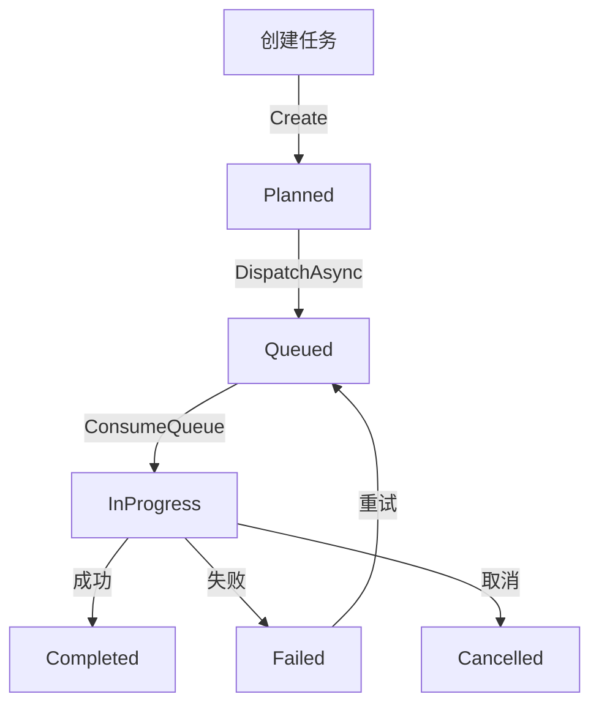

# BackgroundTask 架构设计文档

> **创建日期:** 2025-10-20  
> **版本:** 1.0  
> **状态:** ✅ 已实施

## 📘 概述

`BackgroundTask` 是数据归档工具的**统一后台任务调度系统**,用于异步执行各类耗时操作,包括但不限于:
- 分区管理操作 (添加、拆分、合并边界值)
- 数据归档任务 (分区切换、BCP 导出等)
- 数据清理维护 (日志清理、索引重建等)

## 🎯 设计目标

### 1. 通用性 (Generalization)
- ✅ **不限于分区操作**: 支持所有类型的后台任务
- ✅ **可扩展的操作类型**: 通过枚举 `BackgroundTaskOperationType` 灵活定义新任务类型
- ✅ **统一的执行模型**: 所有任务遵循相同的生命周期和状态管理

### 2. 可靠性 (Reliability)
- ✅ **持久化任务队列**: 所有任务存储在数据库中,重启不丢失
- ✅ **自动故障恢复**: 检测并重启僵尸任务
- ✅ **完整的执行日志**: 记录任务的每个阶段和错误信息
- ✅ **心跳监控**: 定期更新任务心跳,防止任务挂起

### 3. 可观测性 (Observability)
- ✅ **任务状态跟踪**: Planned → Queued → InProgress → Completed/Failed
- ✅ **进度可视化**: 支持百分比进度和检查点记录
- ✅ **审计日志**: 记录谁在何时执行了什么操作
- ✅ **UI 集成**: "任务调度"模块提供完整的任务管理界面

### 4. 性能 (Performance)
- ✅ **优先级队列**: 支持任务优先级,高优先级任务优先执行
- ✅ **并发控制**: 限制同时执行的任务数量,避免资源竞争
- ✅ **内存队列**: 使用 Channel<Guid> 实现高效的任务调度

## 🏗️ 架构组件

### 核心领域模型 (Domain Layer)

#### BackgroundTask (聚合根)
```csharp
/// <summary>
/// 后台任务聚合根
/// </summary>
public sealed class BackgroundTask : Entity, IAggregateRoot
{
    // 基本信息
    public Guid PartitionConfigurationId { get; private set; }
    public Guid DataSourceId { get; private set; }
    public string RequestedBy { get; private set; }
    
    // 任务类型和状态
    public BackgroundTaskOperationType OperationType { get; private set; }
    public BackgroundTaskStatus Status { get; private set; }
    
    // 执行控制
    public int Priority { get; private set; }  // 0=最高优先级
    public DateTime? QueuedAtUtc { get; private set; }
    public DateTime? StartedAtUtc { get; private set; }
    public DateTime? CompletedAtUtc { get; private set; }
    public DateTime? LastHeartbeatUtc { get; private set; }
    
    // 进度和检查点
    public decimal? Progress { get; private set; }  // 0.0 ~ 1.0
    public string? LastCheckpoint { get; private set; }
    
    // 配置和结果
    public string? ConfigurationSnapshot { get; private set; }  // JSON
    public string? SummaryJson { get; private set; }  // JSON
    public string? FailureReason { get; private set; }
    
    // 归档相关字段
    public string? ArchiveScheme { get; private set; }
    public string? ArchiveTargetConnection { get; private set; }
    public string? ArchiveTargetDatabase { get; private set; }
    public string? ArchiveTargetTable { get; private set; }
    public string? BackupReference { get; private set; }
    public string? Notes { get; private set; }
    
    // 工厂方法
    public static BackgroundTask Create(...) { ... }
    
    // 状态转换方法
    public void MarkAsQueued(DateTime queuedAtUtc) { ... }
    public void Start(string phase, DateTime startedAtUtc) { ... }
    public void UpdateProgress(decimal progress, string? checkpoint) { ... }
    public void UpdateHeartbeat(DateTime heartbeatUtc) { ... }
    public void Complete(string summaryJson, DateTime completedAtUtc) { ... }
    public void Fail(string reason, DateTime failedAtUtc) { ... }
}
```

#### BackgroundTaskStatus (枚举)
```csharp
/// <summary>
/// 后台任务状态
/// </summary>
public enum BackgroundTaskStatus
{
    Planned = 0,      // 已计划 (尚未入队)
    Queued = 1,       // 已排队 (等待执行)
    InProgress = 2,   // 执行中
    Completed = 3,    // 已成功
    Failed = 4,       // 已失败
    Cancelled = 5     // 已取消
}
```

#### BackgroundTaskOperationType (枚举)
```csharp
/// <summary>
/// 后台任务操作类型
/// </summary>
public enum BackgroundTaskOperationType
{
    // 分区管理类 (10-19)
    AddBoundary = 10,           // 添加分区边界值
    SplitBoundary = 11,         // 拆分分区
    MergeBoundary = 12,         // 合并分区
    
    // 数据归档类 (30-49)
    ArchiveSwitch = 30,         // 分区切换归档
    ArchiveBcp = 31,            // BCP 批量导出归档
    ArchiveBulkCopy = 32,       // SqlBulkCopy 归档
    
    // 数据清理类 (50-69) - 未来扩展
    DataCleanup = 50,           // 历史数据清理
    LogCleanup = 51,            // 日志清理
    TempTableCleanup = 52,      // 临时表清理
    
    // 维护类 (70-89) - 未来扩展
    IndexRebuild = 70,          // 索引重建
    StatisticsUpdate = 71,      // 统计信息更新
    DatabaseBackup = 72,        // 数据库备份
    
    // 自定义类 (90-99)
    Custom = 90                 // 自定义任务
}
```

### 仓储接口 (Domain Layer)

```csharp
/// <summary>
/// 后台任务仓储接口
/// </summary>
public interface IBackgroundTaskRepository
{
    Task<BackgroundTask?> GetByIdAsync(Guid id, CancellationToken cancellationToken);
    Task AddAsync(BackgroundTask task, CancellationToken cancellationToken);
    Task UpdateAsync(BackgroundTask task, CancellationToken cancellationToken);
    Task<List<BackgroundTask>> GetZombieTasksAsync(TimeSpan timeout, CancellationToken cancellationToken);
}
```

### 任务调度器 (Application Layer)

```csharp
/// <summary>
/// 后台任务调度器接口
/// </summary>
public interface IBackgroundTaskDispatcher
{
    /// <summary>
    /// 分派任务到执行队列
    /// </summary>
    Task DispatchAsync(Guid taskId, Guid dataSourceId, CancellationToken cancellationToken);
    
    /// <summary>
    /// 批量分派任务
    /// </summary>
    Task DispatchBatchAsync(IEnumerable<Guid> taskIds, Guid dataSourceId, CancellationToken cancellationToken);
}
```

### 后台服务 (Infrastructure Layer)

#### BackgroundTaskHostedService
```csharp
/// <summary>
/// 后台任务托管服务
/// </summary>
internal sealed class BackgroundTaskHostedService : BackgroundService
{
    protected override async Task ExecuteAsync(CancellationToken stoppingToken)
    {
        // 1. 启动时扫描僵尸任务
        await ScanZombieTasksAsync(stoppingToken);
        
        // 2. 启动心跳定时器
        StartHeartbeatTimer(stoppingToken);
        
        // 3. 消费任务队列
        await ConsumeQueueAsync(stoppingToken);
    }
    
    private async Task ConsumeQueueAsync(CancellationToken stoppingToken)
    {
        await foreach (var taskId in taskQueue.Reader.ReadAllAsync(stoppingToken))
        {
            // 限制并发任务数
            await semaphore.WaitAsync(stoppingToken);
            
            // 启动任务执行
            _ = Task.Run(() => ExecuteTaskAsync(taskId, stoppingToken), stoppingToken);
        }
    }
    
    private async Task ExecuteTaskAsync(Guid taskId, CancellationToken stoppingToken)
    {
        try
        {
            // 1. 加载任务
            var task = await taskRepository.GetByIdAsync(taskId, stoppingToken);
            
            // 2. 标记为执行中
            task.Start(phase: "准备阶段", DateTime.UtcNow);
            await taskRepository.UpdateAsync(task, stoppingToken);
            
            // 3. 调用处理器执行
            await processor.ProcessAsync(task, stoppingToken);
            
            // 4. 标记为完成
            task.Complete(summaryJson: "...", DateTime.UtcNow);
            await taskRepository.UpdateAsync(task, stoppingToken);
        }
        catch (Exception ex)
        {
            // 标记为失败
            task.Fail(reason: ex.Message, DateTime.UtcNow);
            await taskRepository.UpdateAsync(task, stoppingToken);
        }
        finally
        {
            semaphore.Release();
        }
    }
}
```

#### BackgroundTaskProcessor
```csharp
/// <summary>
/// 后台任务处理器
/// </summary>
internal sealed class BackgroundTaskProcessor
{
    public async Task ProcessAsync(BackgroundTask task, CancellationToken cancellationToken)
    {
        // 根据操作类型执行不同的逻辑
        switch (task.OperationType)
        {
            case BackgroundTaskOperationType.AddBoundary:
                await ExecuteAddBoundaryAsync(task, cancellationToken);
                break;
                
            case BackgroundTaskOperationType.SplitBoundary:
                await ExecuteSplitBoundaryAsync(task, cancellationToken);
                break;
                
            case BackgroundTaskOperationType.MergeBoundary:
                await ExecuteMergeBoundaryAsync(task, cancellationToken);
                break;
                
            case BackgroundTaskOperationType.ArchiveSwitch:
                await ExecuteArchiveSwitchAsync(task, cancellationToken);
                break;
                
            default:
                throw new NotSupportedException($"不支持的操作类型: {task.OperationType}");
        }
    }
}
```

## 📊 数据库设计

### BackgroundTask 表
```sql
CREATE TABLE [BackgroundTask] (
    [Id] uniqueidentifier NOT NULL,
    [PartitionConfigurationId] uniqueidentifier NOT NULL,
    [DataSourceId] uniqueidentifier NOT NULL,
    [RequestedBy] nvarchar(64) NOT NULL,
    [CreatedBy] nvarchar(64) NOT NULL,
    
    -- 任务类型和状态
    [OperationType] int NOT NULL,
    [Status] int NOT NULL,
    
    -- 执行控制
    [Priority] int NOT NULL DEFAULT 0,
    [QueuedAtUtc] datetime2 NULL,
    [StartedAtUtc] datetime2 NULL,
    [CompletedAtUtc] datetime2 NULL,
    [LastHeartbeatUtc] datetime2 NULL,
    
    -- 进度和检查点
    [Progress] decimal(5,4) NULL,
    [LastCheckpoint] nvarchar(256) NULL,
    [Phase] nvarchar(50) NULL,
    
    -- 配置和结果
    [ConfigurationSnapshot] nvarchar(max) NULL,
    [SummaryJson] nvarchar(max) NULL,
    [FailureReason] nvarchar(max) NULL,
    
    -- 归档字段
    [ArchiveScheme] nvarchar(50) NULL,
    [ArchiveTargetConnection] nvarchar(512) NULL,
    [ArchiveTargetDatabase] nvarchar(128) NULL,
    [ArchiveTargetTable] nvarchar(128) NULL,
    [BackupReference] nvarchar(256) NULL,
    [Notes] nvarchar(512) NULL,
    
    -- 审计字段
    [CreatedAtUtc] datetime2 NOT NULL,
    [UpdatedAtUtc] datetime2 NOT NULL,
    [UpdatedBy] nvarchar(64) NOT NULL,
    [IsDeleted] bit NOT NULL DEFAULT 0,
    
    CONSTRAINT [PK_BackgroundTask] PRIMARY KEY ([Id])
);

-- 索引
CREATE INDEX [IX_BackgroundTask_DataSourceId_Status] 
    ON [BackgroundTask] ([DataSourceId], [Status]);
    
CREATE INDEX [IX_BackgroundTask_PartitionConfigurationId_IsDeleted] 
    ON [BackgroundTask] ([PartitionConfigurationId], [IsDeleted]);
```

### BackgroundTaskLog 表
```sql
CREATE TABLE [BackgroundTaskLog] (
    [Id] uniqueidentifier NOT NULL,
    [ExecutionTaskId] uniqueidentifier NOT NULL,
    [LogTimeUtc] datetime2 NOT NULL,
    [Level] nvarchar(20) NOT NULL,
    [Phase] nvarchar(50) NULL,
    [Message] nvarchar(max) NOT NULL,
    [Exception] nvarchar(max) NULL,
    
    CONSTRAINT [PK_BackgroundTaskLog] PRIMARY KEY ([Id]),
    CONSTRAINT [FK_BackgroundTaskLog_BackgroundTask] 
        FOREIGN KEY ([ExecutionTaskId]) REFERENCES [BackgroundTask] ([Id])
);

CREATE INDEX [IX_BackgroundTaskLog_ExecutionTaskId_LogTimeUtc] 
    ON [BackgroundTaskLog] ([ExecutionTaskId], [LogTimeUtc]);
```

## 🔄 任务生命周期



### 状态转换规则

| 当前状态 | 允许的下一状态 | 触发条件 |
|---------|--------------|----------|
| Planned | Queued | 调用 `DispatchAsync` |
| Queued | InProgress | 任务从队列中被消费 |
| InProgress | Completed | 任务成功完成 |
| InProgress | Failed | 任务执行失败 |
| InProgress | Cancelled | 用户手动取消 |
| Failed | Queued | 用户选择重试 |

## 🎯 使用示例

### 1. 创建并执行分区拆分任务

```csharp
public async Task<Result<Guid>> ExecuteSplitAsync(
    SplitPartitionRequest request, 
    CancellationToken cancellationToken)
{
    // 1. 生成 DDL 脚本
    var preview = await GenerateSplitScriptAsync(request, cancellationToken);
    if (!preview.IsSuccess)
        return Result<Guid>.Failure(preview.Error);
    
    // 2. 准备任务配置
    var payload = JsonSerializer.Serialize(new
    {
        request.SchemaName,
        request.TableName,
        DdlScript = preview.Value!.Script,
        request.NewBoundaryKeys
    });
    
    // 3. 创建后台任务
    var task = BackgroundTask.Create(
        partitionConfigurationId: Guid.NewGuid(),
        dataSourceId: request.DataSourceId,
        requestedBy: request.RequestedBy,
        createdBy: request.RequestedBy,
        backupReference: null,
        notes: $"拆分分区: {request.TableName}",
        priority: 0,
        operationType: BackgroundTaskOperationType.SplitBoundary,
        archiveScheme: null,
        archiveTargetConnection: null,
        archiveTargetDatabase: null,
        archiveTargetTable: null);
    
    // 4. 保存配置快照
    task.SaveConfigurationSnapshot(payload, request.RequestedBy);
    await taskRepository.AddAsync(task, cancellationToken);
    
    // 5. 记录操作日志
    await logRepository.AddAsync(new PartitionOperationLog
    {
        OperationType = "SplitPartition",
        DataSourceId = request.DataSourceId,
        TargetTable = $"{request.SchemaName}.{request.TableName}",
        OperatedBy = request.RequestedBy,
        Details = payload
    }, cancellationToken);
    
    // 6. 记录审计日志
    await auditLogRepository.AddAsync(new PartitionAuditLog
    {
        Action = "ExecuteSplit",
        ResourceType = "PartitionTable",
        ResourceId = $"{request.SchemaName}.{request.TableName}",
        UserId = request.RequestedBy,
        OccurredAtUtc = DateTime.UtcNow,
        Summary = $"提交分区拆分任务",
        PayloadJson = payload,
        Script = preview.Value.Script,
        Result = "Success"
    }, cancellationToken);
    
    // 7. 分派任务到执行队列
    await dispatcher.DispatchAsync(task.Id, request.DataSourceId, cancellationToken);
    
    return Result<Guid>.Success(task.Id);
}
```

### 2. 查询任务状态

```csharp
public async Task<BackgroundTaskDetailModel?> GetTaskDetailsAsync(
    Guid taskId, 
    CancellationToken cancellationToken)
{
    var task = await taskRepository.GetByIdAsync(taskId, cancellationToken);
    if (task == null)
        return null;
    
    return new BackgroundTaskDetailModel
    {
        Id = task.Id,
        OperationType = task.OperationType,
        Status = task.Status,
        Progress = task.Progress,
        LastCheckpoint = task.LastCheckpoint,
        QueuedAtUtc = task.QueuedAtUtc,
        StartedAtUtc = task.StartedAtUtc,
        CompletedAtUtc = task.CompletedAtUtc,
        FailureReason = task.FailureReason,
        Notes = task.Notes
    };
}
```

## 📈 扩展指南

### 添加新的任务类型

#### 步骤 1: 扩展 BackgroundTaskOperationType 枚举
```csharp
public enum BackgroundTaskOperationType
{
    // ... 现有类型
    
    // 新增: 数据库备份任务
    DatabaseBackup = 72
}
```

#### 步骤 2: 在 BackgroundTaskProcessor 中添加处理逻辑
```csharp
public async Task ProcessAsync(BackgroundTask task, CancellationToken cancellationToken)
{
    switch (task.OperationType)
    {
        // ... 现有 case
        
        case BackgroundTaskOperationType.DatabaseBackup:
            await ExecuteDatabaseBackupAsync(task, cancellationToken);
            break;
    }
}

private async Task ExecuteDatabaseBackupAsync(
    BackgroundTask task, 
    CancellationToken cancellationToken)
{
    // 1. 更新阶段
    task.Start(phase: "准备备份", DateTime.UtcNow);
    await taskRepository.UpdateAsync(task, cancellationToken);
    
    // 2. 执行备份
    var config = JsonSerializer.Deserialize<DatabaseBackupConfig>(
        task.ConfigurationSnapshot!);
    await backupService.BackupDatabaseAsync(config, cancellationToken);
    
    // 3. 更新进度
    task.UpdateProgress(progress: 0.5m, checkpoint: "备份文件已生成");
    await taskRepository.UpdateAsync(task, cancellationToken);
    
    // 4. 完成任务
    task.Complete(summaryJson: "...", DateTime.UtcNow);
    await taskRepository.UpdateAsync(task, cancellationToken);
}
```

#### 步骤 3: 创建应用服务方法
```csharp
public async Task<Result<Guid>> ExecuteDatabaseBackupAsync(
    DatabaseBackupRequest request, 
    CancellationToken cancellationToken)
{
    var task = BackgroundTask.Create(
        operationType: BackgroundTaskOperationType.DatabaseBackup,
        ...);
    
    await taskRepository.AddAsync(task, cancellationToken);
    await dispatcher.DispatchAsync(task.Id, request.DataSourceId, cancellationToken);
    
    return Result<Guid>.Success(task.Id);
}
```

## 🔍 监控和告警

### 关键指标

1. **任务队列长度**: 监控 `Status = Queued` 的任务数量
2. **执行中任务数**: 监控 `Status = InProgress` 的任务数量
3. **失败率**: `Failed / Total` 任务比例
4. **平均执行时间**: `CompletedAtUtc - StartedAtUtc` 平均值
5. **僵尸任务数**: 心跳超时的任务数量

### 查询示例

```sql
-- 任务状态分布
SELECT 
    OperationType,
    Status,
    COUNT(*) AS TaskCount
FROM BackgroundTask
WHERE IsDeleted = 0
GROUP BY OperationType, Status;

-- 长时间运行的任务
SELECT 
    Id,
    OperationType,
    DATEDIFF(MINUTE, StartedAtUtc, GETUTCDATE()) AS RunningMinutes
FROM BackgroundTask
WHERE Status = 2  -- InProgress
    AND StartedAtUtc < DATEADD(MINUTE, -30, GETUTCDATE())
ORDER BY StartedAtUtc;

-- 失败任务统计
SELECT 
    OperationType,
    FailureReason,
    COUNT(*) AS FailureCount
FROM BackgroundTask
WHERE Status = 4  -- Failed
    AND CreatedAtUtc >= DATEADD(DAY, -7, GETUTCDATE())
GROUP BY OperationType, FailureReason;
```

## 📚 相关文档

- [PartitionCommand机制废弃说明.md](./PartitionCommand机制废弃说明.md) - 旧机制迁移指南
- [分区拆分功能重构-使用BackgroundTask.md](./分区拆分功能重构-使用BackgroundTask.md) - 具体功能实现案例
- [重构计划-BackgroundTask改名.md](./重构计划-BackgroundTask改名为BackgroundTask.md) - 重构历史记录

---

**文档维护:** 请在添加新的任务类型或修改架构时更新本文档。  
**最后更新:** 2025-10-20
