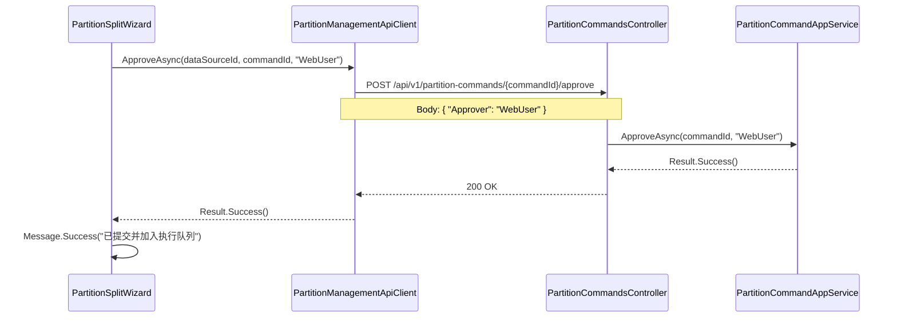
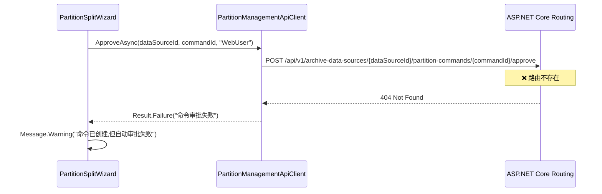

# 分区拆分批量提交审批失败问题修复

## 问题描述

用户在使用"分区拆分"功能的批量生成模式时,生成边界值后点击"提交"按钮,系统提示:

```
命令已创建(ID: 81cfa043-3ff9-4e75-b4d6-eebccb7cf0ba),但自动审批失败: 命令审批失败。请前往任务监控页面手动审批。
```

任务没有进入后台执行队列,需要手动审批。而"分区值添加"功能可以正常自动审批并执行。

## 根本原因分析

经过排查,发现**两个关键问题**:

### 问题 1: 前后端 URL 路径不匹配

**前端调用的 URL:**
```csharp
// PartitionManagementApiClient.ApproveAsync
var url = $"api/v1/archive-data-sources/{dataSourceId}/partition-commands/{commandId}/approve";
```

**后端 Controller 的路由:**
```csharp
[Route("api/v1/partition-commands")]
public class PartitionCommandsController : ControllerBase
{
    [HttpPost("{commandId:guid}/approve")]
    public async Task<IActionResult> Approve(...)
}
```

实际路由为: `/api/v1/partition-commands/{commandId}/approve`

**结论:** 前端多了 `archive-data-sources/{dataSourceId}` 部分,导致 **404 Not Found** 错误。

### 问题 2: 前后端数据格式不匹配 (已在第一次修复中解决)

- **后端 (修复前):** `[FromBody] string approver` - 期望纯字符串
- **前端:** 发送对象 `{ "Approver": "WebUser" }`
- **结果:** JSON 绑定失败

## 完整修复方案

### 修复 1: 统一后端参数格式 (✅ 已完成)

将后端改为接收 DTO 对象:

```csharp
// 修改方法签名
[HttpPost("{commandId:guid}/approve")]
public async Task<IActionResult> Approve(
    Guid commandId,
    [FromBody] ApproveRequest request,  // ✅ 接收对象
    CancellationToken cancellationToken = default)
{
    var result = await appService.ApproveAsync(commandId, request.Approver, cancellationToken);
    // ...
}

// 添加 DTO
public record ApproveRequest(string Approver);
```

### 修复 2: 修正前端 URL 路径 (✅ 本次修复)

修正 `PartitionManagementApiClient` 的 URL:

```csharp
public async Task<Result> ApproveAsync(Guid dataSourceId, Guid commandId, string approver, CancellationToken cancellationToken = default)
{
    // ❌ 错误: 多了 archive-data-sources/{dataSourceId}
    // var url = $"api/v1/archive-data-sources/{dataSourceId}/partition-commands/{commandId}/approve";
    
    // ✅ 正确: 直接使用 partition-commands
    var url = $"api/v1/partition-commands/{commandId}/approve";
    
    // 增强错误处理,读取详细错误信息
    try
    {
        var response = await httpClient.PostAsJsonAsync(url, new ApprovePartitionCommandApiRequest(approver), cancellationToken);
        if (response.IsSuccessStatusCode)
        {
            return Result.Success();
        }

        // 读取详细错误信息
        var responseText = await response.Content.ReadAsStringAsync(cancellationToken);
        try
        {
            var problem = System.Text.Json.JsonSerializer.Deserialize<HttpValidationProblemDetails>(responseText);
            if (!string.IsNullOrWhiteSpace(problem?.Detail))
            {
                return Result.Failure(problem.Detail);
            }
        }
        catch
        {
            // 忽略 JSON 解析失败
        }

        var errorMessage = string.IsNullOrWhiteSpace(responseText)
            ? $"命令审批失败 ({(int)response.StatusCode} {response.ReasonPhrase})"
            : responseText;

        return Result.Failure(errorMessage);
    }
    catch (Exception ex)
    {
        return Result.Failure($"调用审批接口失败: {ex.Message}");
    }
}
```

**同时修复 `RejectAsync` 方法的相同问题。**

## API 路由设计说明

项目中有两个分区相关的 Controller,路由设计不同:

| Controller | 路由前缀 | 用途 |
|-----------|---------|------|
| `PartitionManagementController` | `/api/v1/archive-data-sources/{dataSourceId}/partitions` | 分区元数据查询、添加边界值 |
| `PartitionCommandsController` | `/api/v1/partition-commands` | 分区命令管理(拆分/合并/审批) |

**关键区别:**
- `PartitionManagementController` 的操作直接绑定到特定数据源,URL 包含 `dataSourceId`
- `PartitionCommandsController` 管理的是**命令实体**,命令 ID 已经包含了数据源信息,所以 URL 不需要 `dataSourceId`

## 对比:"添加边界值"为什么能成功

"添加边界值" 使用的是 `PartitionManagementController`:

```csharp
// 后端
[Route("api/v1/archive-data-sources/{dataSourceId:guid}/partitions")]
[HttpPost("boundaries")]
public async Task<IActionResult> AddBoundaryAsync(
    Guid dataSourceId, 
    [FromBody] AddBoundaryRequestDto dto,
    CancellationToken cancellationToken)

// 前端
var url = $"api/v1/archive-data-sources/{dataSourceId}/partitions/boundaries";
```

**结论:** "添加边界值"前后端 URL 一致,且从设计之初就使用对象传递,所以没有问题。

## 测试验证

修复后需要验证的场景:

### 1. 单值拆分模式
- 输入单个边界值
- 点击"提交"
- ✅ 应显示: `拆分任务已提交并加入执行队列!命令ID: xxx`
- ✅ 任务监控页面应看到任务自动进入"待执行"状态

### 2. 批量拆分模式
- 生成多个边界值(例如 5 个)
- 点击"提交"
- ✅ 应显示: `拆分任务(5个边界值)已提交并加入执行队列!命令ID: xxx`
- ✅ 任务监控页面应看到批量任务

### 3. 错误场景测试
- **命令不存在:** 应显示详细错误信息(非通用的"命令审批失败")
- **重复审批:** 应提示"命令已被审批"
- **网络错误:** 应显示"调用审批接口失败: [异常信息]"

## 相关文件

### 修改文件

#### 第一次修复 (参数格式)
- `DBManageTool/src/DbArchiveTool.Api/Controllers/V1/PartitionCommandsController.cs`
  - 修改 `Approve` 方法签名: `[FromBody] string approver` → `[FromBody] ApproveRequest request`
  - 添加 `ApproveRequest` record 定义

#### 第二次修复 (URL 路径 + 错误处理)
- `DBManageTool/src/DbArchiveTool.Web/Services/PartitionManagementApiClient.cs`
  - 修正 `ApproveAsync` URL: 移除 `archive-data-sources/{dataSourceId}` 前缀
  - 修正 `RejectAsync` URL: 移除 `archive-data-sources/{dataSourceId}` 前缀
  - 增强错误处理: 读取后端返回的详细错误信息,而非通用提示

### 不需修改的文件
- `DBManageTool/src/DbArchiveTool.Web/Components/PartitionSplitWizard.razor` (调用方式正确)

## 调试技巧

### 如何快速发现 URL 不匹配问题

1. **浏览器开发者工具 Network 标签:**
   - 查看请求 URL: `/api/v1/archive-data-sources/.../partition-commands/.../approve`
   - 查看响应状态码: `404 Not Found`

2. **后端日志:**
   ```
   warn: Microsoft.AspNetCore.Routing.Matching.PathMatcherPolicy[0]
         No match found for route '/api/v1/archive-data-sources/{dataSourceId}/partition-commands/{commandId}/approve'
   ```

3. **Swagger/OpenAPI 文档:**
   - API 项目启用了 Swagger,访问 `/swagger` 可以看到所有可用路由
   - 确认实际路由为 `/api/v1/partition-commands/{commandId}/approve`

## 最佳实践建议

1. **URL 路由设计规范:**
   - 资源操作(CRUD): `/api/v1/{resource}/{id}`
   - 子资源操作: `/api/v1/{resource}/{id}/{sub-resource}`
   - 命令操作: `/api/v1/{commands}/{commandId}/{action}`
   - **避免混用**: 不要在命令路由中嵌入父资源 ID(除非真正需要)

2. **前后端契约测试:**
   ```csharp
   [Fact]
   public async Task ApproveCommand_ShouldUseCorrectUrl()
   {
       var commandId = Guid.NewGuid();
       var expectedUrl = $"/api/v1/partition-commands/{commandId}/approve";
       
       var response = await client.PostAsJsonAsync(expectedUrl, new { Approver = "Test" });
       Assert.NotEqual(HttpStatusCode.NotFound, response.StatusCode);
   }
   ```

3. **错误消息应具体化:**
   - ❌ 通用: "命令审批失败"
   - ✅ 具体: "命令 {commandId} 不存在" / "命令已被审批" / "命令状态不允许审批"

4. **API 版本管理:**
   - 使用 `/api/v1/` 前缀便于未来版本演进
   - 保持同一版本内的 URL 设计风格一致

## 附录: 完整请求流程

### 修复后的正确流程



### 修复前的错误流程



---

**修复日期:** 2025-10-20  
**修复次数:** 2 次 (参数格式 + URL 路径)  
**验证状态:** ⏳ 待用户重启应用后测试

