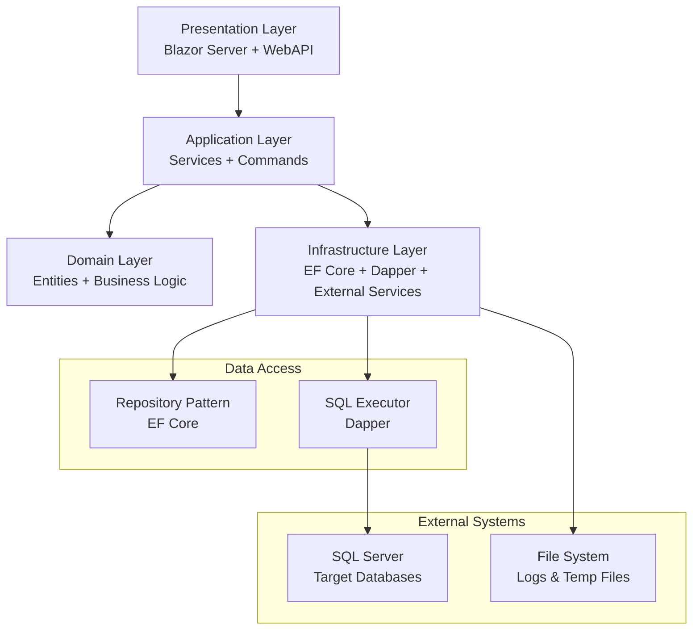
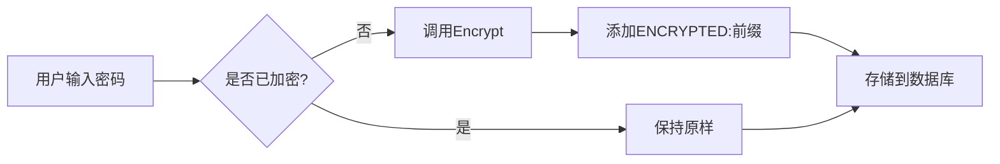
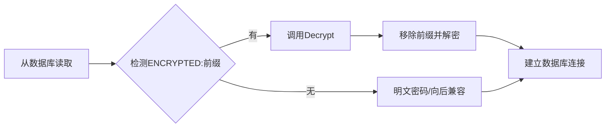

# 新数据库归档工具 - 总体架构设计

> **版本**: 1.0  
> **日期**: 2025年9月29日  
> **设计原则**: 精简架构、快速迭代、模块化开发  

---

## 🏗️ 架构概览

### 设计理念
- **精简至上**: 避免过度设计，专注核心功能实现
- **模块化**: 按功能域划分，支持独立开发和部署
- **快速迭代**: 支持功能模块的快速开发和上线
- **技术先进**: 采用 .NET 8 + Blazor Server 现代技术栈
- **双数据访问**: EF Core 仓储 + Dapper 原生SQL，各司其职

### 技术选型

#### 后端技术栈
- **.NET 8**: 最新长期支持版本，性能优越
- **ASP.NET Core 8**: Web API 和 Blazor Server 支持
- **Entity Framework Core 8**: 配置管理和业务数据持久化
- **Dapper**: 高性能原生 SQL 执行，用于归档脚本
- **Microsoft Extensions**: 依赖注入、配置、日志等基础设施

#### 前端技术栈
- **Blazor Server**: C# 全栈开发，减少技术栈复杂度
- **Ant Design Blazor**: 企业级 UI 组件库
- **SignalR**: 实时通信，用于任务进度推送
- **Bootstrap 5**: 响应式布局支持

#### 数据存储
- **SQL Server**: 工具配置和元数据存储
- **Redis** (可选): 缓存和会话存储
- **文件系统**: 日志文件和临时数据存储

---

## 🔧 系统架构

### 分层架构



#### 1. 表示层 (Presentation Layer)
**职责**: 用户界面和API接口
**技术**: Blazor Server + ASP.NET Core WebAPI

**组件构成**:
- **Blazor Pages**: 用户界面页面
- **Blazor Components**: 可复用UI组件
- **Web API Controllers**: RESTful API接口
- **SignalR Hubs**: 实时通信中心
- **Middleware**: 认证、异常处理、日志中间件

#### 2. 应用层 (Application Layer)
**职责**: 业务流程编排和服务协调
**技术**: .NET 8 Services

**组件构成**:
- **Application Services**: 应用服务，业务流程编排
- **Command Handlers**: 命令处理器，执行具体业务操作
- **Query Services**: 查询服务，数据检索和展示
- **Background Services**: 后台任务服务，定时调度
- **Validators**: 数据验证器
- **Mappers**: 对象映射器 (AutoMapper)

#### 3. 领域层 (Domain Layer)
**职责**: 核心业务逻辑和领域模型
**技术**: .NET 8 Class Libraries

**组件构成**:
- **Entities**: 领域实体对象
- **Value Objects**: 值对象
- **Domain Services**: 领域服务
- **Aggregates**: 聚合根
- **Business Rules**: 业务规则验证
- **Domain Events**: 领域事件 (可选)

#### 4. 基础设施层 (Infrastructure Layer)
**职责**: 技术实现和外部系统集成
**技术**: EF Core + Dapper + 第三方库

**组件构成**:
- **EF Core Repositories**: 仓储模式实现
- **Dapper SQL Executors**: 原生SQL执行器
- **Database Context**: 数据库上下文
- **External Services**: 外部服务集成
- **File Services**: 文件操作服务
- **Caching Services**: 缓存服务

---

## 📁 项目结构

### 解决方案结构
```
DbArchiveTool.sln
├── src/
│   ├── DbArchiveTool.Web/              # Blazor Server 主应用
│   ├── DbArchiveTool.Api/              # Web API (可选独立部署)
│   ├── DbArchiveTool.Application/      # 应用层
│   ├── DbArchiveTool.Domain/           # 领域层
│   ├── DbArchiveTool.Infrastructure/   # 基础设施层
│   └── DbArchiveTool.Shared/           # 共享类库
├── tests/
│   ├── DbArchiveTool.UnitTests/        # 单元测试
│   ├── DbArchiveTool.IntegrationTests/ # 集成测试
│   └── DbArchiveTool.E2ETests/         # 端到端测试
├── docs/                               # 项目文档
├── scripts/                            # 部署脚本
└── docker/                             # Docker配置
```

### 项目详细结构

#### 1. DbArchiveTool.Web (Blazor Server)
**职责**: 提供基于 AntDesign Blazor 的用户界面,通过 API 客户端调用后端服务。

```
DbArchiveTool.Web/
├── Pages/                           # Razor 页面组件
│   ├── Admin/                       # 管理员页面
│   │   ├── Login.razor              # 登录页面
│   │   └── Settings.razor           # 系统设置
│   ├── PartitionExecutions/         # 分区执行监控
│   │   ├── ExecutionWizard.razor    # 执行向导页面
│   │   ├── ExecutionWizard.razor.cs # 执行向导代码后置
│   │   └── Monitor.razor            # 执行监控页面
│   ├── Partitions/                  # 分区管理页面
│   ├── Index.razor                  # 首页
│   ├── Partitions.razor             # 分区列表页
│   ├── AuditLogs.razor              # 审计日志页面
│   ├── PartitionTableInfo.cs        # 分区表信息模型
│   └── _Host.cshtml                 # Blazor Server 宿主页
├── Components/                      # 可复用组件
│   ├── PartitionConfigWizard.razor  # 分区配置向导组件
│   └── PartitionConfigWizard.razor.cs # 配置向导代码后置
├── Services/                        # API 客户端服务
│   ├── AdminUserApiClient.cs        # 管理员用户 API 客户端
│   ├── ArchiveDataSourceApiClient.cs # 归档数据源 API 客户端
│   ├── PartitionConfigurationApiClient.cs # 分区配置 API 客户端
│   ├── PartitionExecutionApiClient.cs # 分区执行 API 客户端
│   ├── PartitionInfoApiClient.cs    # 分区信息 API 客户端
│   ├── PartitionManagementApiClient.cs # 分区管理 API 客户端
│   ├── PartitionCommandRequests.cs  # 分区命令请求模型
│   └── PartitionConfigurationRequests.cs # 分区配置请求模型
├── Core/                            # 核心状态管理
│   ├── AdminAuthStorageService.cs   # 管理员认证存储服务
│   ├── AdminSessionState.cs         # 管理员会话状态
│   └── PartitionPageState.cs        # 分区页面状态
├── Shared/                          # 共享布局组件
├── Data/                            # 示例数据服务
│   ├── WeatherForecast.cs           # 天气预报模型(示例)
│   └── WeatherForecastService.cs    # 天气预报服务(示例)
├── wwwroot/                         # 静态资源(CSS/JS/图片)
├── App.razor                        # 应用根组件
├── _Imports.razor                   # 全局 Razor 引用
├── Program.cs                       # 应用入口点
└── appsettings.json                 # 应用配置文件
```

#### 2. DbArchiveTool.Api (Web API)
**职责**: 提供 RESTful API 端点,将请求委托给 Application 层服务。

```
DbArchiveTool.Api/
├── Controllers/                     # API 控制器
│   ├── AdminUsersController.cs      # 管理员用户管理
│   ├── ArchiveTasksController.cs    # 归档任务管理
│   ├── DataSourcesController.cs     # 数据源管理
│   ├── PartitionArchiveController.cs # 分区归档控制器
│   ├── PartitionCommandsController.cs # 分区命令控制器
│   ├── PartitionConfigurationsController.cs # 分区配置控制器
│   ├── PartitionExecutionsController.cs # 分区执行控制器
│   └── PartitionManagementController.cs # 分区管理控制器
├── Models/                          # API 视图模型
├── Program.cs                       # 应用入口和中间件配置
├── appsettings.json                 # 配置文件(含连接字符串)
├── appsettings.Development.json     # 开发环境配置
└── DbArchiveTool.Api.http           # HTTP 测试文件
```

#### 3. DbArchiveTool.Application (应用层)
**职责**: 实现业务用例编排,协调领域层和基础设施层。

```
DbArchiveTool.Application/
├── ArchiveTasks/                    # 归档任务应用服务
│   ├── IArchiveTaskCommandService.cs # 归档任务命令服务接口
│   ├── ArchiveTaskCommandService.cs # 命令服务实现
│   ├── IArchiveTaskQueryService.cs  # 归档任务查询服务接口
│   ├── ArchiveTaskQueryService.cs   # 查询服务实现
│   ├── CreateArchiveTaskRequest.cs  # 创建归档任务请求 DTO
│   └── ArchiveTaskDto.cs            # 归档任务数据传输对象
├── DataSources/                     # 数据源管理服务
│   └── (数据源相关服务和 DTOs)
├── Partitions/                      # 分区管理应用服务
│   ├── IPartitionConfigurationAppService.cs # 分区配置服务接口
│   ├── PartitionConfigurationAppService.cs # 分区配置服务实现
│   ├── IPartitionCommandAppService.cs # 分区命令服务接口
│   ├── PartitionCommandAppService.cs # 分区命令服务实现
│   ├── IPartitionExecutionAppService.cs # 分区执行服务接口
│   ├── PartitionExecutionAppService.cs # 分区执行服务实现
│   ├── IPartitionArchiveAppService.cs # 分区归档服务接口
│   ├── PartitionArchiveAppService.cs # 分区归档服务实现
│   ├── IPartitionManagementAppService.cs # 分区管理服务接口
│   ├── PartitionManagementAppService.cs # 分区管理服务实现
│   ├── IPartitionExecutionDispatcher.cs # 分区执行调度器接口
│   ├── PartitionValueParser.cs      # 分区值解析器
│   └── Dtos/                        # 分区 DTOs
│       ├── PartitionConfigurationDto.cs # 分区配置 DTO
│       ├── CreatePartitionConfigRequest.cs # 创建分区配置请求
│       ├── UpdatePartitionConfigRequest.cs # 更新分区配置请求
│       ├── PartitionExecutionRequest.cs # 分区执行请求
│       └── (其他请求/响应模型)
├── AdminUsers/                      # 管理员用户服务
├── Abstractions/                    # 应用层抽象
├── DependencyInjection.cs           # 依赖注入扩展
└── AssemblyInfo.cs                  # 程序集信息
```

#### 4. DbArchiveTool.Domain (领域层)
**职责**: 封装核心业务逻辑,定义聚合根、实体、值对象和仓储接口。

```
DbArchiveTool.Domain/
├── ArchiveTasks/                    # 归档任务聚合
│   ├── ArchiveTask.cs               # 归档任务聚合根
│   ├── ArchiveTaskStatus.cs         # 任务状态枚举
│   ├── ArchiveTaskFailedEvent.cs    # 任务失败领域事件
│   └── IArchiveTaskRepository.cs    # 归档任务仓储接口
├── DataSources/                     # 数据源聚合
│   ├── ArchiveDataSource.cs         # 数据源实体
│   └── IArchiveDataSourceRepository.cs # 数据源仓储接口
├── Partitions/                      # 分区领域模型
│   ├── PartitionConfiguration.cs    # 分区配置聚合根
│   ├── PartitionCommand.cs          # 分区命令实体
│   ├── BackgroundTask.cs    # 分区执行任务实体
│   ├── PartitionBoundary.cs         # 分区边界值对象
│   ├── PartitionColumn.cs           # 分区列值对象
│   ├── PartitionTargetTable.cs      # 目标表值对象
│   ├── PartitionFilegroupMapping.cs # 文件组映射值对象
│   ├── PartitionStorageSettings.cs  # 存储设置值对象
│   ├── PartitionRetentionPolicy.cs  # 保留策略值对象
│   ├── PartitionSafetyRule.cs       # 安全规则实体
│   ├── PartitionSafetySnapshot.cs   # 安全快照实体
│   ├── PartitionIndexInspection.cs  # 索引检查结果实体
│   ├── PartitionPermissionRequirement.cs # 权限需求值对象
│   ├── PartitionAuditLog.cs         # 分区审计日志实体
│   ├── PartitionExecutionLogEntry.cs # 分区执行日志条目
│   ├── TableStatistics.cs           # 表统计信息实体
│   ├── PermissionCheckResult.cs     # 权限检查结果值对象
│   ├── PartitionValue.cs            # 分区值值对象
│   ├── PartitionCommandType.cs      # 分区命令类型枚举
│   ├── PartitionCommandStatus.cs    # 分区命令状态枚举
│   ├── PartitionFilegroupStrategy.cs # 文件组策略枚举
│   ├── PartitionStorageMode.cs      # 分区存储模式枚举
│   ├── PartitionRetentionType.cs    # 保留类型枚举
│   ├── PartitionValueKind.cs        # 分区值类型枚举
│   ├── IPartitionConfigurationRepository.cs # 分区配置仓储接口
│   ├── IPartitionCommandRepository.cs # 分区命令仓储接口
│   ├── IBackgroundTaskRepository.cs # 执行任务仓储接口
│   ├── IPartitionCommandQueue.cs    # 分区命令队列接口
│   ├── IPartitionMetadataRepository.cs # 分区元数据仓储接口
│   ├── IPermissionInspectionRepository.cs # 权限检查仓储接口
│   ├── IPartitionAuditLogRepository.cs # 审计日志仓储接口
│   ├── IPartitionExecutionLogRepository.cs # 执行日志仓储接口
│   └── IPartitionCommandScriptGenerator.cs # 分区脚本生成器接口
├── AdminUsers/                      # 管理员用户聚合
└── Abstractions/                    # 领域层抽象
```

#### 5. DbArchiveTool.Infrastructure (基础设施层)
**职责**: 实现数据访问、SQL 执行、后台服务等技术基础设施。

```
DbArchiveTool.Infrastructure/
├── Persistence/                     # 数据持久化
│   ├── ArchiveDbContext.cs          # EF Core 数据库上下文
│   ├── ArchiveTaskRepository.cs     # 归档任务仓储实现
│   ├── PartitionConfigurationRepository.cs # 分区配置仓储实现
│   ├── PartitionCommandRepository.cs # 分区命令仓储实现
│   ├── BackgroundTaskRepository.cs # 执行任务仓储实现
│   ├── PartitionAuditLogRepository.cs # 审计日志仓储实现
│   └── (其他仓储实现)
├── Executors/                       # 分区命令执行器
│   ├── PartitionExecutionProcessor.cs        # 分区执行编排器
│   ├── SqlPartitionCommandExecutor.cs        # SQL 命令执行器
│   ├── SplitPartitionCommandExecutor.cs      # 分裂分区执行器
│   ├── MergePartitionCommandExecutor.cs      # 合并分区执行器
│   ├── IPartitionCommandExecutor.cs          # 执行器接口
│   ├── PartitionCommandQueue.cs              # 分区命令队列
│   ├── PartitionExecutionQueue.cs            # 分区执行队列
│   ├── PartitionCommandHostedService.cs      # 命令后台服务
│   ├── PartitionExecutionHostedService.cs    # 执行后台服务
│   ├── PartitionExecutionDispatcher.cs       # 执行调度器
│   └── PartitionConversionException.cs       # 分区转换异常
├── Partitions/                      # 分区基础设施
│   ├── SqlServerPartitionMetadataRepository.cs  # SQL Server 元数据查询
│   ├── SqlServerPermissionInspectionRepository.cs # SQL Server 权限检查
│   └── TSqlPartitionCommandScriptGenerator.cs   # T-SQL 脚本生成器
├── SqlExecution/                    # SQL 执行服务
│   ├── SqlExecutor.cs               # Dapper SQL 执行器
│   └── (其他 SQL 辅助类)
├── SqlTemplates/                    # SQL 模板文件
│   ├── CreatePartitionFunction.sql  # 创建分区函数模板
│   ├── CreatePartitionScheme.sql    # 创建分区方案模板
│   ├── SplitPartition.sql           # 分裂分区模板
│   └── (其他 SQL 模板)
├── Models/                          # 基础设施模型
│   ├── TableIndexDefinition.cs      # 表索引定义模型
│   └── (其他内部模型)
├── Queries/                         # 查询优化
├── Security/                        # 安全实现(密码加密等)
├── DataSources/                     # 数据源基础设施
├── Migrations/                      # EF Core 迁移
│   └── (自动生成的迁移文件)
├── Properties/                      # 项目属性
└── DependencyInjection.cs           # 依赖注入扩展
```

#### 6. DbArchiveTool.Shared (共享类库)
**职责**: 提供跨项目的通用类型和辅助类。

```
DbArchiveTool.Shared/
├── Results/                         # 统一结果类型
│   ├── Result.cs                    # 操作结果泛型类
│   └── PagedResult.cs               # 分页结果类
├── Partitions/                      # 分区共享类型
│   ├── BackgroundTaskOperationType.cs  # 执行操作类型枚举
│   └── (其他共享枚举和常量)
└── DataSources/                     # 数据源共享类型
    └── (数据源共享枚举和常量)
```

---

## 💾 数据访问策略

### 双数据访问模式

#### EF Core 仓储模式 - 配置管理
**使用场景**: 工具自身的配置管理和业务数据持久化
**技术特点**: 
- 类型安全、LINQ查询
- 变更跟踪、事务管理
- 代码优先、迁移支持

**应用范围**:
```csharp
// 数据源配置管理
public interface IDataSourceRepository : IRepository<DataSource>
{
    Task<DataSource> GetByNameAsync(string name);
    Task<List<DataSource>> GetActiveDataSourcesAsync();
}

// 归档任务管理
public interface IArchiveTaskRepository : IRepository<ArchiveTask>
{
    Task<List<ArchiveTask>> GetPendingTasksAsync();
    Task<List<ArchiveTask>> GetTasksByStatusAsync(TaskStatus status);
}

// 执行日志管理
public interface IExecutionLogRepository : IRepository<ExecutionLog>
{
    Task<PagedResult<ExecutionLog>> GetPagedLogsAsync(LogQueryFilter filter);
}
```

### 旧工具数据兼容策略

#### 数据迁移与兼容性
**迁移原则**: 
- 旧工具数据表从目标数据库迁移到新工具自身数据库
- 保持数据完整性和历史记录连续性
- 支持增量同步和双向兼容

**旧表结构映射**:
```csharp
// 旧工具配置表 -> 新工具实体映射
public class LegacyDataMigrationService
{
    // PartitionArchive_SourceConfiguration -> DataSource + ArchiveConfiguration
    public async Task MigrateSourceConfigurationAsync(string legacyConnectionString)
    {
        var legacyConfigs = await _dapper.QueryAsync<LegacySourceConfiguration>(
            legacyConnectionString, 
            "SELECT * FROM PartitionArchive_SourceConfiguration WHERE OperationStatus = 1");
            
        foreach (var config in legacyConfigs)
        {
            // 创建数据源
            var dataSource = new DataSource
            {
                Name = config.SourceTableName,
                SourceConnection = ExtractSourceConnection(config),
                TargetConnection = ExtractTargetConnection(config),
                LegacyId = config.SourceConfigurationId
            };
            
            // 创建归档配置
            var archiveConfig = new ArchiveConfiguration
            {
                DataSourceId = dataSource.Id,
                PartitionColumn = config.PartitionColumnName,
                FileGroupMode = (FileGroupMode)config.FileGroupMode,
                EnableAutoArchive = config.EnabledAutoArchive ?? false,
                ArchiveDataType = (ArchiveDataType)config.ArchiveDataType,
                RelativeDays = config.RelativeDays
            };
        }
    }
}
```

#### Dapper 原生SQL - 归档脚本执行
**使用场景**: 数据库归档相关的复杂SQL脚本执行
**技术特点**: 
- 高性能、轻量级
- 原生SQL支持
- 灵活的参数化查询

**应用范围**:
```csharp
// SQL Server 分区操作
public interface ISqlServerPartitionExecutor
{
    Task<bool> CreatePartitionFunctionAsync(string connectionString, CreatePartitionFunctionCommand command);
    Task<bool> SplitPartitionAsync(string connectionString, SplitPartitionCommand command);
    Task<List<PartitionInfo>> GetPartitionInfoAsync(string connectionString, string tableName);
}

// BCP 数据导出导入
public interface IBcpExecutor 
{
    Task<BcpResult> ExportDataAsync(string connectionString, BcpExportOptions options);
    Task<BcpResult> ImportDataAsync(string connectionString, BcpImportOptions options);
}

// 数据库元数据查询
public interface IMetadataQueryService
{
    Task<List<TableInfo>> GetTablesAsync(string connectionString);
    Task<List<IndexInfo>> GetIndexesAsync(string connectionString, string tableName);
    Task<DatabaseInfo> GetDatabaseInfoAsync(string connectionString);
}
```

---

## 🔗 核心模块设计

### 1. 数据源管理模块

#### 领域模型
**核心实体**: `ArchiveDataSource` (聚合根)

```csharp
/// <summary>归档数据源实体,记录数据源连接必需信息与描述。</summary>
public sealed class ArchiveDataSource : AggregateRoot
{
    // 基础信息
    public string Name { get; private set; }              // 数据源显示名称
    public string? Description { get; private set; }      // 数据源描述
    
    // 源服务器配置
    public string ServerAddress { get; private set; }     // 服务器地址
    public int ServerPort { get; private set; }           // 端口号,默认 1433
    public string DatabaseName { get; private set; }      // 数据库名称
    public bool UseIntegratedSecurity { get; private set; } // 是否使用集成认证
    public string? UserName { get; private set; }         // SQL 认证用户名
    public string? Password { get; private set; }         // SQL 认证密码(加密存储)
    
    // 目标服务器配置
    public bool UseSourceAsTarget { get; private set; }   // 是否使用源服务器作为目标
    public string? TargetServerAddress { get; private set; }
    public int TargetServerPort { get; private set; }
    public string? TargetDatabaseName { get; private set; }
    public bool TargetUseIntegratedSecurity { get; private set; }
    public string? TargetUserName { get; private set; }
    public string? TargetPassword { get; private set; }   // 加密存储
    
    public bool IsEnabled { get; private set; }           // 是否启用
    
    // 领域方法
    public void Update(...) { }                           // 更新配置并验证
    public void Enable(string operatorName) { }           // 启用数据源
    public void Disable(string operatorName) { }          // 禁用数据源
}
```

#### 应用服务
**服务接口**: `IArchiveDataSourceAppService`

```csharp
/// <summary>归档数据源应用服务,负责数据源的增删改查与连接测试。</summary>
public interface IArchiveDataSourceAppService
{
    Task<Result<ArchiveDataSourceDto>> CreateAsync(CreateArchiveDataSourceRequest request);
    Task<Result<ArchiveDataSourceDto>> UpdateAsync(Guid id, UpdateArchiveDataSourceRequest request);
    Task<Result> DeleteAsync(Guid id);
    Task<Result<ArchiveDataSourceDto>> GetByIdAsync(Guid id);
    Task<Result<List<ArchiveDataSourceDto>>> GetAllAsync();
    Task<Result> TestConnectionAsync(Guid id);           // 测试源服务器连接
    Task<Result> TestTargetConnectionAsync(Guid id);     // 测试目标服务器连接
}
```

**关键实现**:
- **密码加密**: 创建/更新时自动加密密码,使用 `IPasswordEncryptionService`
- **连接验证**: 测试连接时临时解密密码,建立真实数据库连接验证可用性
- **DTO 转换**: 查询时不解密密码,保持加密状态返回前端

### 2. 分区管理模块

#### 领域模型
**核心实体**: `PartitionConfiguration` (聚合根)

```csharp
/// <summary>
/// PartitionConfiguration 聚合根,描述 SQL Server 分区表的配置、边界集合、
/// 文件组策略与安全规则,负责验证边界合法性并提供聚合行为。
/// </summary>
public sealed class PartitionConfiguration : AggregateRoot
{
    // 关联关系
    public Guid ArchiveDataSourceId { get; }              // 归档数据源标识
    
    // 分区对象标识
    public string SchemaName { get; }                     // 表架构名称
    public string TableName { get; }                      // 表名称
    public string PartitionFunctionName { get; }          // 分区函数名称
    public string PartitionSchemeName { get; }            // 分区方案名称
    
    // 分区配置
    public PartitionColumn PartitionColumn { get; }       // 分区列定义(值对象)
    public PartitionFilegroupStrategy FilegroupStrategy { get; } // 文件组策略
    public PartitionRetentionPolicy? RetentionPolicy { get; } // 保留策略
    public PartitionStorageSettings StorageSettings { get; } // 存储设置
    
    // 聚合集合
    public IReadOnlyCollection<PartitionBoundary> Boundaries { get; } // 分区边界列表
    public IReadOnlyCollection<PartitionFilegroupMapping> FilegroupMappings { get; } // 文件组映射
    
    // 领域方法
    public void AddBoundary(PartitionValue value, string filegroup) { }
    public void RemoveBoundary(PartitionValue value) { }
    public void UpdateStorageSettings(...) { }
    public void UpdateRetentionPolicy(...) { }
}
```

**值对象**:
- `PartitionColumn`: 分区列定义(列名、数据类型)
- `PartitionBoundary`: 分区边界值(支持多种类型:日期、整数、字符串等)
- `PartitionStorageSettings`: 存储设置(文件大小、增长量等)
- `PartitionRetentionPolicy`: 保留策略(保留天数、自动清理规则)

#### 执行服务
**核心执行器**: `PartitionExecutionProcessor`

```csharp
/// <summary>
/// 分区执行编排器,负责完整的分区转换/维护流程编排:
/// 1. 权限检查  2. 索引检查  3. 安全快照
/// 4. 文件组准备  5. 分区对象创建  6. 边界分裂/合并
/// 7. 索引重建  8. 验证与日志
/// </summary>
internal sealed class PartitionExecutionProcessor
{
    public async Task<Result> ExecutePartitionConversionAsync(
        PartitionConfiguration config, 
        string connectionString);
        
    public async Task<Result> ExecuteSplitPartitionAsync(
        PartitionConfiguration config, 
        List<PartitionValue> newBoundaries);
        
    public async Task<Result> ExecuteMergePartitionAsync(
        PartitionConfiguration config, 
        List<PartitionValue> boundariesToRemove);
}
```

**T-SQL 生成器**: `TSqlPartitionCommandScriptGenerator`
- 生成分区函数/方案创建脚本
- 生成 ALTER PARTITION FUNCTION SPLIT/MERGE 脚本
- 生成索引重建脚本(转换为分区索引)

**元数据查询**: `SqlServerPartitionMetadataRepository`
- 查询现有分区边界: `ListBoundariesAsync`
- 查询表索引定义: `ListIndexesAsync`
- 查询文件组信息: `ListFilegroupsAsync`

### 3. 归档任务模块

#### 领域模型
**核心实体**: `ArchiveTask` (聚合根)

```csharp
/// <summary>归档任务聚合根,记录单次归档执行的全生命周期信息。</summary>
public sealed class ArchiveTask : AggregateRoot
{
    public Guid DataSourceId { get; private set; }        // 关联数据源
    public string SourceTableName { get; private set; }   // 来源表名称
    public string TargetTableName { get; private set; }   // 目标表名称
    public ArchiveTaskStatus Status { get; private set; } // 任务状态
    public bool IsAutoArchive { get; private set; }       // 是否自动调度
    
    // 执行时间跟踪
    public DateTime? StartedAtUtc { get; private set; }
    public DateTime? CompletedAtUtc { get; private set; }
    
    // 数据统计
    public long? SourceRowCount { get; private set; }
    public long? TargetRowCount { get; private set; }
    
    // 领域方法
    public void Start() { }                               // 开始执行
    public void Complete(long sourceRows, long targetRows) { }
    public void Fail(string errorMessage) { }
}
```

**任务状态枚举**:
```csharp
public enum ArchiveTaskStatus
{
    Pending = 0,      // 待处理
    Running = 1,      // 执行中
    Completed = 2,    // 已完成
    Failed = 3,       // 失败
    Cancelled = 4     // 已取消
}
```

---

## 🎛️ 前端架构设计

### Blazor Server + AntDesign 组件库

#### 技术栈
- **Blazor Server**: C# 全栈开发,服务端渲染,SignalR 实时通信
- **AntDesign Blazor**: 企业级 UI 组件库,提供丰富的交互组件
- **组件模式**: 基于组件的页面构建,支持代码后置分离

#### 核心页面结构

**1. 分区执行向导** (`ExecutionWizard.razor`)
```csharp
@page "/partition-executions/wizard/{ConfigId:guid}"
@using AntDesign

<PageHeader Title="分区执行向导" OnBack="@NavigateBack">
    <PageHeaderExtra>
        <Tag Color="@TagColor.Blue">配置ID: @ConfigId</Tag>
    </PageHeaderExtra>
</PageHeader>

<Spin Spinning="@Loading" Tip="正在加载配置信息...">
    <!-- 数据源信息展示 -->
    <Alert Type="@AlertType.Info" ShowIcon="true">
        <MessageTemplate>
            <Descriptions Column="2" Size="@DescriptionsSize.Small">
                <DescriptionsItem Title="数据源">@Context.DataSourceName</DescriptionsItem>
                <DescriptionsItem Title="目标表">@Context.FullTableName</DescriptionsItem>
            </Descriptions>
        </MessageTemplate>
    </Alert>
    
    <!-- 执行进度展示 -->
    <Steps Current="@CurrentStep">
        <Step Title="权限检查" />
        <Step Title="索引检查" />
        <Step Title="执行分区" />
        <Step Title="完成" />
    </Steps>
</Spin>
```

**2. 分区配置向导组件** (`PartitionConfigWizard.razor`)
```csharp
<Drawer Visible="Visible"
        Title="分区配置向导"
        Width="760"
        Placement="DrawerPlacement.Right"
        OnClose="HandleDrawerClose">
    <Steps Current="@CurrentStep" Size="@StepsSize.Small">
        <Step Title="基础信息" />
        <Step Title="分区值" />
        <Step Title="完成" />
    </Steps>
    
    <!-- 步骤内容 -->
    @if (CurrentStep == 0)
    {
        <Form Model="@FormModel">
            <FormItem Label="表名">
                <Input @bind-Value="@FormModel.TableName" />
            </FormItem>
            <FormItem Label="分区列">
                <Select @bind-Value="@FormModel.PartitionColumn">
                    @foreach (var column in AvailableColumns)
                    {
                        <SelectOption Value="@column.Name">@column.Name</SelectOption>
                    }
                </Select>
            </FormItem>
        </Form>
    }
</Drawer>
```

#### 组件设计模式

**1. 代码后置分离**
```csharp
// ExecutionWizard.razor.cs
public partial class ExecutionWizard : ComponentBase
{
    [Parameter] public Guid ConfigId { get; set; }
    
    [Inject] private IPartitionExecutionApiClient ExecutionClient { get; set; }
    [Inject] private NavigationManager Navigation { get; set; }
    
    private bool Loading { get; set; } = true;
    private ExecutionContext? Context { get; set; }
    
    protected override async Task OnInitializedAsync()
    {
        await LoadConfigurationAsync();
    }
    
    private async Task LoadConfigurationAsync()
    {
        Loading = true;
        try
        {
            Context = await ExecutionClient.GetExecutionContextAsync(ConfigId);
        }
        finally
        {
            Loading = false;
        }
    }
}
```

**2. 状态管理**
```csharp
// PartitionPageState.cs - 页面状态服务
public class PartitionPageState
{
    public event Action? OnChange;
    
    public Guid? SelectedConfigId { get; private set; }
    public string? SearchKeyword { get; private set; }
    
    public void SetSelectedConfig(Guid configId)
    {
        SelectedConfigId = configId;
        NotifyStateChanged();
    }
    
    private void NotifyStateChanged() => OnChange?.Invoke();
}
```

**3. API 客户端服务**
```csharp
// PartitionExecutionApiClient.cs
public class PartitionExecutionApiClient
{
    private readonly HttpClient _httpClient;
    
    public async Task<ExecutionContext> GetExecutionContextAsync(Guid configId)
    {
        var response = await _httpClient.GetAsync(
            $"/api/v1/partition-executions/{configId}/context");
        response.EnsureSuccessStatusCode();
        return await response.Content.ReadFromJsonAsync<ExecutionContext>();
    }
    
    public async Task<Result> ExecuteAsync(Guid configId)
    {
        var response = await _httpClient.PostAsync(
            $"/api/v1/partition-executions/{configId}/execute", null);
        return await response.Content.ReadFromJsonAsync<Result>();
    }
}
```

#### UI 交互模式

**1. 表单验证**
```csharp
<Form Model="@FormModel" OnFinish="@HandleSubmit">
    <FormItem Label="分区列" Required>
        <Input @bind-Value="@FormModel.PartitionColumnName"
               Placeholder="请输入分区列名" />
    </FormItem>
    
    <FormItem>
        <Button Type="@ButtonType.Primary" HtmlType="submit" Loading="@Submitting">
            提交
        </Button>
    </FormItem>
</Form>
```

**2. 数据展示**
```csharp
<Table TItem="PartitionConfigDto" 
       DataSource="@Configurations"
       Loading="@Loading"
       OnChange="@HandleTableChange">
    <Column TData="string" @bind-Field="@context.TableName" Title="表名" />
    <Column TData="int" @bind-Field="@context.BoundaryCount" Title="边界数量" />
    <ActionColumn Title="操作">
        <Space>
            <SpaceItem>
                <Button Size="@ButtonSize.Small" OnClick="() => Edit(context.Id)">
                    编辑
                </Button>
            </SpaceItem>
            <SpaceItem>
                <Popconfirm Title="确定删除?" OnConfirm="() => Delete(context.Id)">
                    <Button Size="@ButtonSize.Small" Danger>删除</Button>
                </Popconfirm>
            </SpaceItem>
        </Space>
    </ActionColumn>
</Table>
```

**3. 消息反馈**
```csharp
// 成功提示
await MessageService.Success("分区创建成功!");

// 错误提示
await MessageService.Error("执行失败: " + errorMessage);

// 确认对话框
var confirmed = await ConfirmService.Show(
    "确定执行分区转换吗?",
    "此操作将重建表索引,可能需要较长时间",
    ConfirmButtons.YesNo);
```

#### 布局与导航

**1. 主布局** (`MainLayout.razor`)
```csharp
<Layout Style="min-height: 100vh;">
    <Sider Collapsible>
        <Menu Theme="MenuTheme.Dark" Mode="MenuMode.Inline">
            <MenuItem Key="home" RouterLink="/">
                <Icon Type="home" /> 首页
            </MenuItem>
            <SubMenu Key="partition" TitleTemplate="@PartitionMenuTitle">
                <MenuItem Key="partition-configs" RouterLink="/partitions">
                    配置管理
                </MenuItem>
                <MenuItem Key="partition-executions" RouterLink="/partition-executions">
                    执行监控
                </MenuItem>
            </SubMenu>
        </Menu>
    </Sider>
    
    <Layout>
        <Header Style="background: #fff; padding: 0;">
            <PageHeader Title="数据归档工具" />
        </Header>
        <Content Style="margin: 16px;">
            @Body
        </Content>
    </Layout>
</Layout>
```

**2. 路由导航**
```csharp
// 编程式导航
Navigation.NavigateTo($"/partition-executions/wizard/{configId}");

// 路由参数
@page "/partitions/{Id:guid}"
[Parameter] public Guid Id { get; set; }
```

#### 性能优化

**1. 虚拟化长列表**
```csharp
<Virtualize Items="@LargeDataSet" Context="item">
    <ItemContent>
        <div>@item.Name</div>
    </ItemContent>
</Virtualize>
```

**2. 防抖搜索**
```csharp
private Timer? _searchTimer;

private void OnSearchInput(string value)
{
    _searchTimer?.Dispose();
    _searchTimer = new Timer(_ =>
    {
        InvokeAsync(() => PerformSearch(value));
    }, null, 500, Timeout.Infinite);
}
```

**3. 按需加载**
```csharp
// 延迟加载大型组件
@if (ShowDetailPanel)
{
    <DetailPanel Data="@SelectedItem" />
}
```

#### 响应式设计

```csharp
<Row Gutter="16">
    <AntDesign.Col Xs="24" Sm="12" Md="8" Lg="6">
        <Card Title="统计卡片">内容</Card>
    </AntDesign.Col>
</Row>
```

---

## ⚙️ 配置和部署

### 配置管理
```json
// appsettings.json
{
  "ConnectionStrings": {
    "DefaultConnection": "Server=localhost;Database=DbArchiveToolDb;Trusted_Connection=true;",
    "Redis": "localhost:6379"
  },
  "ArchiveSettings": {
    "TempDirectory": "C:\\Temp\\DbArchive",
    "MaxConcurrentTasks": 5,
    "DefaultTimeout": "00:30:00"
  },
  "Logging": {
    "LogLevel": {
      "Default": "Information",
      "Microsoft.AspNetCore": "Warning"
    }
  }
}
```

### Docker 部署
```dockerfile
# Dockerfile
FROM mcr.microsoft.com/dotnet/aspnet:8.0 AS base
WORKDIR /app
EXPOSE 80
EXPOSE 443

FROM mcr.microsoft.com/dotnet/sdk:8.0 AS build
WORKDIR /src
COPY ["DbArchiveTool.Web/DbArchiveTool.Web.csproj", "DbArchiveTool.Web/"]
RUN dotnet restore "DbArchiveTool.Web/DbArchiveTool.Web.csproj"
COPY . .
WORKDIR "/src/DbArchiveTool.Web"
RUN dotnet build "DbArchiveTool.Web.csproj" -c Release -o /app/build

FROM build AS publish
RUN dotnet publish "DbArchiveTool.Web.csproj" -c Release -o /app/publish

FROM base AS final
WORKDIR /app
COPY --from=publish /app/publish .
ENTRYPOINT ["dotnet", "DbArchiveTool.Web.dll"]
```

---

## 📏 开发规范

### 命名约定
- **类名**: PascalCase (例: `DataSourceService`)
- **方法名**: PascalCase (例: `CreateDataSourceAsync`)
- **变量名**: camelCase (例: `dataSource`)
- **常量**: PascalCase (例: `MaxRetryCount`)
- **接口**: I + PascalCase (例: `IDataSourceRepository`)

### 代码组织
- **单一职责**: 每个类只负责一个功能
- **依赖注入**: 所有依赖通过构造函数注入
- **异步优先**: 所有IO操作使用异步方法
- **异常处理**: 使用 Result 模式替代异常传递业务错误

### API 设计规范
```csharp
// RESTful API 示例
[ApiController]
[Route("api/[controller]")]
public class DataSourcesController : ControllerBase
{
    [HttpGet]
    public async Task<ActionResult<PagedResult<DataSourceDto>>> GetDataSources(
        [FromQuery] DataSourceQueryFilter filter)
    {
        var result = await _dataSourceService.GetPagedDataSourcesAsync(filter);
        return Ok(result);
    }

    [HttpPost]
    public async Task<ActionResult<DataSourceDto>> CreateDataSource(
        [FromBody] CreateDataSourceDto dto)
    {
        var result = await _dataSourceService.CreateDataSourceAsync(dto);
        if (!result.IsSuccess)
            return BadRequest(result.Error);
            
        return CreatedAtAction(nameof(GetDataSource), new { id = result.Value.Id }, result.Value);
    }
}
```

---

## 🔄 开发流程

### 迭代计划
1. **第一阶段**: 核心数据访问层 + 基础UI框架
2. **第二阶段**: 数据源管理 + 分区基础功能
3. **第三阶段**: 归档执行引擎 + 监控面板
4. **第四阶段**: 调度系统 + 高级功能
5. **第五阶段**: 性能优化 + 部署支持

### 技术选型理由

#### .NET 8 + Blazor Server
- **统一技术栈**: C# 全栈开发，减少学习成本
- **快速开发**: Blazor Server 无需前后端分离的复杂性
- **实时交互**: SignalR 内置支持，适合任务进度推送
- **性能优势**: .NET 8 性能显著提升

#### Ant Design Blazor
- **企业级UI**: 专业的企业级组件库
- **完整生态**: 表格、表单、图表等全套组件
- **中文友好**: 官方中文文档和社区支持
- **快速上手**: 与 Ant Design React 设计一致

#### EF Core + Dapper 双访问
- **各司其职**: EF Core 处理配置管理，Dapper 执行归档SQL
- **性能平衡**: 在开发效率和执行性能间找到平衡
- **灵活性**: 复杂SQL用Dapper，业务逻辑用EF Core

---

## 🔒 安全性设计

### 密码加密机制

#### 实现方案
采用 **ASP.NET Core Data Protection API** 确保敏感数据安全:

```csharp
/// <summary>
/// 密码加密服务接口
/// </summary>
public interface IPasswordEncryptionService
{
    string Encrypt(string plainText);
    string Decrypt(string encryptedText);
    bool IsEncrypted(string text);
}
```

#### 技术特点
- **加密算法**: AES-256-CBC (由 Data Protection API 管理)
- **密钥管理**: 自动密钥生成、轮换和持久化
- **Purpose隔离**: 使用 `DbArchiveTool.PasswordProtection` 作为加密用途标识
- **向后兼容**: 通过 `ENCRYPTED:` 前缀识别加密状态,支持明文到密文的平滑过渡

#### 加密流程


#### 解密流程


#### 应用场景
1. **数据源配置**:
   - `Password` 字段 (源服务器SQL认证密码)
   - `TargetPassword` 字段 (目标服务器SQL认证密码)

2. **加密时机**:
   - 创建数据源时: 在 `ArchiveDataSourceAppService.CreateAsync` 中加密
   - 更新数据源时: 在 `ArchiveDataSourceAppService.UpdateAsync` 中检测并加密新密码
   - 保留原密码: 前端传入空值时,保持现有加密密码不变

3. **解密时机**:
   - 测试连接时: 在 `TestConnectionAsync` 中临时解密用于建立连接
   - 执行归档时: 在构建连接字符串前解密
   - **不解密场景**: DTO传输、日志记录、页面显示 (保持加密状态)

#### 数据迁移
对于现有明文密码,提供迁移工具 `tools/EncryptPasswords`:

```bash
# 运行密码加密迁移工具
cd tools/EncryptPasswords
dotnet run "Server=localhost;Database=DbArchiveTool;Trusted_Connection=True"
```

**迁移特性**:
- ✅ 自动检测并跳过已加密密码
- ✅ 批量处理所有数据源
- ✅ 详细的迁移日志输出
- ✅ 幂等操作 (可安全重复运行)

#### 生产环境配置
```csharp
// Program.cs - 配置持久化密钥存储
services.AddDataProtection()
    .PersistKeysToFileSystem(new DirectoryInfo(@"\\shared\keys"))
    .SetApplicationName("DbArchiveTool")
    .ProtectKeysWithDpapi(); // Windows环境使用DPAPI保护密钥
```

**注意事项**:
⚠️ **密钥管理**: 
- 开发环境: 密钥存储在用户配置文件 `%LOCALAPPDATA%\ASP.NET\DataProtection-Keys`
- 生产环境: 必须配置共享密钥存储 (文件系统、Azure Key Vault、Redis等)
- 密钥丢失: 将导致所有加密密码无法解密,需要重新配置数据源

⚠️ **安全审计**:
- 密码仅在内存中短暂解密
- 解密后的密码不写入日志
- API响应中不包含解密后的密码
- 数据库中永久存储加密密码

### 其他安全措施
- **连接字符串安全**: 敏感配置使用环境变量或密钥管理服务
- **SQL注入防护**: Dapper参数化查询,禁止字符串拼接SQL
- **HTTPS强制**: 生产环境强制HTTPS,保护传输层数据
- **CORS策略**: API配置严格的跨域访问策略
- **认证授权**: 基于JWT或Cookie的身份验证机制

---

*本架构设计遵循精简、实用、快速迭代的原则,为新数据库归档工具提供了清晰的技术方案和开发指导。安全性设计确保敏感数据得到充分保护,符合企业级应用的安全标准。*
