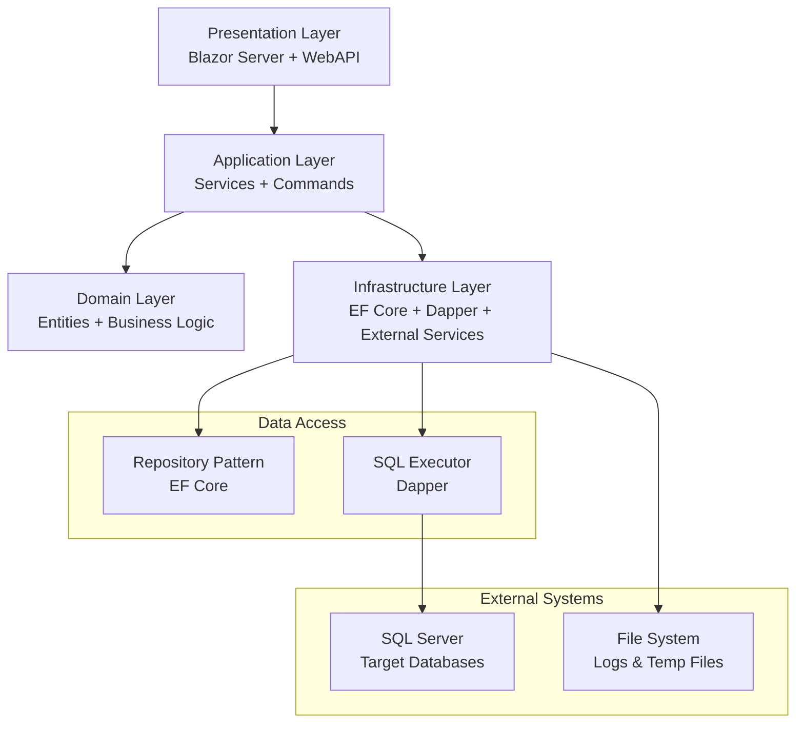

# 新数据库归档工具 - 总体架构设计

> **版本**: 1.0  
> **日期**: 2025年9月29日  
> **设计原则**: 精简架构、快速迭代、模块化开发  

---

## 🏗️ 架构概览

### 设计理念
- **精简至上**: 避免过度设计，专注核心功能实现
- **模块化**: 按功能域划分，支持独立开发和部署
- **快速迭代**: 支持功能模块的快速开发和上线
- **技术先进**: 采用 .NET 8 + Blazor Server 现代技术栈
- **双数据访问**: EF Core 仓储 + Dapper 原生SQL，各司其职

### 技术选型

#### 后端技术栈
- **.NET 8**: 最新长期支持版本，性能优越
- **ASP.NET Core 8**: Web API 和 Blazor Server 支持
- **Entity Framework Core 8**: 配置管理和业务数据持久化
- **Dapper**: 高性能原生 SQL 执行，用于归档脚本
- **Microsoft Extensions**: 依赖注入、配置、日志等基础设施

#### 前端技术栈
- **Blazor Server**: C# 全栈开发，减少技术栈复杂度
- **Ant Design Blazor**: 企业级 UI 组件库
- **SignalR**: 实时通信，用于任务进度推送
- **Bootstrap 5**: 响应式布局支持

#### 数据存储
- **SQL Server**: 工具配置和元数据存储
- **Redis** (可选): 缓存和会话存储
- **文件系统**: 日志文件和临时数据存储

---

## 🔧 系统架构

### 分层架构



#### 1. 表示层 (Presentation Layer)
**职责**: 用户界面和API接口
**技术**: Blazor Server + ASP.NET Core WebAPI

**组件构成**:
- **Blazor Pages**: 用户界面页面
- **Blazor Components**: 可复用UI组件
- **Web API Controllers**: RESTful API接口
- **SignalR Hubs**: 实时通信中心
- **Middleware**: 认证、异常处理、日志中间件

#### 2. 应用层 (Application Layer)
**职责**: 业务流程编排和服务协调
**技术**: .NET 8 Services

**组件构成**:
- **Application Services**: 应用服务，业务流程编排
- **Command Handlers**: 命令处理器，执行具体业务操作
- **Query Services**: 查询服务，数据检索和展示
- **Background Services**: 后台任务服务，定时调度
- **Validators**: 数据验证器
- **Mappers**: 对象映射器 (AutoMapper)

#### 3. 领域层 (Domain Layer)
**职责**: 核心业务逻辑和领域模型
**技术**: .NET 8 Class Libraries

**组件构成**:
- **Entities**: 领域实体对象
- **Value Objects**: 值对象
- **Domain Services**: 领域服务
- **Aggregates**: 聚合根
- **Business Rules**: 业务规则验证
- **Domain Events**: 领域事件 (可选)

#### 4. 基础设施层 (Infrastructure Layer)
**职责**: 技术实现和外部系统集成
**技术**: EF Core + Dapper + 第三方库

**组件构成**:
- **EF Core Repositories**: 仓储模式实现
- **Dapper SQL Executors**: 原生SQL执行器
- **Database Context**: 数据库上下文
- **External Services**: 外部服务集成
- **File Services**: 文件操作服务
- **Caching Services**: 缓存服务

---

## 📁 项目结构

### 解决方案结构
```
DbArchiveTool.sln
├── src/
│   ├── DbArchiveTool.Web/              # Blazor Server 主应用
│   ├── DbArchiveTool.Api/              # Web API (可选独立部署)
│   ├── DbArchiveTool.Application/      # 应用层
│   ├── DbArchiveTool.Domain/           # 领域层
│   ├── DbArchiveTool.Infrastructure/   # 基础设施层
│   └── DbArchiveTool.Shared/           # 共享类库
├── tests/
│   ├── DbArchiveTool.UnitTests/        # 单元测试
│   ├── DbArchiveTool.IntegrationTests/ # 集成测试
│   └── DbArchiveTool.E2ETests/         # 端到端测试
├── docs/                               # 项目文档
├── scripts/                            # 部署脚本
└── docker/                             # Docker配置
```

### 项目详细结构

#### DbArchiveTool.Web (Blazor Server)
```
DbArchiveTool.Web/
├── Components/          # Blazor组件
│   ├── Layout/         # 布局组件
│   ├── Pages/          # 页面组件
│   ├── Shared/         # 共享组件
│   └── Forms/          # 表单组件
├── Controllers/        # API控制器 (如果集成API)
├── Hubs/              # SignalR Hubs
├── wwwroot/           # 静态资源
├── appsettings.json   # 配置文件
└── Program.cs         # 启动文件
```

#### DbArchiveTool.Application (应用层)
```
DbArchiveTool.Application/
├── Services/          # 应用服务
│   ├── DataSourceService.cs
│   ├── PartitionService.cs
│   ├── ArchiveService.cs
│   └── ScheduleService.cs
├── Commands/          # 命令处理
│   ├── CreateDataSource/
│   ├── ExecutePartition/
│   └── StartArchive/
├── Queries/           # 查询服务
├── DTOs/              # 数据传输对象
├── Validators/        # 数据验证器
├── BackgroundServices/ # 后台服务
└── Extensions/        # 扩展方法
```

#### DbArchiveTool.Domain (领域层)
```
DbArchiveTool.Domain/
├── Entities/          # 实体对象
│   ├── DataSource.cs
│   ├── PartitionConfig.cs
│   ├── ArchiveTask.cs
│   └── ExecutionLog.cs
├── ValueObjects/      # 值对象
├── Enums/            # 枚举类型
├── Services/         # 领域服务
├── Interfaces/       # 接口定义
└── Exceptions/       # 自定义异常
```

#### DbArchiveTool.Infrastructure (基础设施层)
```
DbArchiveTool.Infrastructure/
├── Data/             # 数据访问
│   ├── Contexts/     # EF Core 上下文
│   ├── Repositories/ # 仓储实现
│   ├── Configurations/ # EF 实体配置
│   └── Migrations/   # 数据库迁移
├── SqlExecutors/     # Dapper SQL执行器
├── Services/         # 基础设施服务
│   ├── FileService.cs
│   ├── LoggingService.cs
│   └── CacheService.cs
├── ExternalServices/ # 外部服务集成
└── Extensions/       # 扩展方法
```

---

## 💾 数据访问策略

### 双数据访问模式

#### EF Core 仓储模式 - 配置管理
**使用场景**: 工具自身的配置管理和业务数据持久化
**技术特点**: 
- 类型安全、LINQ查询
- 变更跟踪、事务管理
- 代码优先、迁移支持

**应用范围**:
```csharp
// 数据源配置管理
public interface IDataSourceRepository : IRepository<DataSource>
{
    Task<DataSource> GetByNameAsync(string name);
    Task<List<DataSource>> GetActiveDataSourcesAsync();
}

// 归档任务管理
public interface IArchiveTaskRepository : IRepository<ArchiveTask>
{
    Task<List<ArchiveTask>> GetPendingTasksAsync();
    Task<List<ArchiveTask>> GetTasksByStatusAsync(TaskStatus status);
}

// 执行日志管理
public interface IExecutionLogRepository : IRepository<ExecutionLog>
{
    Task<PagedResult<ExecutionLog>> GetPagedLogsAsync(LogQueryFilter filter);
}
```

### 旧工具数据兼容策略

#### 数据迁移与兼容性
**迁移原则**: 
- 旧工具数据表从目标数据库迁移到新工具自身数据库
- 保持数据完整性和历史记录连续性
- 支持增量同步和双向兼容

**旧表结构映射**:
```csharp
// 旧工具配置表 -> 新工具实体映射
public class LegacyDataMigrationService
{
    // PartitionArchive_SourceConfiguration -> DataSource + ArchiveConfiguration
    public async Task MigrateSourceConfigurationAsync(string legacyConnectionString)
    {
        var legacyConfigs = await _dapper.QueryAsync<LegacySourceConfiguration>(
            legacyConnectionString, 
            "SELECT * FROM PartitionArchive_SourceConfiguration WHERE OperationStatus = 1");
            
        foreach (var config in legacyConfigs)
        {
            // 创建数据源
            var dataSource = new DataSource
            {
                Name = config.SourceTableName,
                SourceConnection = ExtractSourceConnection(config),
                TargetConnection = ExtractTargetConnection(config),
                LegacyId = config.SourceConfigurationId
            };
            
            // 创建归档配置
            var archiveConfig = new ArchiveConfiguration
            {
                DataSourceId = dataSource.Id,
                PartitionColumn = config.PartitionColumnName,
                FileGroupMode = (FileGroupMode)config.FileGroupMode,
                EnableAutoArchive = config.EnabledAutoArchive ?? false,
                ArchiveDataType = (ArchiveDataType)config.ArchiveDataType,
                RelativeDays = config.RelativeDays
            };
        }
    }
}
```

#### Dapper 原生SQL - 归档脚本执行
**使用场景**: 数据库归档相关的复杂SQL脚本执行
**技术特点**: 
- 高性能、轻量级
- 原生SQL支持
- 灵活的参数化查询

**应用范围**:
```csharp
// SQL Server 分区操作
public interface ISqlServerPartitionExecutor
{
    Task<bool> CreatePartitionFunctionAsync(string connectionString, CreatePartitionFunctionCommand command);
    Task<bool> SplitPartitionAsync(string connectionString, SplitPartitionCommand command);
    Task<List<PartitionInfo>> GetPartitionInfoAsync(string connectionString, string tableName);
}

// BCP 数据导出导入
public interface IBcpExecutor 
{
    Task<BcpResult> ExportDataAsync(string connectionString, BcpExportOptions options);
    Task<BcpResult> ImportDataAsync(string connectionString, BcpImportOptions options);
}

// 数据库元数据查询
public interface IMetadataQueryService
{
    Task<List<TableInfo>> GetTablesAsync(string connectionString);
    Task<List<IndexInfo>> GetIndexesAsync(string connectionString, string tableName);
    Task<DatabaseInfo> GetDatabaseInfoAsync(string connectionString);
}
```

---

## 🔗 核心模块设计

### 1. 数据源管理模块

#### 领域模型
```csharp
// 数据源实体 - 兼容旧工具数据源配置
public class DataSource : BaseEntity
{
    public string Name { get; set; }
    public string Description { get; set; }
    public DatabaseType DatabaseType { get; set; }
    public ConnectionConfig SourceConnection { get; set; }
    public ConnectionConfig TargetConnection { get; set; }
    public bool IsActive { get; set; }
    public DateTime CreatedAt { get; set; }
    public DateTime? LastValidatedAt { get; set; }
    
    // 兼容性字段
    public string? LegacySourceConfigId { get; set; } // 对应 PartitionArchive_SourceConfiguration.SourceConfigurationId
    public int? LegacyOperationStatus { get; set; }
    
    // 导航属性
    public List<ArchiveConfiguration> ArchiveConfigurations { get; set; } = new();
    public List<ArchiveTask> ArchiveTasks { get; set; } = new();
}

// 归档配置 - 兼容旧工具分区和自动归档配置
public class ArchiveConfiguration : BaseEntity
{
    public Guid DataSourceId { get; set; }
    public string SourceTableName { get; set; }
    public string TargetTableName { get; set; }
    public string PartitionColumnName { get; set; }
    public string? PartitionValues { get; set; } // JSON格式存储
    public FileGroupMode FileGroupMode { get; set; }
    public int FileSize { get; set; } = 100; // MB
    public int FileGrowth { get; set; } = 50; // MB
    
    // 自动归档配置
    public bool EnableAutoArchive { get; set; }
    public ArchiveDataType ArchiveDataType { get; set; }
    public string? AutoArchivePartitionValues { get; set; }
    public int? RelativeDays { get; set; }
    public AutoArchiveTimeType AutoArchiveTimeType { get; set; }
    public string? AutoArchiveTimeValue { get; set; }
    
    public string? Remark { get; set; }
    
    // 导航属性
    public DataSource DataSource { get; set; }
}

// 归档任务执行记录 - 兼容旧工具操作日志
public class ArchiveTask : BaseEntity
{
    public Guid DataSourceId { get; set; }
    public string SourceTableName { get; set; }
    public string TargetTableName { get; set; }
    public ArchiveTaskType TaskType { get; set; } // 归档、分区创建、分区维护等
    public ArchiveTaskStatus Status { get; set; }
    public bool IsAutoArchive { get; set; }
    
    // 执行信息
    public DateTime? StartedAt { get; set; }
    public DateTime? CompletedAt { get; set; }
    public TimeSpan? Duration => CompletedAt - StartedAt;
    
    // 数据统计
    public long? SourceRowCount { get; set; }
    public long? TargetRowCount { get; set; }
    public long? SuccessfulRows { get; set; }
    
    // 执行环境信息 - 兼容旧工具环境记录
    public string MachineName { get; set; }
    public string? InternalIP { get; set; }
    public string? ExternalIP { get; set; }
    public string ExecutorUser { get; set; }
    
    // 错误和备注
    public string? ErrorMessage { get; set; }
    public string? WhereSql { get; set; }
    public string? Remark { get; set; }
    public string? RichTextContent { get; set; } // 对应旧工具 RtfContent
    
    // 兼容性字段
    public string? LegacyOperationRecordId { get; set; }
    
    // 导航属性
    public DataSource DataSource { get; set; }
    public List<ArchivePartitionDetail> PartitionDetails { get; set; } = new();
}

// 分区归档明细 - 兼容旧工具分区明细记录
public class ArchivePartitionDetail : BaseEntity
{
    public Guid ArchiveTaskId { get; set; }
    public int PartitionNumber { get; set; }
    public string? PartitionName { get; set; }
    public long ArchiveRows { get; set; }
    public ArchiveDetailStatus Status { get; set; }
    
    // 性能指标 - 保持与旧工具一致
    public double? SwitchTimeConsuming { get; set; } // 秒
    public double? QueryoutTimeConsuming { get; set; } // 秒  
    public double? ImportTimeConsuming { get; set; } // 秒
    
    // 文件信息
    public string? ExportFilePath { get; set; } // 对应旧工具 XmlFilePath，支持多种格式
    public string? ExportFileFormat { get; set; } // XML、BCP、CSV等
    
    public string? Remark { get; set; }
    
    // 兼容性字段
    public string? LegacyDetailId { get; set; }
    
    // 导航属性
    public ArchiveTask ArchiveTask { get; set; }
}

// 系统配置 - 兼容旧工具系统设置
public class SystemConfiguration : BaseEntity
{
    public string ConfigKey { get; set; }
    public string ConfigValue { get; set; }
    public string? Description { get; set; }
    public bool IsEncrypted { get; set; } // 敏感配置加密存储
    public ConfigScope Scope { get; set; } // Global、DataSource等
    
    // 兼容旧工具常用配置
    public static class Keys
    {
        public const string DefaultTargetServer = "DefaultTargetServer";
        public const string DefaultTargetUsername = "DefaultTargetUsername";
        public const string DefaultTargetPassword = "DefaultTargetPassword"; // 加密存储
        public const string TempFileDirectory = "TempFileDirectory"; // 对应 XMLFolder
        public const string EnableLogShrink = "EnableLogShrink"; // 对应 IsShrinkLogFile
        public const string MaxConcurrentTasks = "MaxConcurrentTasks";
        public const string DefaultTimeout = "DefaultTimeout";
    }
}

// 枚举定义 - 与旧工具保持兼容
public enum ArchiveDataType
{
    SpecifiedPartitions = 1, // 指定分区
    RelativeTime = 2         // 相对时间
}

public enum FileGroupMode
{
    SingleFileGroupSingleFile = 1, // 单文件组单文件
    SingleFileGroupMultiFile = 2,  // 单文件组多文件  
    MultiFileGroupSingleFile = 3,  // 多文件组单文件
    PrimaryFileGroup = 4           // 主文件组
}

public enum AutoArchiveTimeType
{
    ByInterval = 1, // 按时间间隔
    ByDays = 2      // 按天数
}

public enum ArchiveTaskStatus
{
    Pending = 1,
    Running = 2,
    Success = 3,
    Failed = 4,
    Cancelled = 5
}

public enum ArchiveDetailStatus
{
    Pending = 1,
    SwitchCompleted = 2,
    ExportCompleted = 3,
    ImportCompleted = 4,
    Success = 5,
    Failed = 6
}

public enum ArchiveTaskType
{
    DataArchive = 1,      // 数据归档 - 对应旧工具主要功能
    CreatePartition = 2,   // 创建分区
    AddPartition = 3,      // 添加分区
    DropPartition = 4,     // 删除分区  
    MaintainPartition = 5  // 分区维护
}

public class ConnectionConfig : ValueObject
{
    public string Server { get; set; }
    public string Database { get; set; }
    public string Username { get; set; }
    public string Password { get; set; }
    public int Port { get; set; }
    public bool UseIntegratedSecurity { get; set; }
    public string ConnectionString => BuildConnectionString();
    
    private string BuildConnectionString()
    {
        if (UseIntegratedSecurity)
        {
            return $"Server={Server},{Port};Database={Database};Trusted_Connection=true;";
        }
        return $"Server={Server},{Port};Database={Database};User Id={Username};Password={Password};";
    }
}
```

#### 应用服务
```csharp
public class DataSourceService : IDataSourceService
{
    private readonly IDataSourceRepository _repository;
    private readonly IConnectionValidator _validator;
    private readonly ILegacyDataMigrationService _migrationService;
    private readonly ILogger<DataSourceService> _logger;

    public async Task<Result<DataSource>> CreateDataSourceAsync(CreateDataSourceDto dto)
    {
        // 1. 验证连接配置
        var validationResult = await _validator.ValidateConnectionsAsync(dto);
        if (!validationResult.IsSuccess)
            return Result<DataSource>.Failure(validationResult.Error);

        // 2. 创建领域对象
        var dataSource = DataSource.Create(dto.Name, dto.Description, dto.SourceConnection, dto.TargetConnection);
        
        // 3. 保存到仓储
        await _repository.AddAsync(dataSource);
        
        return Result<DataSource>.Success(dataSource);
    }
    
    // 兼容性方法 - 导入旧工具数据源配置
    public async Task<Result> ImportLegacyDataSourcesAsync(string legacyConnectionString)
    {
        try
        {
            await _migrationService.MigrateSourceConfigurationsAsync(legacyConnectionString);
            return Result.Success();
        }
        catch (Exception ex)
        {
            _logger.LogError(ex, "Failed to import legacy data sources");
            return Result.Failure($"导入失败: {ex.Message}");
        }
    }
}

// 数据迁移服务 - 处理旧工具数据兼容
public class LegacyDataMigrationService : ILegacyDataMigrationService
{
    private readonly ISqlExecutor _sqlExecutor;
    private readonly IDataSourceRepository _dataSourceRepository;
    private readonly IArchiveConfigurationRepository _configRepository;
    private readonly IArchiveTaskRepository _taskRepository;

    public async Task MigrateSourceConfigurationsAsync(string legacyConnectionString)
    {
        // 1. 读取旧工具配置表数据
        var legacyConfigs = await _sqlExecutor.QueryAsync<LegacySourceConfigDto>(
            legacyConnectionString,
            @"SELECT SourceConfigurationId, SourceTableName, TargetDatabase, TargetTableName,
                     PartitionColumnName, PartitionValues, OperationStatus, FileGroupMode,
                     FileSize, FileGrowth, Remark, CreateDate, EnabledAutoArchive,
                     ArchiveDataType, AutoArchivePartitionValues, RelativeDays,
                     AutoArchiveTimeType, AutoArchiveTimeValue
              FROM PartitionArchive_SourceConfiguration 
              WHERE OperationStatus = 1");

        // 2. 转换并保存到新数据模型
        foreach (var config in legacyConfigs)
        {
            await MigrateSourceConfiguration(config, legacyConnectionString);
        }
    }

    public async Task MigrateArchiveOperationRecordsAsync(string legacyConnectionString)
    {
        // 迁移归档操作记录
        var legacyRecords = await _sqlExecutor.QueryAsync<LegacyArchiveRecordDto>(
            legacyConnectionString,
            @"SELECT ArchiveOperationRecordId, IsAutoArchive, ArchiveSuccessRows,
                     MachineName, IntranetIP, InternetIP, SourceServerIP,
                     SourceDBUserName, SourceDataBaseaName, SourceTableName,
                     TargetServerIP, TargetDBUserName, TargetDataBaseaName,
                     TargetTableName, DataArchiveStatus, ArchiveDate,
                     Remark, CreateDate, WhereSql, RtfContent
              FROM PartitionArchive_ArchiveOperationRecord");

        foreach (var record in legacyRecords)
        {
            await MigrateArchiveOperationRecord(record, legacyConnectionString);
        }
    }

    public async Task MigratePartitionDetailsAsync(string legacyConnectionString)
    {
        // 迁移分区明细记录
        var legacyDetails = await _sqlExecutor.QueryAsync<LegacyPartitionDetailDto>(
            legacyConnectionString,
            @"SELECT ArchivePartitionDetailId, ArchiveOperationRecordId,
                     PartitionNum, PartitionName, ArchiveRows, SwitchTimeConsuming,
                     DataArchiveStatus, XmlFilePath, QueryoutTimeConsuming,
                     InTimeConsuming, Remark, CreateUserId, CreateDate
              FROM PartitionArchive_ArchivePartitionDetail");

        foreach (var detail in legacyDetails)
        {
            await MigratePartitionDetail(detail);
        }
    }

    private async Task MigrateSourceConfiguration(LegacySourceConfigDto config, string legacyConnectionString)
    {
        // 检查是否已导入
        var existing = await _dataSourceRepository.GetByLegacyIdAsync(config.SourceConfigurationId);
        if (existing != null) return;

        // 创建数据源
        var dataSource = new DataSource
        {
            Name = config.SourceTableName ?? "UnknownSource",
            Description = config.Remark ?? "",
            DatabaseType = DatabaseType.SqlServer,
            SourceConnection = await ExtractSourceConnectionAsync(legacyConnectionString),
            TargetConnection = CreateTargetConnection(config.TargetDatabase),
            IsActive = config.OperationStatus == 1,
            CreatedAt = config.CreateDate ?? DateTime.Now,
            LegacySourceConfigId = config.SourceConfigurationId
        };

        await _dataSourceRepository.AddAsync(dataSource);

        // 创建归档配置
        var archiveConfig = new ArchiveConfiguration
        {
            DataSourceId = dataSource.Id,
            SourceTableName = config.SourceTableName ?? "",
            TargetTableName = config.TargetTableName ?? "",
            PartitionColumnName = config.PartitionColumnName ?? "",
            PartitionValues = config.PartitionValues,
            FileGroupMode = (FileGroupMode)(config.FileGroupMode ?? 1),
            FileSize = config.FileSize ?? 100,
            FileGrowth = config.FileGrowth ?? 50,
            EnableAutoArchive = config.EnabledAutoArchive ?? false,
            ArchiveDataType = (ArchiveDataType)(config.ArchiveDataType ?? 1),
            AutoArchivePartitionValues = config.AutoArchivePartitionValues,
            RelativeDays = config.RelativeDays,
            AutoArchiveTimeType = (AutoArchiveTimeType)(config.AutoArchiveTimeType ?? 1),
            AutoArchiveTimeValue = config.AutoArchiveTimeValue,
            Remark = config.Remark
        };

        await _configRepository.AddAsync(archiveConfig);
    }
}
```

### 2. 分区管理模块

#### 核心服务
```csharp
public class PartitionService : IPartitionService
{
    private readonly ISqlServerPartitionExecutor _partitionExecutor;
    private readonly IPartitionConfigRepository _configRepository;
    private readonly IExecutionLogRepository _logRepository;

    public async Task<Result> ExecutePartitionAsync(ExecutePartitionCommand command)
    {
        var executionLog = new ExecutionLog(command.TableName, OperationType.CreatePartition);
        
        try
        {
            // 1. 前置检查
            var preCheckResult = await PreCheckAsync(command);
            if (!preCheckResult.IsSuccess)
                return preCheckResult;

            // 2. 创建分区函数
            await _partitionExecutor.CreatePartitionFunctionAsync(command.ConnectionString, command);
            
            // 3. 创建分区方案
            await _partitionExecutor.CreatePartitionSchemeAsync(command.ConnectionString, command);
            
            // 4. 重建索引
            await _partitionExecutor.RebuildIndexesAsync(command.ConnectionString, command);
            
            executionLog.MarkSuccess();
            return Result.Success();
        }
        catch (Exception ex)
        {
            executionLog.MarkFailure(ex.Message);
            throw;
        }
        finally
        {
            await _logRepository.AddAsync(executionLog);
        }
    }
}
```

### 3. 数据归档模块

#### 归档引擎
```csharp
public class ArchiveEngine : IArchiveEngine
{
    private readonly IBcpExecutor _bcpExecutor;
    private readonly IMetadataQueryService _metadataService;
    private readonly IArchiveTaskRepository _taskRepository;

    public async Task<ArchiveResult> ExecuteArchiveAsync(ArchiveTask task)
    {
        var result = new ArchiveResult(task.Id);
        
        try
        {
            // 1. 结构一致性检查
            var structureCheck = await ValidateTableStructureAsync(task);
            if (!structureCheck.IsValid)
                return result.WithError("表结构不一致");

            // 2. 分区数据切换
            await SwitchPartitionAsync(task);
            
            // 3. BCP 导出数据
            var exportResult = await _bcpExecutor.ExportDataAsync(task.SourceConnectionString, task.ExportOptions);
            result.ExportedRows = exportResult.ProcessedRows;
            
            // 4. BCP 导入数据
            var importResult = await _bcpExecutor.ImportDataAsync(task.TargetConnectionString, task.ImportOptions);
            result.ImportedRows = importResult.ProcessedRows;
            
            // 5. 数据一致性验证
            var consistencyCheck = await ValidateDataConsistencyAsync(task, result);
            if (!consistencyCheck.IsValid)
                return result.WithError("数据一致性验证失败");
                
            return result.WithSuccess();
        }
        catch (Exception ex)
        {
            return result.WithError(ex.Message);
        }
    }
}
```

---

## 🎛️ 前端架构设计

### Blazor Server + Ant Design

#### 页面结构
```csharp
// 数据源管理页面
@page "/datasources"
@using AntDesign

<PageHeader Title="数据源管理" />

<Card>
    <AntDesign.Table TItem="DataSourceDto" DataSource="dataSources">
        <AntDesign.Column TData="string" DataIndex="Name" Title="名称" />
        <AntDesign.Column TData="string" DataIndex="DatabaseType" Title="数据库类型" />
        <AntDesign.Column TData="DateTime" DataIndex="CreatedAt" Title="创建时间" />
        <ActionColumn>
            <AntDesign.Button Type="primary" Size="small" OnClick="() => EditDataSource(context.Id)">
                编辑
            </AntDesign.Button>
        </ActionColumn>
    </AntDesign.Table>
</Card>

@code {
    private List<DataSourceDto> dataSources = new();

    protected override async Task OnInitializedAsync()
    {
        dataSources = await DataSourceService.GetAllAsync();
    }
}
```

#### 组件设计原则
- **组件化**: 可复用的UI组件
- **响应式**: 支持不同屏幕尺寸
- **实时更新**: 通过SignalR推送任务进度
- **表单验证**: 内置验证规则和错误提示

#### SignalR 实时通信
```csharp
// 实时任务状态推送
public class TaskProgressHub : Hub
{
    public async Task JoinTaskGroup(string taskId)
    {
        await Groups.AddToGroupAsync(Context.ConnectionId, $"task-{taskId}");
    }

    public async Task SendProgress(string taskId, int progress, string message)
    {
        await Clients.Group($"task-{taskId}").SendAsync("UpdateProgress", progress, message);
    }
}
```

---

## ⚙️ 配置和部署

### 配置管理
```json
// appsettings.json
{
  "ConnectionStrings": {
    "DefaultConnection": "Server=localhost;Database=DbArchiveToolDb;Trusted_Connection=true;",
    "Redis": "localhost:6379"
  },
  "ArchiveSettings": {
    "TempDirectory": "C:\\Temp\\DbArchive",
    "MaxConcurrentTasks": 5,
    "DefaultTimeout": "00:30:00"
  },
  "Logging": {
    "LogLevel": {
      "Default": "Information",
      "Microsoft.AspNetCore": "Warning"
    }
  }
}
```

### Docker 部署
```dockerfile
# Dockerfile
FROM mcr.microsoft.com/dotnet/aspnet:8.0 AS base
WORKDIR /app
EXPOSE 80
EXPOSE 443

FROM mcr.microsoft.com/dotnet/sdk:8.0 AS build
WORKDIR /src
COPY ["DbArchiveTool.Web/DbArchiveTool.Web.csproj", "DbArchiveTool.Web/"]
RUN dotnet restore "DbArchiveTool.Web/DbArchiveTool.Web.csproj"
COPY . .
WORKDIR "/src/DbArchiveTool.Web"
RUN dotnet build "DbArchiveTool.Web.csproj" -c Release -o /app/build

FROM build AS publish
RUN dotnet publish "DbArchiveTool.Web.csproj" -c Release -o /app/publish

FROM base AS final
WORKDIR /app
COPY --from=publish /app/publish .
ENTRYPOINT ["dotnet", "DbArchiveTool.Web.dll"]
```

---

## 📏 开发规范

### 命名约定
- **类名**: PascalCase (例: `DataSourceService`)
- **方法名**: PascalCase (例: `CreateDataSourceAsync`)
- **变量名**: camelCase (例: `dataSource`)
- **常量**: PascalCase (例: `MaxRetryCount`)
- **接口**: I + PascalCase (例: `IDataSourceRepository`)

### 代码组织
- **单一职责**: 每个类只负责一个功能
- **依赖注入**: 所有依赖通过构造函数注入
- **异步优先**: 所有IO操作使用异步方法
- **异常处理**: 使用 Result 模式替代异常传递业务错误

### API 设计规范
```csharp
// RESTful API 示例
[ApiController]
[Route("api/[controller]")]
public class DataSourcesController : ControllerBase
{
    [HttpGet]
    public async Task<ActionResult<PagedResult<DataSourceDto>>> GetDataSources(
        [FromQuery] DataSourceQueryFilter filter)
    {
        var result = await _dataSourceService.GetPagedDataSourcesAsync(filter);
        return Ok(result);
    }

    [HttpPost]
    public async Task<ActionResult<DataSourceDto>> CreateDataSource(
        [FromBody] CreateDataSourceDto dto)
    {
        var result = await _dataSourceService.CreateDataSourceAsync(dto);
        if (!result.IsSuccess)
            return BadRequest(result.Error);
            
        return CreatedAtAction(nameof(GetDataSource), new { id = result.Value.Id }, result.Value);
    }
}
```

---

## 🔄 开发流程

### 迭代计划
1. **第一阶段**: 核心数据访问层 + 基础UI框架
2. **第二阶段**: 数据源管理 + 分区基础功能
3. **第三阶段**: 归档执行引擎 + 监控面板
4. **第四阶段**: 调度系统 + 高级功能
5. **第五阶段**: 性能优化 + 部署支持

### 技术选型理由

#### .NET 8 + Blazor Server
- **统一技术栈**: C# 全栈开发，减少学习成本
- **快速开发**: Blazor Server 无需前后端分离的复杂性
- **实时交互**: SignalR 内置支持，适合任务进度推送
- **性能优势**: .NET 8 性能显著提升

#### Ant Design Blazor
- **企业级UI**: 专业的企业级组件库
- **完整生态**: 表格、表单、图表等全套组件
- **中文友好**: 官方中文文档和社区支持
- **快速上手**: 与 Ant Design React 设计一致

#### EF Core + Dapper 双访问
- **各司其职**: EF Core 处理配置管理，Dapper 执行归档SQL
- **性能平衡**: 在开发效率和执行性能间找到平衡
- **灵活性**: 复杂SQL用Dapper，业务逻辑用EF Core

---

*本架构设计遵循精简、实用、快速迭代的原则，为新数据库归档工具提供了清晰的技术方案和开发指导。*