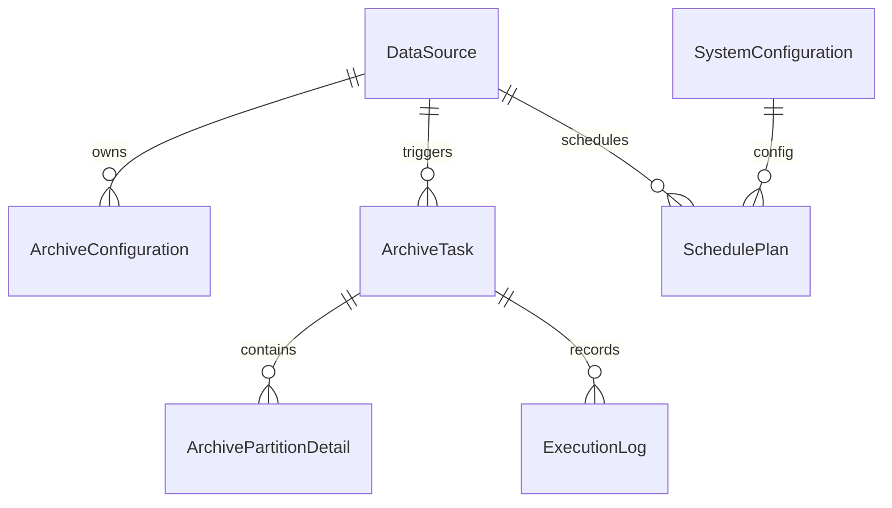
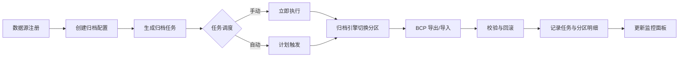
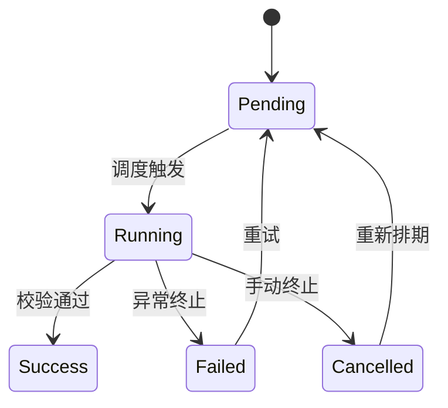
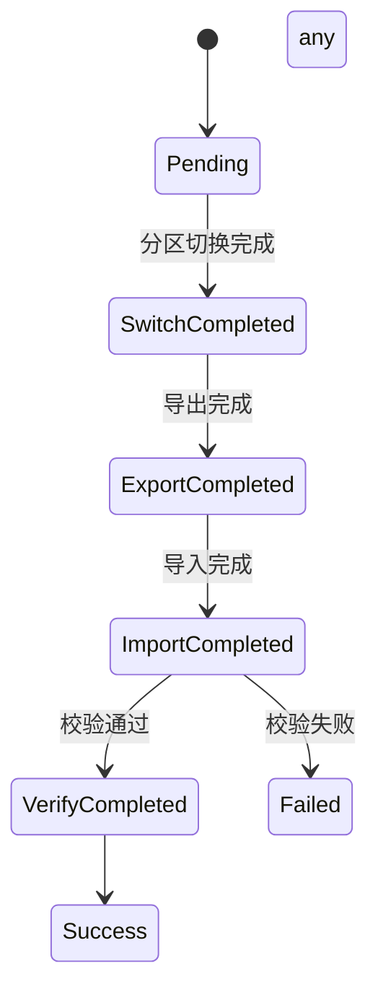

# 数据模型与 API 规范

> **版本**: 1.0  
> **日期**: 2025年9月30日  
> **范围**: 核心数据模型、实体关系、数据流、API 设计、状态机、兼容旧工具字段

---

## 1. 数据模型总览

### 1.1 领域实体列表
| 实体 | 描述 | 关键字段 | 兼容旧工具字段 |
|------|------|----------|----------------|
| `DataSource` | 数据源与归档目标配置 | `Id`, `Name`, `SourceConnection`, `TargetConnection` | `LegacySourceConfigId`, `LegacyOperationStatus` |
| `ArchiveConfiguration` | 单表级归档策略 | `Id`, `DataSourceId`, `PartitionColumnName`, `FileGroupMode` | 对应 `SourceConfiguration` 相关字段 |
| `ArchiveTask` | 每次归档任务记录 | `Id`, `DataSourceId`, `TaskType`, `Status` | `LegacyOperationRecordId`, 环境信息 |
| `ArchivePartitionDetail` | 分区级别执行明细 | `Id`, `ArchiveTaskId`, `PartitionNumber`, `Status` | `LegacyDetailId` |
| `SystemConfiguration` | 系统级配置项 | `Id`, `ConfigKey`, `ConfigValue` | 标记 `LegacyMigrated` |
| `SchedulePlan` | 自动归档调度计划 | `Id`, `CronExpression`, `Enabled` | - |
| `ExecutionLog` | 通用操作日志 | `Id`, `OperationType`, `Status`, `Payload` | `LegacyOperationRecordId` 可选 |

### 1.2 实体关系图


---

## 2. 数据流与状态

### 2.1 核心业务流程


### 2.2 任务状态机


### 2.3 分区明细状态机


---

## 3. 核心实体详细设计

### 3.1 `ArchiveDataSource` (数据源)
```csharp
public class ArchiveDataSource : AggregateRoot
{
    public string Name { get; private set; } = string.Empty;
    public string? Description { get; private set; }
    
    // 源服务器配置
    public string ServerAddress { get; private set; } = string.Empty;
    public int ServerPort { get; private set; } = 1433;
    public string DatabaseName { get; private set; } = string.Empty;
    public string? UserName { get; private set; }
    public string? Password { get; private set; }
    public bool UseIntegratedSecurity { get; private set; }
    
    // 目标服务器配置（用于归档数据存储）
    public bool UseSourceAsTarget { get; private set; } = true;
    public string? TargetServerAddress { get; private set; }
    public int TargetServerPort { get; private set; } = 1433;
    public string? TargetDatabaseName { get; private set; }
    public bool TargetUseIntegratedSecurity { get; private set; }
    public string? TargetUserName { get; private set; }
    public string? TargetPassword { get; private set; }

    public bool IsEnabled { get; private set; } = true;
}
```

#### 字段说明
| 字段 | 类型 | 约束 | 说明 |
|------|------|------|------|
| `Name` | NVARCHAR(100) | 唯一,非空 | 数据源显示名称 |
| `Description` | NVARCHAR(500) | 可空 | 数据源备注描述 |
| **源服务器字段** | | | |
| `ServerAddress` | NVARCHAR(200) | 非空 | 源服务器地址或主机名 |
| `ServerPort` | INT | 非空,默认1433 | 源服务器端口号 |
| `DatabaseName` | NVARCHAR(100) | 非空 | 源数据库名称 |
| `UserName` | NVARCHAR(100) | 可空 | SQL身份验证用户名 |
| `Password` | NVARCHAR(200) | 可空 | SQL身份验证密码 |
| `UseIntegratedSecurity` | BIT | 非空 | 是否使用Windows集成认证 |
| **目标服务器字段** | | | |
| `UseSourceAsTarget` | BIT | 非空,默认true | 是否使用源服务器作为目标服务器 |
| `TargetServerAddress` | NVARCHAR(200) | 可空 | 目标服务器地址,UseSourceAsTarget=false时必填 |
| `TargetServerPort` | INT | 非空,默认1433 | 目标服务器端口号 |
| `TargetDatabaseName` | NVARCHAR(100) | 可空 | 目标数据库名称,UseSourceAsTarget=false时必填 |
| `TargetUseIntegratedSecurity` | BIT | 非空 | 目标服务器是否使用集成认证 |
| `TargetUserName` | NVARCHAR(100) | 可空 | 目标服务器SQL用户名 |
| `TargetPassword` | NVARCHAR(200) | 可空 | 目标服务器SQL密码 |
| `IsEnabled` | BIT | 非空 | 是否启用当前数据源 |

> **说明**:
> - 当 `UseSourceAsTarget = true` 时,归档数据将存储在源服务器的指定数据库中,目标服务器字段可为空。
> - 当 `UseSourceAsTarget = false` 时,必须完整配置目标服务器信息,归档数据将导出到独立的目标服务器。
> - **密码加密机制**:
>   - 所有密码字段 (`Password`, `TargetPassword`) 在存储时使用 **ASP.NET Core Data Protection API** 加密
>   - 加密后的密码以 `ENCRYPTED:` 前缀标识,确保向后兼容
>   - 加密算法: AES-256-CBC (由 Data Protection API 自动管理)
>   - Purpose: `DbArchiveTool.PasswordProtection` (确保密钥隔离)
>   - 密码仅在需要建立数据库连接时解密,其他时候保持加密状态
>   - 前端更新时空值表示保留原密码,不会触发重新加密

### 3.2 `ArchiveConfiguration`
```csharp
public sealed class ArchiveConfiguration : AggregateRoot
{
  public string Name { get; private set; } = string.Empty;
  public string? Description { get; private set; }
  public Guid DataSourceId { get; private set; }
  public string SourceSchemaName { get; private set; } = "dbo";
  public string SourceTableName { get; private set; } = string.Empty;
  public string? TargetSchemaName { get; private set; }
  public string? TargetTableName { get; private set; }
  public bool IsPartitionedTable { get; private set; }
  public Guid? PartitionConfigurationId { get; private set; }
  public string? ArchiveFilterColumn { get; private set; }
  public string? ArchiveFilterCondition { get; private set; }
  public ArchiveMethod ArchiveMethod { get; private set; }
  public bool DeleteSourceDataAfterArchive { get; private set; } = true;
  public int BatchSize { get; private set; } = 10000;
  public bool EnableScheduledArchive { get; private set; }
  public string? CronExpression { get; private set; }
  public DateTime? NextArchiveAtUtc { get; private set; }
  public bool IsEnabled { get; private set; } = true;
  public DateTime? LastExecutionTimeUtc { get; private set; }
  public string? LastExecutionStatus { get; private set; }
  public long? LastArchivedRowCount { get; private set; }
}
```

#### 字段重点
| 字段 | 类型 | 说明 |
|------|------|------|
| `TargetSchemaName` | NVARCHAR(128) | 可选,默认继承源架构,用于将归档数据写入独立架构。 |
| `TargetTableName` | NVARCHAR(128) | 可选,默认继承源表,用于落地到独立归档表。 |
| `EnableScheduledArchive` | BIT | 是否启用 Hangfire 定时任务,启用时需同时提供 `CronExpression`。 |
| `CronExpression` | NVARCHAR(120) | NCrontab 语法,支持 5/6 段表达式。系统会通过 `CronScheduleHelper` 计算下一次触发时间。 |
| `NextArchiveAtUtc` | DATETIME2 | 最近一次计算出的归档触发时间(UTC),用于界面展示与后续调度。 |
| `LastExecutionStatus` | NVARCHAR(32) | 最近一次归档执行的状态,取值 `Success`/`Failed`。 |
| `LastArchivedRowCount` | BIGINT | 最近一次归档成功写入的行数。 |

### 3.3 `ArchiveTask`
```csharp
public class ArchiveTask : BaseEntity
{
    public Guid DataSourceId { get; set; }
    public Guid ArchiveConfigurationId { get; set; }
    public ArchiveTaskType TaskType { get; set; }
    public ArchiveTaskStatus Status { get; set; } = ArchiveTaskStatus.Pending;
    public bool IsAutoArchive { get; set; }

    public DateTime? StartedAt { get; set; }
    public DateTime? CompletedAt { get; set; }
    public long? SourceRowCount { get; set; }
    public long? TargetRowCount { get; set; }
    public long? SuccessfulRows { get; set; }

    // 运行环境
    public string MachineName { get; set; } = Environment.MachineName;
    public string? InternalIP { get; set; }
    public string? ExternalIP { get; set; }
    public string ExecutorUser { get; set; } = string.Empty;

    // 兼容旧工具
    public string? LegacyOperationRecordId { get; set; }
    public string? WhereSql { get; set; }
    public string? RichTextContent { get; set; }

    public string? ErrorMessage { get; set; }
    public string? Remark { get; set; }

    public DataSource DataSource { get; set; } = default!;
    public ArchiveConfiguration ArchiveConfiguration { get; set; } = default!;
    public List<ArchivePartitionDetail> PartitionDetails { get; set; } = new();
}
```

### 3.4 `ArchivePartitionDetail`
```csharp
public class ArchivePartitionDetail : BaseEntity
{
    public Guid ArchiveTaskId { get; set; }
    public int PartitionNumber { get; set; }
    public string? PartitionName { get; set; }
    public long ArchiveRows { get; set; }
    public ArchiveDetailStatus Status { get; set; }

    public double? SwitchTimeConsuming { get; set; }
    public double? ExportTimeConsuming { get; set; }
    public double? ImportTimeConsuming { get; set; }
    public double? VerifyTimeConsuming { get; set; }

    public string? ExportFilePath { get; set; }
    public string? ExportFileFormat { get; set; }
    public string? Remark { get; set; }

    public string? LegacyDetailId { get; set; }

    public ArchiveTask ArchiveTask { get; set; } = default!;
}
```

---

## 4. API 规范

### 4.1 命名与版本
- 基础路由: `api/v1/{resource}`
- 资源使用复数形式，如 `datasources`, `archive-configs`
- 使用 `Accept` 头控制不同数据格式（默认 `application/json`）

### 4.2 统一响应模型
```json
{
  "isSuccess": true,
  "value": { /* 业务数据 */ },
  "error": null,
  "traceId": "00-4bf92f3577b34da6a3ce929d0e0e4736-00f067aa0ba902b7-00"
}
```

### 4.3 分页模型
```json
{
  "items": [ /* 数据列表 */ ],
  "total": 120,
  "page": 1,
  "pageSize": 20
}
```

### 4.4 数据源管理 API
| 方法 | 路径 | 说明 | 请求示例 |
|------|------|------|----------|
| GET | `/api/v1/archive-data-sources` | 列表查询 | `?keyword=&isEnabled=true&page=1&pageSize=20` |
| GET | `/api/v1/archive-data-sources/{id}` | 获取详情 | - |
| POST | `/api/v1/archive-data-sources` | 新增数据源 | 见下 |
| PUT | `/api/v1/archive-data-sources/{id}` | 更新数据源 | - |
| PUT | `/api/v1/archive-data-sources/{id}/target-server` | **更新目标服务器配置** | 见下 |
| DELETE | `/api/v1/archive-data-sources/{id}` | 删除数据源 | - |

#### 新增数据源请求示例
```json
{
  "name": "生产订单库",
  "description": "生产环境订单数据源",
  "serverAddress": "10.0.0.5",
  "serverPort": 1433,
  "databaseName": "OrderDB",
  "useIntegratedSecurity": false,
  "userName": "archiveuser",
  "password": "SecureP@ss123",
  "useSourceAsTarget": true
}
```

#### 更新目标服务器配置请求示例
```json
{
  "useSourceAsTarget": false,
  "targetServerAddress": "10.0.0.100",
  "targetServerPort": 1433,
  "targetDatabaseName": "ArchiveDB",
  "targetUseIntegratedSecurity": false,
  "targetUserName": "archive_admin",
  "targetPassword": "ArchiveP@ss456"
}
```

> **说明**:
> - `/target-server` 端点专用于更新目标服务器配置,不影响源服务器信息
> - 当 `useSourceAsTarget = true` 时,目标服务器字段可省略或为空
> - 密码字段为空字符串或 null 时,保留原有密码不更新
> - 更新后会验证目标服务器连接有效性(如果 `useSourceAsTarget = false`)


### 4.5 归档配置 API
| 方法 | 路径 | 说明 |
|------|------|------|
| GET | `/api/v1/archive-configurations` | 列表查询,支持 `dataSourceId`、`isEnabled` 筛选。 |
| GET | `/api/v1/archive-configurations/{id}` | 获取单个配置详情。 |
| POST | `/api/v1/archive-configurations` | 创建归档配置,自动计算 `nextArchiveAtUtc` 并推送 Hangfire 周期任务。 |
| PUT | `/api/v1/archive-configurations/{id}` | 更新归档配置,重新计算下一次执行时间并同步 Hangfire。 |
| DELETE | `/api/v1/archive-configurations/{id}` | 软删除配置,移除关联的 Hangfire 周期任务。 |
| POST | `/api/v1/archive-configurations/{id}/enable` | 启用配置,根据当前设置重新注册 Hangfire 周期任务。 |
| POST | `/api/v1/archive-configurations/{id}/disable` | 禁用配置,确保 Hangfire 周期任务被移除。 |

#### 4.5.1 请求体与字段
| 字段 | 说明 |
|------|------|
| `sourceSchemaName` / `sourceTableName` | 必填,指定归档来源表。 |
| `targetSchemaName` / `targetTableName` | 可选,未提供时沿用源表结构;提供后归档数据将写入独立架构/表。 |
| `archiveMethod` | 归档策略,支持 `Bcp`、`BulkCopy`、`PartitionSwitch`。非分区表选择非 `PartitionSwitch` 时必须提供过滤条件。 |
| `archiveFilterColumn` / `archiveFilterCondition` | 非分区表必填,用于拼接 WHERE 条件。 |
| `enableScheduledArchive` | 是否启用定时归档。启用时必须同时提供合法的 `cronExpression`。 |
| `cronExpression` | NCrontab 语法的 Cron 表达式,支持 6 段(含秒)。后端通过 `CronScheduleHelper` 验证并计算下一次执行时间。 |
| `nextArchiveAtUtc` | 仅响应中返回,记录下一次计划执行时间(UTC)。 |

#### 4.5.2 调度同步策略
- 控制器在创建、更新、启用、禁用、删除配置时都会调用 `IArchiveTaskScheduler` 同步 Hangfire 周期任务。
- 当配置未启用或未开启定时归档时,调度器会移除对应的周期任务,确保不会触发历史任务。
- Cron 验证失败会返回 `400 BadRequest`,避免写入非法调度计划。
- 详细调度实现见《Hangfire集成说明.md》中的“归档配置同步策略”章节。

### 4.6 归档任务 API
| 方法 | 路径 | 说明 |
|------|------|------|
| GET | `/api/v1/archive-tasks` | 分页查询任务 |
| POST | `/api/v1/archive-tasks` | 手动触发归档 |
| POST | `/api/v1/archive-tasks/{id}/cancel` | 取消任务 |
| POST | `/api/v1/archive-tasks/{id}/retry` | 重试任务 |
| GET | `/api/v1/archive-tasks/{id}/partition-details` | 获取分区明细 |

### 4.7 调度计划 API
| 方法 | 路径 | 说明 |
|------|------|------|
| GET | `/api/v1/schedule-plans` | 查询计划 |
| POST | `/api/v1/schedule-plans` | 创建计划 |
| PUT | `/api/v1/schedule-plans/{id}` | 更新计划 |
| PATCH | `/api/v1/schedule-plans/{id}/toggle` | 启停切换 |

### 4.8 管理员账户 API
| 方法 | 路径 | 说明 |
|------|------|------|
| GET | `/api/v1/admin-users/exists` | 首次启动时检查是否已注册管理员 |
| POST | `/api/v1/admin-users/register` | 注册系统第一个管理员账户，返回管理员 `Id` |
| POST | `/api/v1/admin-users/login` | 登录并返回管理员 `Id`，失败时返回 401 |

> **说明**: 
> - 管理员注册仅允许成功一次，如系统已存在管理员会返回 `400`，详情见 `ProblemDetails.detail`。  
> - 登录失败返回 `401` 和错误描述，前端需提示“用户名或密码不正确”。  
> - Blazor 首屏会调用 `exists` 接口决定跳转到登录页或注册页，注册成功后立即登录。  

### 4.9 分区归档 API（分区切换）

| 方法 | 路径 | 说明 |
|------|------|------|
| POST | `/api/v1/partition-archive/switch/inspect` | 预检分区切换条件 |
| POST | `/api/v1/partition-archive/switch/autofix` | 执行自动补齐步骤 |
| POST | `/api/v1/partition-archive/switch` | 提交分区切换归档任务 |

#### 4.9.1 预检请求体示例

```json
{
  "partitionConfigurationId": "a4c0d93a-8e46-4e0b-9f7c-6a60c4e4aff1",
  "dataSourceId": "d5a9b9f9-7db7-4d6a-9a61-6ff7c04476d3",
  "schemaName": "dbo",
  "tableName": "Orders",
  "sourcePartitionKey": "5",
  "targetTable": "Archive.OrdersHistory",
  "targetDatabase": "ArchiveDB",
  "createStagingTable": true,
  "requestedBy": "tester"
}
```

> 字段说明：
> - `partitionConfigurationId` 可为空。当为空时，系统会基于 `dataSourceId` + `schemaName` + `tableName` 直接读取实时元数据执行检查，无需先创建“配置草稿”。
> - `dataSourceId` 始终为必填，用于定位归档数据源。即便传入 `partitionConfigurationId`，接口仍会校验数据源是否存在。
> - `schemaName`、`tableName` 在未指定配置时必填；指定配置时若留空则自动采用配置中的架构/表名。
> - `createStagingTable` 控制是否在执行 SWITCH 前自动创建临时表。

#### 4.9.2 自动补齐请求体示例

```json
{
  "partitionConfigurationId": null,
  "dataSourceId": "d5a9b9f9-7db7-4d6a-9a61-6ff7c04476d3",
  "schemaName": "dbo",
  "tableName": "Orders",
  "sourcePartitionKey": "5",
  "targetTable": "Archive.OrdersHistory",
  "targetDatabase": "ArchiveDB",
  "createStagingTable": true,
  "requestedBy": "tester",
  "autoFixStepCodes": [
    "CreateTargetTable",
    "SyncIndexes",
    "SyncConstraints"
  ]
}
```

#### 4.9.3 提交执行请求体示例

```json
{
  "partitionConfigurationId": null,
  "dataSourceId": "d5a9b9f9-7db7-4d6a-9a61-6ff7c04476d3",
  "schemaName": "dbo",
  "tableName": "Orders",
  "sourcePartitionKey": "5",
  "targetTable": "Archive.OrdersHistory",
  "targetDatabase": "ArchiveDB",
  "createStagingTable": true,
  "backupConfirmed": true,
  "requestedBy": "tester"
}
```

> 约束说明：
> - `backupConfirmed` 必须为 `true` 才能提交后台任务。
> - 服务端会根据是否提供 `partitionConfigurationId` 自动选择配置仓储或 `IPartitionMetadataRepository` 加载元数据，并在审计日志中标记来源（保存配置 / 元数据直连）。
> - 所有请求均复用共享 `Result<T>` 响应模型，错误时返回 `isSuccess = false` + `error` 文案。

---

## 5. 数据迁移 API

### 5.1 导入旧工具数据源
```
POST /api/v1/migration/import-source-configs
{
  "connectionString": "Server=old-db;Database=Archive;User Id=...;Password=...;",
  "batchSize": 200,
  "migrateTasks": true
}
```

### 5.2 迁移任务记录
```
POST /api/v1/migration/import-archive-records
{
  "connectionString": "...",
  "since": "2024-01-01T00:00:00Z",
  "includePartitionDetails": true
}
```

### 5.3 迁移状态查询
```
GET /api/v1/migration/status
```
返回迁移进度、错误详情、执行日志。

---

## 6. DTO 与映射

### 6.1 数据源 DTO
```csharp
public record DataSourceDto
{
    public Guid Id { get; init; }
    public string Name { get; init; } = string.Empty;
    public string? Description { get; init; }
    public DatabaseType DatabaseType { get; init; }
    public ConnectionDto SourceConnection { get; init; } = default!;
    public ConnectionDto TargetConnection { get; init; } = default!;
    public bool IsActive { get; init; }
    public DateTime CreatedAt { get; init; }
    public string? LegacySourceConfigId { get; init; }
}
```

### 6.2 AutoMapper 配置
```csharp
public class DataSourceProfile : Profile
{
    public DataSourceProfile()
    {
        CreateMap<DataSource, DataSourceDto>();
        CreateMap<CreateDataSourceRequest, DataSource>();
        CreateMap<LegacySourceConfigDto, DataSource>()
            .ForMember(dest => dest.LegacySourceConfigId, opt => opt.MapFrom(src => src.SourceConfigurationId))
            .ForMember(dest => dest.SourceConnection, opt => opt.MapFrom(src => ConnectionConfig.FromLegacy(src)))
            .ForMember(dest => dest.TargetConnection, opt => opt.MapFrom(src => ConnectionConfig.FromLegacyTarget(src)));
    }
}
```

---

## 7. 验证与错误处理

### 7.1 请求验证
- 使用 `FluentValidation` 定义请求 DTO 的验证规则
- Blazor 表单结合 AntD 组件提供即时提示
- API 层统一返回 `ValidationProblemDetails`

### 7.2 错误编码规范
| 错误编码 | 场景 | 说明 |
|----------|------|------|
| `ARCHIVE-001` | 分区切换失败 | 需提示人工介入 |
| `ARCHIVE-002` | BCP 导出失败 | 提供导出的错误文件路径 |
| `CONFIG-001` | 表结构不一致 | 附差异项 |
| `MIGRATE-001` | 旧工具数据库连接失败 | 检查连接信息 |
| `SCHEDULE-001` | Cron 表达式非法 | 返回错误具体位置 |

---

## 8. API 示例

### 8.1 获取进行中的任务
```
GET /api/v1/archive-tasks?status=Running&page=1&pageSize=20
```

响应:
```json
{
  "items": [
    {
      "id": "5f9d55cb-...",
      "dataSourceId": "d2ab73f3-...",
      "taskType": "DataArchive",
      "status": "Running",
      "startedAt": "2025-09-30T02:13:45Z",
      "progress": 65,
      "isAutoArchive": true,
      "machineName": "ARCHIVE-NODE-01"
    }
  ],
  "page": 1,
  "pageSize": 20,
  "total": 6
}
```

### 8.2 创建调度计划
```
POST /api/v1/schedule-plans
{
  "dataSourceId": "d2ab73f3-...",
  "archiveConfigurationId": "8d25d9c7-...",
  "cronExpression": "0 0 3 * * ?",  
  "timeZone": "Asia/Shanghai",
  "maxRetryCount": 3,
  "retryIntervalMinutes": 30,
  "enabled": true,
  "preCheckScripts": ["EXEC dbo.CheckArchiveReadiness"],
  "postCheckScripts": ["EXEC dbo.SendArchiveReport"]
}
```

---

## 9. 监控与审计数据模型

### 9.1 监控指标表 (`ArchiveMetrics`)
| 字段 | 类型 | 说明 |
|------|------|------|
| `Id` | GUID | 主键 |
| `ArchiveTaskId` | GUID | 引用归档任务 |
| `MetricName` | NVARCHAR(100) | 指标名称 (ArchiveDuration, ExportSpeed) |
| `MetricValue` | DECIMAL(18,4) | 指标值 |
| `CapturedAt` | DATETIME2 | 采集时间 |

### 9.2 审计日志表 (`AuditLog`)
| 字段 | 类型 | 说明 |
|------|------|------|
| `Id` | GUID |
| `UserId` | NVARCHAR(64) |
| `Action` | NVARCHAR(100) |
| `ResourceType` | NVARCHAR(100) |
| `ResourceId` | NVARCHAR(64) |
| `Time` | DATETIME2 |
| `Payload` | NVARCHAR(MAX) | JSON 记录详细参数 |
| `Result` | NVARCHAR(32) | Success / Failure |

---

## 10. 附录

### 10.1 状态码枚举
```csharp
public enum ArchiveTaskStatus
{
    Pending = 1,
    Running = 2,
    Success = 3,
    Failed = 4,
    Cancelled = 5
}

public enum ArchiveDetailStatus
{
    Pending = 1,
    SwitchCompleted = 2,
    ExportCompleted = 3,
    ImportCompleted = 4,
    VerifyCompleted = 5,
    Success = 6,
    Failed = 7
}
```

### 10.2 API 权限矩阵
| 角色 | 数据源管理 | 归档配置 | 任务执行 | 调度管理 | 系统配置 |
|------|------------|----------|----------|----------|----------|
| `Admin` | 创建/修改/删除 | 创建/修改/删除 | 执行/取消 | 管理全部 | 管理 |
| `Operator` | 查看 | 查看/调整 | 手动执行/取消 | 启停 | 查看 |
| `Auditor` | 查看 | 查看 | 查看 | 查看 | 查看 |

### 10.3 数据同步接口
- 与第三方系统对接，通过 `POST /api/v1/integration/archive-events`
- 采用 Webhook 推送归档完成事件
- 事件格式包括任务 ID、状态、分区明细、统计数据

---

*本规范为初版，随着架构设计、API 定稿及实际开发进展持续更新。*
