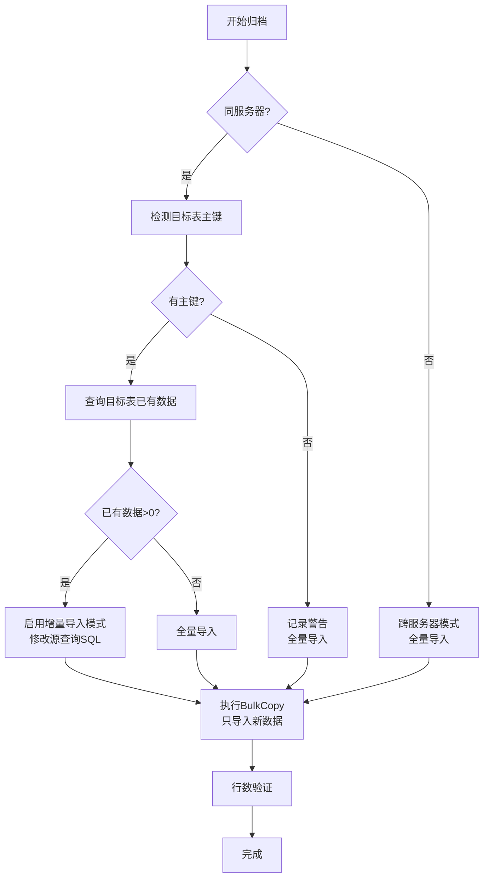

# BulkCopy 增量导入模式 - 设计文档

## 概述

为 BulkCopy 归档模式新增**增量导入**功能,实现只导入目标表中不存在的数据,解决归档任务中断或重复执行时的数据重复问题。

## 业务场景

### 问题描述

在以下场景中,可能导致目标表中已存在部分归档数据:

1. **归档任务中断**: 归档过程中因网络故障、超时等异常中断,部分数据已导入目标表
2. **误操作重复提交**: 用户不小心重复提交同一归档任务
3. **分阶段归档**: 先归档部分数据测试,后续继续归档剩余数据
4. **恢复场景**: 从临时表恢复归档时,目标表可能已有部分数据

### 原有方案的问题

**修改前**:
- 检测到目标表有重复数据直接报错并中断
- 用户需要手动删除重复数据后重新提交
- 操作复杂,容易出错

**用户体验差**:
```
[Error] 发现重复数据 - 目标表已存在 15,000 行待归档数据
请按以下步骤处理:
1. 检查目标表中的重复数据
2. 手动删除目标表中的重复数据
3. 处理完成后,重新提交任务
```

### 新方案优势

**修改后**:
- 自动检测目标表已有数据
- 只导入目标表不存在的数据
- 无需人工干预,自动完成增量归档

**用户体验好**:
```
[Info] 增量导入模式 - 目标表已存在 15,000 行数据，将启用增量导入模式（只导入目标表不存在的数据）
主键列: Id, PartitionKey
[Info] 行数验证 - 增量导入行数验证通过 - 新增 5,927 行 (总数 20,927, 已存在 15,000)
```

## 技术实现

### 1. 主键检测

通过 SQL Server 系统视图自动检测目标表的主键列:

```sql
SELECT COLUMN_NAME
FROM INFORMATION_SCHEMA.KEY_COLUMN_USAGE
WHERE OBJECTPROPERTY(OBJECT_ID(CONSTRAINT_SCHEMA + '.' + CONSTRAINT_NAME), 'IsPrimaryKey') = 1
AND TABLE_SCHEMA = @Schema AND TABLE_NAME = @Table
ORDER BY ORDINAL_POSITION
```

**支持场景**:
- ✅ 单列主键 (如 `Id`)
- ✅ 复合主键 (如 `Id + PartitionKey`)
- ❌ 无主键表 (降级为全量导入,记录警告)

### 2. 重复数据检测

检查目标表中已存在多少条待归档数据:

```sql
SELECT COUNT_BIG(*)
FROM [TargetSchema].[TargetTable] t
WHERE EXISTS (
    SELECT 1 FROM [SourceSchema].[SourceTable] s
    WHERE s.Id = t.Id 
      AND s.PartitionKey = t.PartitionKey  -- 多列主键
)
```

### 3. 增量查询构建

当检测到重复数据时,动态修改源查询SQL,使用 `NOT EXISTS` 排除已存在的记录:

**原始查询**:
```sql
SELECT * FROM [dbo].[OrderDetails] 
WHERE $PARTITION.[PF_OrderDate]([OrderDate]) = 1
```

**增量查询** (自动生成):
```sql
SELECT s.* 
FROM (
    SELECT * FROM [dbo].[OrderDetails] 
    WHERE $PARTITION.[PF_OrderDate]([OrderDate]) = 1
) s
WHERE NOT EXISTS (
    SELECT 1 FROM [ArchiveDB].[dbo].[OrderDetails] t
    WHERE t.Id = s.Id 
      AND t.PartitionKey = s.PartitionKey
)
```

### 4. 处理流程



## 代码实现

### 关键代码位置

**文件**: `BackgroundTaskProcessor.ArchiveOperations.cs`  
**方法**: `ExecuteArchiveBulkCopyAsync`  
**行数**: Lines 1209-1325

### 核心逻辑

#### 1. 主键检测 (Lines 1224-1238)

```csharp
// 获取主键列信息
var primaryKeySql = $@"
    SELECT COLUMN_NAME
    FROM INFORMATION_SCHEMA.KEY_COLUMN_USAGE
    WHERE OBJECTPROPERTY(OBJECT_ID(CONSTRAINT_SCHEMA + '.' + CONSTRAINT_NAME), 'IsPrimaryKey') = 1
    AND TABLE_SCHEMA = @Schema AND TABLE_NAME = @Table
    ORDER BY ORDINAL_POSITION";

using var pkConn = new SqlConnection(targetConnectionString);
await pkConn.OpenAsync(cancellationToken);
using var pkCmd = new SqlCommand(primaryKeySql, pkConn);
pkCmd.Parameters.AddWithValue("@Schema", targetSchema);
pkCmd.Parameters.AddWithValue("@Table", targetTable);

using var pkReader = await pkCmd.ExecuteReaderAsync(cancellationToken);
while (await pkReader.ReadAsync(cancellationToken))
{
    primaryKeyColumns.Add(pkReader.GetString(0));
}
```

#### 2. 重复数据检测 (Lines 1249-1267)

```csharp
// 检查目标表中是否已有源表/临时表的数据
var sourceTableRef = !string.IsNullOrWhiteSpace(tempTableName) 
    ? $"[{snapshot.SchemaName}].[{tempTableName}]" 
    : $"[{snapshot.SchemaName}].[{snapshot.TableName}]";

var pkJoinCondition = string.Join(" AND ", 
    primaryKeyColumns.Select(col => $"s.[{col}] = t.[{col}]"));

var duplicateCheckSql = $@"
    SELECT COUNT_BIG(*)
    FROM [{targetSchema}].[{targetTable}] t
    WHERE EXISTS (
        SELECT 1 FROM {sourceTableRef} s
        WHERE {pkJoinCondition}
    )";

using var checkConn = new SqlConnection(targetConnectionString);
await checkConn.OpenAsync(cancellationToken);
using var checkCmd = new SqlCommand(duplicateCheckSql, checkConn);
existingRowsInTarget = (long)(await checkCmd.ExecuteScalarAsync(cancellationToken) ?? 0L);
```

#### 3. 增量查询构建 (Lines 1274-1295)

```csharp
if (existingRowsInTarget > 0)
{
    await AppendLogAsync(task.Id, "Info", "增量导入模式", 
        $"目标表已存在 {existingRowsInTarget:N0} 行数据，将启用增量导入模式（只导入目标表不存在的数据）。\n" +
        $"主键列: {string.Join(", ", primaryKeyColumns)}", 
        cancellationToken);
    
    // 修改源查询SQL,只查询目标表不存在的数据
    var pkJoinConditionInQuery = string.Join(" AND ", 
        primaryKeyColumns.Select(col => $"t.[{col}] = s.[{col}]"));
    
    // 构建增量查询SQL
    sourceQuery = $@"
        SELECT s.* 
        FROM ({sourceQuery}) s
        WHERE NOT EXISTS (
            SELECT 1 FROM [{targetSchema}].[{targetTable}] t
            WHERE {pkJoinConditionInQuery}
        )";
    
    await AppendLogAsync(task.Id, "Debug", "增量查询SQL", 
        $"已修改源查询为增量模式:\n{sourceQuery}", 
        cancellationToken);
}
```

#### 4. 行数验证增强 (Lines 1396-1427)

```csharp
// 行数验证
if (existingRowsInTarget > 0)
{
    // 增量导入模式: 实际导入数 = 预期总数 - 已存在数
    var expectedNewRows = expectedRowCount - existingRowsInTarget;
    
    if (result.RowsCopied != expectedNewRows && expectedNewRows > 0)
    {
        await AppendLogAsync(task.Id, "Warning", "行数不一致", 
            $"增量导入模式 - 预期导入: {expectedNewRows:N0} 行 (总数 {expectedRowCount:N0} - 已存在 {existingRowsInTarget:N0}), " +
            $"实际导入: {result.RowsCopied:N0} 行, 差异: {Math.Abs(result.RowsCopied - expectedNewRows):N0}", 
            cancellationToken);
    }
    else if (expectedNewRows > 0)
    {
        await AppendLogAsync(task.Id, "Info", "行数验证", 
            $"增量导入行数验证通过 - 新增 {result.RowsCopied:N0} 行 (总数 {expectedRowCount:N0}, 已存在 {existingRowsInTarget:N0})", 
            cancellationToken);
    }
    else if (result.RowsCopied == 0 && expectedNewRows <= 0)
    {
        await AppendLogAsync(task.Id, "Info", "行数验证", 
            "目标表已包含所有数据，无需导入新数据", 
            cancellationToken);
    }
}
```

## 日志输出示例

### 场景1: 首次全量导入 (目标表为空)

```
[Step] 开始 BulkCopy - 源查询: SELECT * FROM [dbo].[OrderDetails] WHERE ...
目标表: [ArchiveDB].[dbo].[OrderDetails]
预期行数: 20,927

[Debug] BulkCopy 配置 - 批次大小: 10000, 超时: 600秒, 每批通知行数: 5000

[Info] 目标表状态 - 目标表为空，将执行全量导入。

[Info] BulkCopy 归档完成 - 成功归档 20,927 行数据,耗时: 00:00:15,吞吐量: 1,395 行/秒

[Info] 行数验证 - 全量导入行数验证通过: 20,927 行
```

### 场景2: 增量导入 (目标表已有15000行)

```
[Step] 开始 BulkCopy - 源查询: SELECT * FROM [dbo].[OrderDetails] WHERE ...
目标表: [ArchiveDB].[dbo].[OrderDetails]
预期行数: 20,927

[Debug] BulkCopy 配置 - 批次大小: 10000, 超时: 600秒, 每批通知行数: 5000

[Info] 增量导入模式 - 目标表已存在 15,000 行数据，将启用增量导入模式（只导入目标表不存在的数据）。
主键列: Id, PartitionKey

[Debug] 增量查询SQL - 已修改源查询为增量模式:
SELECT s.* 
FROM (SELECT * FROM [dbo].[OrderDetails] WHERE ...) s
WHERE NOT EXISTS (
    SELECT 1 FROM [ArchiveDB].[dbo].[OrderDetails] t
    WHERE t.Id = s.Id AND t.PartitionKey = s.PartitionKey
)

[Info] BulkCopy 归档完成 - 成功归档 5,927 行数据,耗时: 00:00:08,吞吐量: 741 行/秒

[Info] 行数验证 - 增量导入行数验证通过 - 新增 5,927 行 (总数 20,927, 已存在 15,000)
```

### 场景3: 所有数据已存在

```
[Step] 开始 BulkCopy - 源查询: SELECT * FROM [dbo].[OrderDetails] WHERE ...
目标表: [ArchiveDB].[dbo].[OrderDetails]
预期行数: 20,927

[Info] 增量导入模式 - 目标表已存在 20,927 行数据，将启用增量导入模式（只导入目标表不存在的数据）。
主键列: Id

[Info] BulkCopy 归档完成 - 成功归档 0 行数据,耗时: 00:00:01,吞吐量: 0 行/秒

[Info] 行数验证 - 目标表已包含所有数据，无需导入新数据
```

### 场景4: 无主键表 (降级全量导入)

```
[Warning] 增量导入检查 - 目标表 [ArchiveDB].[dbo].[OrderDetails] 没有定义主键，无法启用增量导入模式。将导入所有数据（可能产生重复）。

[Info] BulkCopy 归档完成 - 成功归档 20,927 行数据,耗时: 00:00:15,吞吐量: 1,395 行/秒
```

### 场景5: 跨服务器归档

```
[Info] 跨服务器归档 - 跨服务器归档模式:目标服务器无法访问源服务器数据,无法启用增量导入,将执行全量导入

[Info] BulkCopy 归档完成 - 成功归档 20,927 行数据,耗时: 00:00:20,吞吐量: 1,046 行/秒
```

## 功能限制

### 1. 必需条件

| 条件 | 说明 |
|------|------|
| 主键约束 | 目标表必须定义主键(单列或复合主键) |
| 同服务器 | 源数据库和目标数据库在同一SQL Server实例 |
| 列名一致 | 源表和目标表的主键列名必须完全一致 |

### 2. 不支持的场景

| 场景 | 原因 | 降级方案 |
|------|------|---------|
| 无主键表 | 无法唯一标识记录 | 全量导入 + 警告日志 |
| 跨服务器归档 | 目标服务器无法访问源表 | 全量导入 + 提示日志 |
| 主键列不一致 | 无法构建JOIN条件 | 全量导入 + 可能重复 |

### 3. 性能考虑

**增量导入性能影响**:

| 因素 | 影响 | 程度 |
|------|------|------|
| 主键检测 | 查询系统视图 | 极小 (< 100ms) |
| 重复检测 | COUNT查询 | 小 (< 1秒,取决于数据量) |
| NOT EXISTS查询 | 子查询开销 | 中等 (SQL Server会优化) |

**优化建议**:
- ✅ 目标表主键建立聚集索引 (提升EXISTS性能)
- ✅ 统计信息保持更新 (帮助查询优化器)
- ⚠️ 大数据量时增量查询可能慢于全量导入+去重

## 与BCP模式对比

| 特性 | BCP模式 | BulkCopy模式 (修改前) | BulkCopy模式 (修改后) |
|------|---------|---------------------|---------------------|
| 重复数据处理 | 报错中断 | 报错中断 | ✅ 自动增量导入 |
| 主键检测 | ❌ | ❌ | ✅ |
| 跨服务器支持 | ✅ | ✅ | ✅ (降级全量) |
| 用户干预 | 需要手动删除重复 | 需要手动删除重复 | ✅ 无需干预 |
| 日志详细程度 | 详细 | 详细 | ✅ 更详细 |

## 测试建议

### 测试场景1: 主键检测

```sql
-- 创建测试表(单列主键)
CREATE TABLE dbo.TestTable1 (
    Id INT PRIMARY KEY,
    Data NVARCHAR(100)
);

-- 创建测试表(复合主键)
CREATE TABLE dbo.TestTable2 (
    Id INT,
    PartitionKey INT,
    Data NVARCHAR(100),
    PRIMARY KEY (Id, PartitionKey)
);

-- 创建测试表(无主键)
CREATE TABLE dbo.TestTable3 (
    Id INT,
    Data NVARCHAR(100)
);
```

**验证**:
1. 对 TestTable1 归档 → 检测到单列主键
2. 对 TestTable2 归档 → 检测到复合主键
3. 对 TestTable3 归档 → 记录警告,全量导入

### 测试场景2: 增量导入

```sql
-- 准备源表数据
INSERT INTO dbo.OrderDetails VALUES 
(1, '2024-01-01', 'Order1'),
(2, '2024-01-02', 'Order2'),
(3, '2024-01-03', 'Order3');

-- 模拟部分归档
INSERT INTO ArchiveDB.dbo.OrderDetails VALUES 
(1, '2024-01-01', 'Order1');

-- 执行增量归档
```

**预期结果**:
- 检测到目标表已有 1 行数据
- 启用增量导入模式
- 只导入 Id=2 和 Id=3 的记录
- 总计导入 2 行

### 测试场景3: 所有数据已存在

```sql
-- 目标表已包含所有源数据
INSERT INTO ArchiveDB.dbo.OrderDetails 
SELECT * FROM dbo.OrderDetails;

-- 执行增量归档
```

**预期结果**:
- 检测到目标表已有所有数据
- 启用增量导入模式
- 实际导入 0 行
- 日志提示: "目标表已包含所有数据，无需导入新数据"

### 测试场景4: 中断恢复

```sql
-- 模拟归档中断(部分数据已导入)
INSERT INTO ArchiveDB.dbo.OrderDetails 
SELECT TOP 50 PERCENT * FROM dbo.OrderDetails;

-- 重新执行归档任务
```

**预期结果**:
- 自动检测到临时表存在
- 恢复归档流程
- 启用增量导入,只导入剩余50%数据
- 无需人工干预

## 注意事项

### 1. 主键设计要求

- **必须定义主键**: 无主键表无法使用增量导入
- **列名一致**: 源表和目标表主键列名必须相同
- **不支持唯一索引**: 必须是PRIMARY KEY约束,不能只有UNIQUE索引

### 2. 数据一致性

- **主键不可变**: 归档期间主键值不应被修改
- **并发控制**: 归档时避免其他进程修改源表或目标表
- **事务保护**: BulkCopy使用内部事务,保证原子性

### 3. 性能调优

**建议**:
- 目标表主键建立聚集索引
- 大批量数据时调整BatchSize
- 监控SQL Server的执行计划

**不建议**:
- 对超大表(亿级)使用增量导入(性能差)
- 高频率小批量增量导入(开销大)

### 4. 错误处理

**自动降级场景**:
- 无主键 → 全量导入 + Warning日志
- 跨服务器 → 全量导入 + Info日志
- 检测失败 → 全量导入 + Warning日志

**不会中断场景**:
- 所有降级场景都会继续执行,不会报错中断
- 保证归档任务的可用性

## 后续优化建议

### 1. 智能索引建议

在启用增量导入前,检查目标表索引情况,给出优化建议:

```
[Info] 索引建议 - 目标表主键未建立聚集索引，建议执行以下SQL提升增量导入性能:
ALTER TABLE [ArchiveDB].[dbo].[OrderDetails] 
DROP CONSTRAINT [PK_OrderDetails];

ALTER TABLE [ArchiveDB].[dbo].[OrderDetails] 
ADD CONSTRAINT [PK_OrderDetails] PRIMARY KEY CLUSTERED (Id, PartitionKey);
```

### 2. 增量模式选择

提供配置选项让用户选择:
- 自动增量 (默认)
- 强制全量
- 检测到重复时询问

### 3. 基于时间戳的增量

对于支持 `RowVersion` 或 `UpdatedAt` 字段的表,支持基于版本号的增量导入:

```sql
SELECT s.* 
FROM SourceTable s
LEFT JOIN TargetTable t ON s.Id = t.Id
WHERE t.Id IS NULL 
   OR s.RowVersion > t.RowVersion  -- 只导入更新的记录
```

### 4. 批量增量导入

对于超大表,分批进行增量检测和导入:

```csharp
// 按主键范围分批
for (int batchId = 0; batchId < totalBatches; batchId++)
{
    var rangeStart = batchId * batchSize;
    var rangeEnd = (batchId + 1) * batchSize;
    
    // 只检测当前批次的重复数据
    // 只导入当前批次的新数据
}
```

## 相关文档

- [BulkCopy归档增强总结](./Changes/重构完成总结-BulkCopy归档增强.md)
- [开发规范与项目结构](./开发规范与项目结构.md)
- [数据模型与API规范](./数据模型与API规范.md)

## 修改记录

| 日期 | 作者 | 修改内容 |
|------|------|---------|
| 2025-11-14 | GitHub Copilot | 初始设计和实现 |

## 审核状态

待审核
